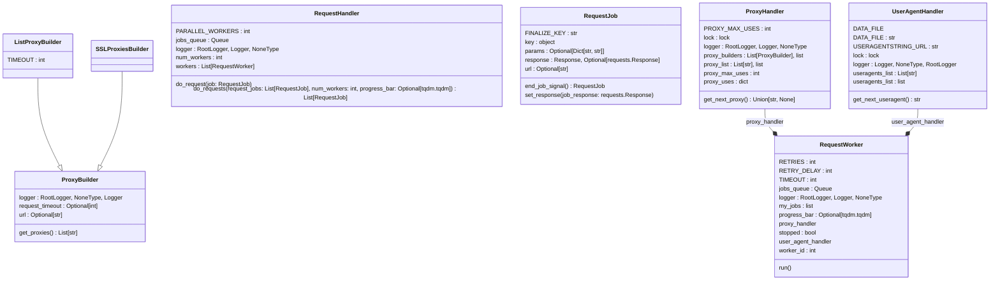

<h1 style="font-size: 80px; color: blue"> 
Olivia Finder - Implementation
</h1>


The notebook is prepared to show the operation of the Olivia Finder library from the point of view of the implementation of the source code.

A description of the sub-packages implemented is provided and a demonstration of their functionality

# **0 - Previous requirements**

## Setup venv and install requirements


```python
%pip install -r requirements.txt
```

    Requirement already satisfied: pandas in /home/dnllns/Documentos/repositorios/olivia-finder/.venv/lib/python3.10/site-packages (from -r requirements.txt (line 1)) (2.0.1)
    Requirement already satisfied: tqdm in /home/dnllns/Documentos/repositorios/olivia-finder/.venv/lib/python3.10/site-packages (from -r requirements.txt (line 2)) (4.65.0)
    Requirement already satisfied: requests in /home/dnllns/Documentos/repositorios/olivia-finder/.venv/lib/python3.10/site-packages (from -r requirements.txt (line 3)) (2.30.0)
    Requirement already satisfied: BeautifulSoup4 in /home/dnllns/Documentos/repositorios/olivia-finder/.venv/lib/python3.10/site-packages (from -r requirements.txt (line 4)) (4.12.2)
    Requirement already satisfied: selenium in /home/dnllns/Documentos/repositorios/olivia-finder/.venv/lib/python3.10/site-packages (from -r requirements.txt (line 5)) (4.9.1)
    Requirement already satisfied: networkx in /home/dnllns/Documentos/repositorios/olivia-finder/.venv/lib/python3.10/site-packages (from -r requirements.txt (line 6)) (3.1)
    Requirement already satisfied: matplotlib in /home/dnllns/Documentos/repositorios/olivia-finder/.venv/lib/python3.10/site-packages (from -r requirements.txt (line 7)) (3.7.1)
    Requirement already satisfied: pybraries in /home/dnllns/Documentos/repositorios/olivia-finder/.venv/lib/python3.10/site-packages (from -r requirements.txt (line 8)) (0.4.0)
    Requirement already satisfied: typing_extensions in /home/dnllns/Documentos/repositorios/olivia-finder/.venv/lib/python3.10/site-packages (from -r requirements.txt (line 9)) (4.5.0)
    Requirement already satisfied: scipy in /home/dnllns/Documentos/repositorios/olivia-finder/.venv/lib/python3.10/site-packages (from -r requirements.txt (line 11)) (1.11.0)
    Requirement already satisfied: python-dateutil>=2.8.2 in /home/dnllns/Documentos/repositorios/olivia-finder/.venv/lib/python3.10/site-packages (from pandas->-r requirements.txt (line 1)) (2.8.2)
    Requirement already satisfied: pytz>=2020.1 in /home/dnllns/Documentos/repositorios/olivia-finder/.venv/lib/python3.10/site-packages (from pandas->-r requirements.txt (line 1)) (2023.3)
    Requirement already satisfied: tzdata>=2022.1 in /home/dnllns/Documentos/repositorios/olivia-finder/.venv/lib/python3.10/site-packages (from pandas->-r requirements.txt (line 1)) (2023.3)
    Requirement already satisfied: numpy>=1.21.0 in /home/dnllns/Documentos/repositorios/olivia-finder/.venv/lib/python3.10/site-packages (from pandas->-r requirements.txt (line 1)) (1.24.3)
    Requirement already satisfied: charset-normalizer<4,>=2 in /home/dnllns/Documentos/repositorios/olivia-finder/.venv/lib/python3.10/site-packages (from requests->-r requirements.txt (line 3)) (3.1.0)
    Requirement already satisfied: idna<4,>=2.5 in /home/dnllns/Documentos/repositorios/olivia-finder/.venv/lib/python3.10/site-packages (from requests->-r requirements.txt (line 3)) (3.4)
    Requirement already satisfied: urllib3<3,>=1.21.1 in /home/dnllns/Documentos/repositorios/olivia-finder/.venv/lib/python3.10/site-packages (from requests->-r requirements.txt (line 3)) (2.0.2)
    Requirement already satisfied: certifi>=2017.4.17 in /home/dnllns/Documentos/repositorios/olivia-finder/.venv/lib/python3.10/site-packages (from requests->-r requirements.txt (line 3)) (2023.5.7)
    Requirement already satisfied: soupsieve>1.2 in /home/dnllns/Documentos/repositorios/olivia-finder/.venv/lib/python3.10/site-packages (from BeautifulSoup4->-r requirements.txt (line 4)) (2.4.1)
    Requirement already satisfied: trio~=0.17 in /home/dnllns/Documentos/repositorios/olivia-finder/.venv/lib/python3.10/site-packages (from selenium->-r requirements.txt (line 5)) (0.22.0)
    Requirement already satisfied: trio-websocket~=0.9 in /home/dnllns/Documentos/repositorios/olivia-finder/.venv/lib/python3.10/site-packages (from selenium->-r requirements.txt (line 5)) (0.10.2)
    Requirement already satisfied: contourpy>=1.0.1 in /home/dnllns/Documentos/repositorios/olivia-finder/.venv/lib/python3.10/site-packages (from matplotlib->-r requirements.txt (line 7)) (1.0.7)
    Requirement already satisfied: cycler>=0.10 in /home/dnllns/Documentos/repositorios/olivia-finder/.venv/lib/python3.10/site-packages (from matplotlib->-r requirements.txt (line 7)) (0.11.0)
    Requirement already satisfied: fonttools>=4.22.0 in /home/dnllns/Documentos/repositorios/olivia-finder/.venv/lib/python3.10/site-packages (from matplotlib->-r requirements.txt (line 7)) (4.39.4)
    Requirement already satisfied: kiwisolver>=1.0.1 in /home/dnllns/Documentos/repositorios/olivia-finder/.venv/lib/python3.10/site-packages (from matplotlib->-r requirements.txt (line 7)) (1.4.4)
    Requirement already satisfied: packaging>=20.0 in /home/dnllns/Documentos/repositorios/olivia-finder/.venv/lib/python3.10/site-packages (from matplotlib->-r requirements.txt (line 7)) (23.1)
    Requirement already satisfied: pillow>=6.2.0 in /home/dnllns/Documentos/repositorios/olivia-finder/.venv/lib/python3.10/site-packages (from matplotlib->-r requirements.txt (line 7)) (9.5.0)
    Requirement already satisfied: pyparsing>=2.3.1 in /home/dnllns/Documentos/repositorios/olivia-finder/.venv/lib/python3.10/site-packages (from matplotlib->-r requirements.txt (line 7)) (3.0.9)
    Requirement already satisfied: fire>0.1.1 in /home/dnllns/Documentos/repositorios/olivia-finder/.venv/lib/python3.10/site-packages (from pybraries->-r requirements.txt (line 8)) (0.5.0)
    Requirement already satisfied: six in /home/dnllns/Documentos/repositorios/olivia-finder/.venv/lib/python3.10/site-packages (from fire>0.1.1->pybraries->-r requirements.txt (line 8)) (1.16.0)
    Requirement already satisfied: termcolor in /home/dnllns/Documentos/repositorios/olivia-finder/.venv/lib/python3.10/site-packages (from fire>0.1.1->pybraries->-r requirements.txt (line 8)) (2.3.0)
    Requirement already satisfied: attrs>=19.2.0 in /home/dnllns/Documentos/repositorios/olivia-finder/.venv/lib/python3.10/site-packages (from trio~=0.17->selenium->-r requirements.txt (line 5)) (23.1.0)
    Requirement already satisfied: sortedcontainers in /home/dnllns/Documentos/repositorios/olivia-finder/.venv/lib/python3.10/site-packages (from trio~=0.17->selenium->-r requirements.txt (line 5)) (2.4.0)
    Requirement already satisfied: async-generator>=1.9 in /home/dnllns/Documentos/repositorios/olivia-finder/.venv/lib/python3.10/site-packages (from trio~=0.17->selenium->-r requirements.txt (line 5)) (1.10)
    Requirement already satisfied: outcome in /home/dnllns/Documentos/repositorios/olivia-finder/.venv/lib/python3.10/site-packages (from trio~=0.17->selenium->-r requirements.txt (line 5)) (1.2.0)
    Requirement already satisfied: sniffio in /home/dnllns/Documentos/repositorios/olivia-finder/.venv/lib/python3.10/site-packages (from trio~=0.17->selenium->-r requirements.txt (line 5)) (1.3.0)
    Requirement already satisfied: exceptiongroup>=1.0.0rc9 in /home/dnllns/Documentos/repositorios/olivia-finder/.venv/lib/python3.10/site-packages (from trio~=0.17->selenium->-r requirements.txt (line 5)) (1.1.1)
    Requirement already satisfied: wsproto>=0.14 in /home/dnllns/Documentos/repositorios/olivia-finder/.venv/lib/python3.10/site-packages (from trio-websocket~=0.9->selenium->-r requirements.txt (line 5)) (1.2.0)
    Requirement already satisfied: pysocks!=1.5.7,<2.0,>=1.5.6 in /home/dnllns/Documentos/repositorios/olivia-finder/.venv/lib/python3.10/site-packages (from urllib3<3,>=1.21.1->requests->-r requirements.txt (line 3)) (1.7.1)
    Requirement already satisfied: h11<1,>=0.9.0 in /home/dnllns/Documentos/repositorios/olivia-finder/.venv/lib/python3.10/site-packages (from wsproto>=0.14->trio-websocket~=0.9->selenium->-r requirements.txt (line 5)) (0.14.0)
    Note: you may need to restart the kernel to use updated packages.


If you use a virtual environment, it is necessary to configure it as selected in the Jupyter kernel


## Setup library path

Make sure to run this cell to have the **olivia-finder** library at PATH


```python
# Append the path to the olivia_finder package
import sys
sys.path.append('../../olivia_finder/')
```

## Setup configuration

It is necessary to initialize the configuration, the most comfortable and global way to do so is through an environment variable


```python
# Add the environment variable OLIVIA_FINDER_CONFIG_FILE_PATH
import os
os.environ['OLIVIA_FINDER_CONFIG_FILE_PATH'] = "./config.ini"
```


```python
import networkx as nx
import matplotlib.pyplot as plt
```

# **1 - `olivia_finder.utilities`**


The utility package is designed to contain source code that is used in the library on a recurring basis, and whose functionality is to provide a certain utility to the library.

## Module structure

**Package structure**

```bash
../../olivia_finder/olivia_finder/utilities
├── config.py
├── exception.py
├── __init__.py
├── logger.py
├── singleton_decorator.py
└── utilities.py
```


**Class diagrams**


```python
!pyreverse -o mmd -d ../../olivia_finder/diagrams/ -p utilities ../../olivia_finder/olivia_finder/utilities
```

    parsing ../../olivia_finder/olivia_finder/utilities/__init__.py...
    parsing /home/dnllns/Documentos/repositorios/olivia-finder/olivia_finder/olivia_finder/utilities/singleton_decorator.py...
    parsing /home/dnllns/Documentos/repositorios/olivia-finder/olivia_finder/olivia_finder/utilities/logger.py...
    parsing /home/dnllns/Documentos/repositorios/olivia-finder/olivia_finder/olivia_finder/utilities/utilities.py...
    parsing /home/dnllns/Documentos/repositorios/olivia-finder/olivia_finder/olivia_finder/utilities/__init__.py...
    parsing /home/dnllns/Documentos/repositorios/olivia-finder/olivia_finder/olivia_finder/utilities/config.py...
    parsing /home/dnllns/Documentos/repositorios/olivia-finder/olivia_finder/olivia_finder/utilities/exception.py...


## Module `utilities.config`


Provides the configuration class, which is used to obtain the configuration variables defined in the .ini configuration file

It is a Singleton instance so only one instance is accessible from any part of the code through the constructor


```python
from olivia_finder.utilities.config import Configuration
```

You need to provide a configuration file

The configuration file is located in the root of the olivia_finder package

In this execution we are using a personalized configuration file for demonstration


```python
!cat ./config.ini
```

    [olivia_finder_logger]
    ; Levels: DEBUG, INFO, WARNING, ERROR, CRITICAL
    name                     = olivia_finder
    level                    = DEBUG
    status                   = ENABLED
    file_handler             = ENABLED
    console_handler          = ENABLED
    
    ; Myrequests configuration
    [logger_myrequests]
    name                 = olivia_finder.myrequests
    level                = DEBUG
    status               = DISABLED
    file_handler         = DISABLED
    console_handler      = DISABLED
    
    ; Package Manager configuration
    [logger_packagemanager]
    name                 = olivia_finder.packagemanager
    level                = DEBUG
    status               = DISABLED
    file_handler         = DISABLED
    console_handler      = DISABLED
    
    ; CSV Datasource configuration
    [logger_datasource]
    name                 = olivia_finder.datasource
    level                = DEBUG
    status               = DISABLED
    file_handler         = DISABLED
    console_handler      = DISABLED
    
    ; Output directory for the results
    [folders]
    logger                      = logs/
    working_dir                 = results/working/
    
    
    ; Libraries.io configuration
    [librariesio]
    api_key                     = 558f419425861e607e78cd4e3a0b129b

Acess the keys using `get_key` method


```python
Configuration().get_key('olivia_finder_logger', 'status')
```


    'ENABLED'


## Module `utilities.logger`


```python
from olivia_finder.utilities.logger import MyLogger
```

The class MyLogger implements an utility loging tools to register the actions of execution. It is based on the default Python logging module


```python
logger = MyLogger.configure('olivia_finder_logger')

logger.debug('Debug message')
logger.info('Info message')
logger.warning('Warning message')
logger.error('Error message')
logger.critical('Critical message')

# Acess the logger using the configured name
MyLogger.get_logger(logger.name).debug('Debug message')

# Acess the logger using the default logging class
import logging
logging.getLogger(logger.name).debug('Debug message')
```

    2023-06-28 19:26:34,316 [olivia_finder(DEBUG)] -> 4423775.py:3
    Debug message
    2023-06-28 19:26:34,318 [olivia_finder(INFO)] -> 4423775.py:4
    Info message
    2023-06-28 19:26:34,318 [olivia_finder(WARNING)] -> 4423775.py:5
    Warning message
    2023-06-28 19:26:34,319 [olivia_finder(ERROR)] -> 4423775.py:6
    Error message
    2023-06-28 19:26:34,319 [olivia_finder(CRITICAL)] -> 4423775.py:7
    Critical message
    2023-06-28 19:26:34,320 [olivia_finder(DEBUG)] -> 4423775.py:10
    Debug message
    2023-06-28 19:26:34,320 [olivia_finder(DEBUG)] -> 4423775.py:14
    Debug message


Default logger is root


```python
# The default logger is root and it is not configured
MyLogger.get_logger().debug('Debug message')
MyLogger.get_logger().info('Info message')
MyLogger.get_logger().warning('Warning message')
MyLogger.get_logger().error('Error message')
MyLogger.get_logger().critical('Critical message')
```

    Warning message
    Error message
    Critical message


Change log level


```python
MyLogger.configure_level(logger.name, 'console', 'warning')
MyLogger.get_logger(logger.name).debug('Debug message')
MyLogger.get_logger(logger.name).info('Info message')
MyLogger.get_logger(logger.name).warning('Warning message')
MyLogger.get_logger(logger.name).error('Error message')
MyLogger.get_logger(logger.name).critical('Critical message')
```

    2023-06-28 19:26:34,331 [olivia_finder(WARNING)] -> 446635553.py:4
    Warning message
    2023-06-28 19:26:34,332 [olivia_finder(ERROR)] -> 446635553.py:5
    Error message
    2023-06-28 19:26:34,333 [olivia_finder(CRITICAL)] -> 446635553.py:6
    Critical message


## Module `utilities.exceptions`

Includes a series of exceptions to be used by the library and provide a more generic context in the case of being rised


```python
from olivia_finder.utilities.exception import OliviaFinderException
```


```python
OliviaFinderException('Test exception')
```


    OliviaFinderException: Test exception


## Module `utilities.singleton_decorator`

This module includes a decorator-based implementation of the Singleton design pattern


```python
from olivia_finder.utilities.singleton_decorator import singleton
```


```python
# Dummy class
@singleton
class Dummy:
    def __init__(self, name):
        self.name = name
```


```python
print(Dummy('test').name)
print(Dummy('test2').name)
```

    test
    test


## Module `utilities.utilities`

A module containing common source code to be reused

# **2 - `olivia_finder.myrequests`**


The myrequest package is prepared to concurrently make requests to a web server, being able to abuse these requests without denying us the service. 

The package includes different modules that are responsible for carrying out this task transparently, such as obtaining proxies and useragents to disguise the origin of the request, or the concurrent execution of requests.


## Module structure

**Package structure**


```python
# Remove compiled files (pycache folders and .pyc files)
!find ../../olivia_finder/ -name "__pycache__" -exec rm -rf {} \;

# Show the directory structure
!tree ../../olivia_finder/olivia_finder/myrequests
```

    find: ‘../../olivia_finder/olivia_finder/data_source/repository_scrapers/__pycache__’: No existe el archivo o el directorio
    find: ‘../../olivia_finder/olivia_finder/data_source/__pycache__’: No existe el archivo o el directorio
    find: ‘../../olivia_finder/olivia_finder/__pycache__’: No existe el archivo o el directorio
    find: ‘../../olivia_finder/olivia_finder/utilities/__pycache__’: No existe el archivo o el directorio
    find: ‘../../olivia_finder/olivia_finder/myrequests/__pycache__’: No existe el archivo o el directorio
    find: ‘../../olivia_finder/olivia_finder/myrequests/proxy_builders/__pycache__’: No existe el archivo o el directorio
    ../../olivia_finder/olivia_finder/myrequests
    ├── data
    │   └── useragents.txt
    ├── __init__.py
    ├── job.py
    ├── proxy_builders
    │   ├── __init__.py
    │   ├── list_builder.py
    │   ├── proxy_builder.py
    │   └── ssl_proxies.py
    ├── proxy_handler.py
    ├── request_handler.py
    ├── request_worker.py
    └── useragent_handler.py
    
    2 directories, 11 files


**Class diagrams**


```python
#!pyreverse -o mmd -d ../../olivia_finder/diagrams/ -p myrequests ../../olivia_finder/olivia_finder/myrequests
```




## Subpackage `myrequests.proxy_builders`


The proxy builder subpackage takes care of getting a list of proxies. 

Two implementations are available, one based on an online proxy provider called SSL proxies, and the other based on a proxy list. The proxy list-based implementation is proposed as the best option due to its genericity.

We can focus on two different ways:

- Obtain the data through Web Scraping from some website that provides updated proxys, like SSLProxies

- Obtain the data from a proxies list in format `<IP>:<PORT>` from a web server

This is shown below


**_Web scraping implementation (from sslproxies.org)_**


```python
from olivia_finder.myrequests.proxy_builders.ssl_proxies import SSLProxiesBuilder
```


```python
pb_SSLProxies = SSLProxiesBuilder()
pb_SSLProxies.get_proxies()
```


    ['78.46.190.133:8000',
     '64.225.4.63:9993',
     '134.19.254.2:21231',
     '114.7.27.98:8080',
     '146.196.54.68:443',
     '103.169.254.164:8061',
     '186.121.235.222:8080',
     '64.225.8.191:9992',
     '8.219.97.248:80',
     '118.70.12.171:53281',
     '118.69.111.51:8080',
     '54.237.145.145:80',
     '186.121.235.66:8080',
     '190.61.88.147:8080',
     '103.81.194.213:88',
     '171.226.91.210:14023',
     '64.225.4.29:9865',
     '202.86.138.18:8080',
     '94.110.148.115:3128',
     '64.225.8.115:9996',
     '77.247.108.17:33080',
     '195.133.45.149:7788',
     '185.103.128.138:8080',
     '18.116.27.91:443',
     '47.90.162.160:8080',
     '81.25.227.216:3128',
     '144.217.253.209:9300',
     '200.105.215.22:33630',
     '13.231.166.96:80',
     '13.127.56.176:80',
     '13.125.151.78:80',
     '35.227.57.1:3128',
     '24.152.40.49:8080',
     '35.213.91.45:80',
     '173.176.14.246:3128',
     '146.196.54.75:80',
     '188.40.90.62:3128',
     '34.87.55.162:8080',
     '3.96.207.185:80',
     '51.79.50.31:9300',
     '34.143.228.238:8080',
     '115.144.102.39:10080',
     '158.69.74.53:9300',
     '112.217.162.5:3128',
     '198.11.175.180:6666',
     '66.135.14.166:443',
     '51.79.50.22:9300',
     '158.69.71.245:9300',
     '20.44.206.138:80',
     '192.241.238.167:31028',
     '158.69.73.79:9300',
     '13.236.6.61:80',
     '116.0.61.122:3128',
     '202.180.20.10:55443',
     '85.221.217.142:57867',
     '103.145.160.5:8080',
     '94.232.11.178:46449',
     '13.233.152.98:80',
     '186.121.200.4:80',
     '34.124.225.130:8080',
     '5.161.105.227:3128',
     '5.161.207.103:3128',
     '185.78.29.95:3128',
     '195.158.30.89:3128',
     '178.33.3.163:8080',
     '83.151.4.172:57812',
     '144.217.240.185:9300',
     '103.166.10.71:32650',
     '213.178.250.33:8080',
     '154.79.245.166:32650',
     '5.28.35.226:9812',
     '20.204.190.254:3129',
     '31.220.183.217:53281',
     '20.219.178.121:3129',
     '20.219.180.149:3129',
     '20.219.235.172:3129',
     '20.204.214.23:3129',
     '20.204.212.45:3129',
     '20.219.182.59:3129',
     '20.219.177.38:3129',
     '20.219.177.85:3129',
     '20.219.176.57:3129',
     '20.204.214.79:3129',
     '20.219.183.188:3129',
     '103.247.152.125:3128',
     '20.204.212.76:3129',
     '34.154.161.152:80',
     '130.61.24.8:3128',
     '46.228.199.252:5555',
     '181.205.86.66:32650',
     '103.129.92.95:9995',
     '40.83.102.86:80',
     '87.237.239.57:3128',
     '86.57.137.63:2222',
     '140.238.245.116:8100',
     '171.244.65.14:4002',
     '35.240.219.50:8080',
     '115.144.1.222:12089',
     '119.8.120.4:80',
     '41.174.96.38:32650']


**_Web list implementation (from lists)_**


```python
from olivia_finder.myrequests.proxy_builders.list_builder import ListProxyBuilder
```


```python
pb_ListBuilder = ListProxyBuilder(
    url="https://raw.githubusercontent.com/mertguvencli/http-proxy-list/main/proxy-list/data.txt")
pb_ListBuilder.get_proxies()
```


    ['77.247.108.17:33080',
     '195.133.45.149:7788',
     '94.110.148.115:3128',
     '35.240.156.235:8080',
     '35.213.91.45:80',
     '8.219.170.236:3128',
     '200.105.215.22:33630',
     '66.135.14.166:443',
     '149.202.159.3:8888',
     '203.142.77.226:8080',
     '174.138.88.120:3128',
     '35.213.91.45:80',
     '119.8.120.4:80',
     '131.153.48.254:8080',
     '202.86.138.18:8080',
     '64.225.8.82:9981',
     '148.113.6.138:3128',
     '128.14.23.113:3128',
     '77.247.108.17:33080',
     '64.225.8.115:9974',
     '190.121.207.183:999',
     '186.121.235.66:8080',
     '93.157.196.58:8080',
     '41.76.145.136:8080',
     '103.59.176.154:8080',
     '202.43.110.171:8080',
     '47.242.3.214:8081',
     '102.220.121.56:3128',
     '202.43.110.168:8080',
     '116.90.119.1:8080',
     '182.253.183.192:80',
     '41.76.145.18:3128',
     '35.213.91.45:80',
     '34.87.55.162:8080',
     '35.240.156.235:8080',
     '200.105.215.22:33630',
     '34.154.161.152:80',
     '41.76.145.136:3128',
     '103.165.126.66:8080',
     '64.225.4.29:9493',
     '45.189.118.92:999',
     '190.19.114.104:8080',
     '131.153.48.254:8080',
     '139.144.24.46:8080',
     '77.247.108.17:33080',
     '103.155.196.82:8080',
     '103.87.68.125:8080',
     '95.217.167.241:8080',
     '147.139.168.187:3128',
     '182.136.74.130:1080',
     '124.106.150.209:8082',
     '64.225.8.191:9973',
     '103.178.12.178:3030',
     '165.232.114.200:8080',
     '193.138.178.6:8282',
     '54.237.145.145:80',
     '212.174.17.15:8085',
     '123.126.158.184:80',
     '45.71.36.67:3128',
     '180.211.191.182:8080',
     '103.165.155.226:1111',
     '201.184.24.13:999',
     '14.241.133.178:8080',
     '190.92.208.146:7890',
     '202.180.20.11:55443',
     '4.193.164.48:3128',
     '45.5.118.142:8080',
     '103.23.98.33:8181',
     '201.182.251.142:999',
     '192.141.196.129:8080',
     '210.213.212.121:8080',
     '177.25.40.146:4343',
     '45.229.34.174:999',
     '103.123.168.165:83',
     '78.110.195.242:7080',
     '64.225.8.191:9982',
     '35.213.91.45:80',
     '131.153.48.254:8080',
     '78.188.81.57:8080',
     '171.226.91.210:14023',
     '189.201.242.146:8888',
     '182.131.7.141:80',
     '201.184.24.13:999',
     '41.76.145.18:3128',
     '77.247.108.17:33080',
     '41.76.145.136:3128',
     '41.76.145.136:8080',
     '24.112.3.220:8080',
     '45.173.12.142:1994',
     '78.110.195.129:7080',
     '61.80.239.168:1337',
     '41.76.145.18:8080',
     '64.225.4.63:9975',
     '186.148.175.7:999',
     '188.43.247.36:3128',
     '221.226.75.86:55443',
     '190.166.21.192:8080',
     '195.138.85.104:41890',
     '103.27.22.65:32650',
     '14.187.7.250:8080',
     '123.126.158.184:80',
     '95.217.167.241:8080',
     '64.225.8.191:9999',
     '200.105.104.185:999',
     '201.91.82.155:3128',
     '103.147.128.65:83',
     '201.168.8.74:999',
     '41.86.251.61:8080',
     '103.145.160.4:8080',
     '181.119.67.130:999',
     '103.149.194.79:32650',
     '177.73.68.150:8080',
     '54.237.145.145:80',
     '45.167.253.129:999',
     '103.169.149.9:8080',
     '64.225.8.191:9973',
     '185.15.172.212:3128',
     '190.142.231.96:999',
     '167.250.50.12:999',
     '177.130.104.118:33333',
     '91.194.239.122:8080',
     '177.139.194.62:3128',
     '185.56.235.246:18081',
     '187.190.108.54:8080',
     '103.4.94.2:8080',
     '200.54.22.74:8080',
     '190.121.207.183:999',
     '185.33.170.210:9999',
     '165.232.114.200:8080',
     '82.200.150.194:443',
     '181.10.204.85:999',
     '89.179.244.233:20000',
     '190.109.168.217:8080',
     '103.36.35.135:8080',
     '183.88.154.75:8080',
     '103.111.118.66:1080',
     '45.189.116.159:999',
     '203.190.53.197:8080',
     '41.76.145.18:443',
     '202.154.18.115:8082',
     '186.167.67.36:8080',
     '177.207.208.35:8080',
     '36.91.45.11:51672',
     '64.225.8.115:9985',
     '182.52.229.165:8080',
     '103.167.69.242:8080',
     '110.78.152.159:8080',
     '116.197.130.24:4995',
     '66.135.14.166:443',
     '38.56.70.97:999',
     '190.92.208.146:7890',
     '182.253.183.192:80',
     '222.67.249.163:9000',
     '96.80.235.1:8080',
     '103.1.50.41:3125',
     '177.154.33.102:9292',
     '31.44.82.2:3128',
     '180.211.179.126:8080',
     '103.156.233.132:3125',
     '103.165.157.62:8080',
     '45.173.12.142:1994',
     '171.97.128.246:8080',
     '103.178.12.231:3030',
     '87.250.63.172:8118',
     '103.166.29.119:32650',
     '46.16.201.51:3129',
     '202.180.17.162:8090',
     '64.225.4.63:9986',
     '103.135.24.100:7788',
     '118.69.111.51:8080',
     '103.184.180.233:8080',
     '18.116.27.91:443',
     '91.194.239.122:8080',
     '115.144.9.246:11066',
     '103.96.119.25:8080',
     '41.76.145.136:8080',
     '200.82.153.212:999',
     '179.60.235.248:8097',
     '37.120.192.154:8080',
     '95.56.254.139:3128',
     '8.219.97.248:80',
     '173.176.14.246:3128',
     '103.36.35.135:8080',
     '128.14.23.114:3128',
     '200.82.153.221:999',
     '161.35.197.118:3000',
     '103.76.12.42:80',
     '190.121.207.183:999',
     '121.33.160.26:808',
     '103.59.176.154:8080',
     '181.191.226.12:999',
     '64.225.8.115:9998',
     '34.124.225.130:8080',
     '192.145.205.177:8080',
     '113.160.94.26:19132',
     '119.8.120.4:80',
     '201.184.24.13:999',
     '45.224.148.117:999',
     '177.8.164.90:8080',
     '186.148.175.7:999',
     '177.93.45.154:999',
     '190.92.208.146:7890',
     '128.14.23.113:3128',
     '103.134.44.176:8080',
     '139.144.24.46:8080',
     '185.98.23.229:3128',
     '204.137.175.66:999',
     '34.154.161.152:80',
     '35.213.91.45:80',
     '64.225.8.82:9998',
     '183.221.242.107:8443',
     '148.113.6.138:3128',
     '94.139.204.51:8080',
     '111.178.11.20:8088',
     '165.232.114.200:8080',
     '94.231.192.26:8080',
     '131.153.48.254:8080',
     '190.61.84.166:9812',
     '37.57.15.43:33761',
     '43.224.119.34:80',
     '176.236.124.252:10001',
     '186.121.235.222:8080',
     '34.66.5.144:8888',
     '114.130.84.94:8080',
     '45.189.116.159:999',
     '167.179.44.77:8080',
     '65.20.171.253:8080',
     '159.192.139.178:8080',
     '41.76.145.18:8080',
     '41.76.145.18:443',
     '188.40.15.9:3128',
     '152.67.46.249:3128',
     '77.247.108.17:33080',
     '41.76.145.18:3128',
     '188.132.222.45:8080',
     '187.1.57.206:20183',
     '185.56.235.246:18081',
     '116.90.119.1:8080',
     '103.19.130.50:8080',
     '103.118.46.77:32650',
     '95.217.167.241:8080',
     '180.184.91.187:443',
     '41.65.236.57:1976',
     '61.80.239.168:1337',
     '103.155.54.26:83',
     '46.16.201.51:3129',
     '103.168.44.167:9191',
     '158.69.73.79:9300',
     '114.130.78.185:8080',
     '190.97.232.197:999',
     '103.52.213.131:80',
     '200.105.215.22:33630',
     '43.153.83.182:8800',
     '185.108.141.74:8080',
     '183.221.242.103:9443',
     '110.78.81.107:8080',
     '103.122.32.10:8080',
     '202.86.138.18:8080',
     '105.235.219.154:8080',
     '123.126.158.184:80',
     '125.25.82.146:8080',
     '103.157.83.229:8080',
     '36.91.46.26:8080',
     '82.165.184.53:80']


## Module `myrequests.proxy_handler`


```python
from olivia_finder.myrequests.proxy_handler import ProxyHandler
```


```python
ph = ProxyHandler()
```


```python
for i in range(10):
    print(ph.get_next_proxy())
```

    http://170.130.55.153:5001
    http://104.17.16.136:80
    http://104.234.138.40:3128
    http://45.131.5.32:80
    http://203.32.120.18:80
    http://172.67.23.197:80
    http://185.162.229.77:80
    http://203.13.32.148:80
    http://172.67.251.80:80
    http://103.19.130.50:8080


## Module `myrequests.useragent_handler`


```python
from olivia_finder.myrequests.useragent_handler import UserAgentHandler
```

The purpose of this class is to provide a set of useragents to be used by the RequestHandler object with the aim of hiding the original identity of the web request

The class is prepared to load the useragents from a text file contained in the package, and in turn can obtain them from a website dedicated to provide them.

If both options are not available, there will be used the default ones hardcoded in the class


Useragents dataset included on the package MyRequests


```python
!tail ../../olivia_finder/olivia_finder/myrequests/data/useragents.txt
```

    Mozilla/5.0 (Windows NT 6.1) AppleWebKit/537.36 (KHTML, like Gecko) Chrome/40.0.2214.91 Safari/537.36
    Mozilla/5.0 (iPad; U; CPU OS 5_0 like Mac OS X) AppleWebKit/534.46 (KHTML, like Gecko) Version/5.1 Mobile/9A334 Safari/7534.48.3
    Mozilla/5.0 (Windows NT 5.1) AppleWebKit/537.36 (KHTML, like Gecko) Chrome/42.0.2311.135 Safari/537.36
    Mozilla/5.0 (Macintosh; Intel Mac OS X 10_10_2) AppleWebKit/537.36 (KHTML, like Gecko) Chrome/43.0.2357.130 Safari/537.36
    Mozilla/5.0 (Windows NT 6.1) AppleWebKit/537.36 (KHTML, like Gecko) coc_coc_browser/50.0.125 Chrome/44.0.2403.125 Safari/537.36
    Mozilla/5.0 (compatible; MSIE 10.0; Windows NT 6.1; WOW64; Trident/6.0; SLCC2; .NET CLR 2.0.50727; .NET4.0C; .NET4.0E)
    Mozilla/5.0 (Macintosh; Intel Mac OS X 10_10_5) AppleWebKit/537.36 (KHTML, like Gecko) Chrome/43.0.2357.124 Safari/537.36
    Mozilla/5.0 (Windows NT 6.3; Win64; x64; Trident/7.0; MAARJS; rv:11.0) like Gecko
    Mozilla/5.0 (Linux; Android 5.0; SAMSUNG SM-N900T Build/LRX21V) AppleWebKit/537.36 (KHTML, like Gecko) SamsungBrowser/2.1 Chrome/34.0.1847.76 Mobile Safari/537.36
    Mozilla/5.0 (iPhone; CPU iPhone OS 8_4 like Mac OS X) AppleWebKit/600.1.4 (KHTML, like Gecko) GSA/7.0.55539 Mobile/12H143 Safari/600.1.4

The default constructor loads the usragents from the file


```python
ua_handler = UserAgentHandler()
ua_handler.useragents_list[:5]
```


    ['Mozilla/5.0 (X11; Linux x86_64) AppleWebKit/537.36 (KHTML, like Gecko) Ubuntu Chromium/37.0.2062.94 Chrome/37.0.2062.94 Safari/537.36',
     'Mozilla/5.0 (Windows NT 6.1; WOW64) AppleWebKit/537.36 (KHTML, like Gecko) Chrome/45.0.2454.85 Safari/537.36',
     'Mozilla/5.0 (Windows NT 6.1; WOW64; Trident/7.0; rv:11.0) like Gecko',
     'Mozilla/5.0 (Windows NT 6.1; WOW64; rv:40.0) Gecko/20100101 Firefox/40.0',
     'Mozilla/5.0 (Macintosh; Intel Mac OS X 10_10_5) AppleWebKit/600.8.9 (KHTML, like Gecko) Version/8.0.8 Safari/600.8.9']


We can force obtaining the useragents from the Internet with the flag:

```python
use_file=False
```

We can force get useragents from internet 


```python
import gc

# Delete the object and force the garbage collector to free the memory
del ua_handler
UserAgentHandler._instance = None  # Delete the singleton instance
gc.collect()

from olivia_finder.myrequests.useragent_handler import UserAgentHandler
ua_handler = UserAgentHandler(use_file=False)
ua_handler.useragents_list[:5]
```


    ['Mozilla/5.0 (compatible; U; ABrowse 0.6; Syllable) AppleWebKit/420+ (KHTML, like Gecko)',
     'Mozilla/5.0 (compatible; U; ABrowse 0.6;  Syllable) AppleWebKit/420+ (KHTML, like Gecko)',
     'Mozilla/5.0 (compatible; ABrowse 0.4; Syllable)',
     'Mozilla/5.0 (compatible; MSIE 8.0; Windows NT 6.0; Trident/4.0; Acoo Browser 1.98.744; .NET CLR 3.5.30729)',
     'Mozilla/5.0 (compatible; MSIE 8.0; Windows NT 6.0; Trident/4.0; Acoo Browser 1.98.744; .NET CLR   3.5.30729)']


Once the class is initialized, it can provide a random useragent to the object RequestHandler to perform the request


```python
useragents = [ua_handler.get_next_useragent() for _ in range(10)]
useragents
```


    ['Mozilla/5.0 (Macintosh; Intel Mac OS X 10_10_3) AppleWebKit/537.36 (KHTML, like Gecko) Chrome/44.0.2403.125 Safari/537.36',
     'Mozilla/5.0 (Windows NT 6.3; Win64; x64; Trident/7.0; Touch; ASU2JS; rv:11.0) like Gecko',
     'Mozilla/5.0 (X11; Linux x86_64; U; en-us) AppleWebKit/537.36 (KHTML, like Gecko) Silk/3.68 like Chrome/39.0.2171.93 Safari/537.36',
     'Mozilla/5.0 (X11; Ubuntu; Linux x86_64; rv:33.0) Gecko/20100101 Firefox/33.0',
     'Mozilla/5.0 (Linux; Android 4.4.2; SM-T530NU Build/KOT49H) AppleWebKit/537.36 (KHTML, like Gecko) Chrome/45.0.2454.84 Safari/537.36',
     'Mozilla/5.0 (compatible; MSIE 10.0; Windows NT 6.2; WOW64; Trident/8.0; 1ButtonTaskbar)',
     'Mozilla/5.0 (Windows NT 6.1; WOW64; rv:35.0) Gecko/20100101 Firefox/35.0',
     'Mozilla/5.0 (Windows NT 6.3; WOW64) AppleWebKit/537.36 (KHTML, like Gecko) Chrome/36.0.1985.143 Safari/537.36',
     'Mozilla/5.0 (Windows NT 6.1) AppleWebKit/537.36 (KHTML, like Gecko) Chrome/44.0.2403.125 Safari/537.36',
     'Mozilla/5.0 (Macintosh; Intel Mac OS X 10_10_3) AppleWebKit/600.6.3 (KHTML, like Gecko) Version/8.0.6 Safari/600.6.3']


## Module `myrequests.request_handler`


```python
from olivia_finder.myrequests.job import RequestJob
from olivia_finder.myrequests.request_handler import RequestHandler
```

It is the main class of the MyRequest package and makes use of the ProxyHandler and UserAgentHandler classes to obtain the proxies and user agents that will be used in the web requests that is responsible for performing.


The default constructor does not receive parameters, the class will manage to instantize their units and use the default configuration


**Make a request**


```python
job = RequestJob(
    key="networkx",
    url="https://www.pypi.org/project/networkx/"
)
```


```python
rh = RequestHandler()
finalized_job = rh.do_request(job)
```

As a result we obtain the ResponseJob object but with the data of the response


```python
print(
    f'Key: {finalized_job.key}\n'
    f'URL: {finalized_job.url}\n'
    f'Response: {finalized_job.response}\n'
)
```

    Key: networkx
    URL: https://www.pypi.org/project/networkx/
    Response: <Response [200]>
    


**Do parallel requests**


We can make parallel requests through the use of Threads, it is safe to do so since the class is prepared for it


```python
# Initialize RequestHandler
from tqdm import tqdm
rh = RequestHandler()

# Initialize RequestJobs
request_jobs = [
    RequestJob(key="networkx", url="https://www.pypi.org/project/networkx/"),
    RequestJob(key="pandas", url="https://www.pypi.org/project/pandas/"),
    RequestJob(key="numpy", url="https://www.pypi.org/project/numpy/"),
    RequestJob(key="matplotlib",
               url="https://www.pypi.org/project/matplotlib/"),
    RequestJob(key="scipy", url="https://www.pypi.org/project/scipy/"),
    RequestJob(key="scikit-learn",
               url="https://www.pypi.org/project/scikit-learn/"),
    RequestJob(key="tensorflow",
               url="https://www.pypi.org/project/tensorflow/"),
    RequestJob(key="keras", url="https://www.pypi.org/project/keras/")
]

# Set number of workers
num_workers = 4

# Initialize progress bar
progress_bar = tqdm(total=len(request_jobs))

finalized_jobs = rh.do_requests(
    request_jobs=request_jobs,
    num_workers=num_workers,
    progress_bar=progress_bar
)
```

      0%|          | 0/8 [00:00<?, ?it/s] 88%|████████▊ | 7/8 [00:02<00:00,  3.36it/s]

As a result we get a list of ResponseJob objects


```python
for job in finalized_jobs:
    print(f'Key: {job.key}, URL: {job.url}, Response: {job.response}')
```

    Key: networkx, URL: https://www.pypi.org/project/networkx/, Response: <Response [200]>
    Key: scipy, URL: https://www.pypi.org/project/scipy/, Response: <Response [200]>
    Key: pandas, URL: https://www.pypi.org/project/pandas/, Response: <Response [200]>
    Key: tensorflow, URL: https://www.pypi.org/project/tensorflow/, Response: <Response [200]>
    Key: numpy, URL: https://www.pypi.org/project/numpy/, Response: <Response [200]>
    Key: scikit-learn, URL: https://www.pypi.org/project/scikit-learn/, Response: <Response [200]>
    Key: matplotlib, URL: https://www.pypi.org/project/matplotlib/, Response: <Response [200]>
    Key: keras, URL: https://www.pypi.org/project/keras/, Response: <Response [200]>


The Job object contains the response to request


```python
print(finalized_jobs[0].response.text[10000:20000])
```

     class="split-layout split-layout--middle package-description">
        
          <p class="package-description__summary">Python package for creating and manipulating graphs and networks</p>
        
        <div data-html-include="/_includes/edit-project-button/networkx">
        </div>
        </div>
      </div>
    </div>
    
    <div data-controller="project-tabs">
      <div class="tabs-container">
        <div class="vertical-tabs">
          <div class="vertical-tabs__tabs">
            <div class="sidebar-section">
              <h3 class="sidebar-section__title">Navigation</h3>
              <nav aria-label="Navigation for networkx">
                <ul class="vertical-tabs__list" role="tablist">
                  <li role="tab">
                    <a id="description-tab" href="#description" data-project-tabs-target="tab" data-action="project-tabs#onTabClick" class="vertical-tabs__tab vertical-tabs__tab--with-icon vertical-tabs__tab--is-active" aria-selected="true" aria-label="Project description. Focus will be moved to the description.">
                      <i class="fa fa-align-left" aria-hidden="true"></i>
                      Project description
                    </a>
                  </li>
                  <li role="tab">
                    <a id="history-tab" href="#history" data-project-tabs-target="tab" data-action="project-tabs#onTabClick" class="vertical-tabs__tab vertical-tabs__tab--with-icon" aria-label="Release history. Focus will be moved to the history panel.">
                      <i class="fa fa-history" aria-hidden="true"></i>
                      Release history
                    </a>
                  </li>
                  
                  <li role="tab">
                    <a id="files-tab" href="#files" data-project-tabs-target="tab" data-action="project-tabs#onTabClick" class="vertical-tabs__tab vertical-tabs__tab--with-icon" aria-label="Download files. Focus will be moved to the project files.">
                      <i class="fa fa-download" aria-hidden="true"></i>
                      Download files
                    </a>
                  </li>
                  
                </ul>
              </nav>
            </div>
            
    <div class="sidebar-section">
      <h3 class="sidebar-section__title">Project links</h3>
      <ul class="vertical-tabs__list">
        
        
        <li>
          <a class="vertical-tabs__tab vertical-tabs__tab--with-icon vertical-tabs__tab--condensed" href="https://networkx.org/" rel="nofollow">
            
    
    
      
    
    
    <i class="fas fa-home" aria-hidden="true"></i>Homepage
          </a>
        </li>
        
        
        
        <li>
          <a class="vertical-tabs__tab vertical-tabs__tab--with-icon vertical-tabs__tab--condensed" href="https://github.com/networkx/networkx/issues" rel="nofollow">
            
    
    
      
    
    
    <i class="fas fa-bug" aria-hidden="true"></i>Bug Tracker
          </a>
        </li>
        
        
        
        <li>
          <a class="vertical-tabs__tab vertical-tabs__tab--with-icon vertical-tabs__tab--condensed" href="https://networkx.org/documentation/stable/" rel="nofollow">
            
    
    
      
    
    
    <i class="fas fa-book" aria-hidden="true"></i>Documentation
          </a>
        </li>
        
        
        
        <li>
          <a class="vertical-tabs__tab vertical-tabs__tab--with-icon vertical-tabs__tab--condensed" href="https://github.com/networkx/networkx" rel="nofollow">
            
    
    
      
    
    
    <i class="fab fa-github" aria-hidden="true"></i>Source Code
          </a>
        </li>
        
        
      </ul>
    </div>
    
    
    <div class="sidebar-section">
      <h3 class="sidebar-section__title">Statistics</h3>
      
      <div class="hidden github-repo-info" data-controller="github-repo-info">
        GitHub statistics:
        <ul class="vertical-tabs__list">
          <li>
            <a class="vertical-tabs__tab vertical-tabs__tab--with-icon vertical-tabs__tab--condensed"
               data-github-repo-info-target="stargazersUrl" rel="noopener">
              <i class="fa fa-star" aria-hidden="true"></i>
              <strong>Stars:</strong>
              <span data-github-repo-info-target="stargazersCount"></span>
            </a>
          </li>
          <li>
            <a class="vertical-tabs__tab vertical-tabs__tab--with-icon vertical-tabs__tab--condensed"
               data-github-repo-info-target="forksUrl" rel="noopener">
              <i class="fa fa-code-branch" aria-hidden="true"></i>
              <strong>Forks:</strong>
              <span data-github-repo-info-target="forksCount"></span>
            </a>
          </li>
          <li>
            <a class="vertical-tabs__tab vertical-tabs__tab--with-icon vertical-tabs__tab--condensed"
               data-github-repo-info-target="openIssuesUrl" rel="noopener">
              <i class="fa fa-exclamation-circle" aria-hidden="true"></i>
              <strong>Open issues:</strong>
              <span data-github-repo-info-target="openIssuesCount"></span>
            </a>
          </li>
          <li>
            <a class="vertical-tabs__tab vertical-tabs__tab--with-icon vertical-tabs__tab--condensed"
               data-github-repo-info-target="openPRsUrl" rel="noopener">
              <i class="fa fa-code-pull-request" aria-hidden="true"></i>
              <strong>Open PRs:</strong>
              <span data-github-repo-info-target="openPRsCount"></span>
            </a>
          </li>
        </ul>
      </div>
      
      <p>
        View statistics for this project via <a href="https://libraries.io/pypi/networkx" title="External link" target="_blank" rel="noopener">Libraries.io</a>, or by using <a href="https://packaging.python.org/guides/analyzing-pypi-package-downloads/" target="_blank" rel="noopener">our public dataset on Google BigQuery</a>
      </p>
    </div>
    
    
    <div class="sidebar-section">
      <h3 class="sidebar-section__title">Meta</h3>
      
      <p><strong>License:</strong> BSD License</p>
      
      
        <p><strong>Author:</strong> <a href="mailto:hagberg@lanl.gov">Aric Hagberg</a></p>
      
      
        <p><strong>Maintainer:</strong> <a href="mailto:networkx-discuss@googlegroups.com">NetworkX Developers</a></p>
      
      
      <p class="tags">
        <i class="fa fa-tags" aria-hidden="true"></i>
        <span class="sr-only">Tags</span>
        
        <span class="package-keyword">
          Networks,
        </span>
        
        <span class="package-keyword">
          Graph Theory,
        </span>
        
        <span class="package-keyword">
          Mathematics,
        </span>
        
        <span class="package-keyword">
          network,
        </span>
        
        <span class="package-keyword">
          graph,
        </span>
        
        <span class="package-keyword">
          discrete mathematics,
        </span>
        
        <span class="package-keyword">
          math
        </span>
        
      </p>
      
      
      <p>
        <strong>Requires:</strong> Python &gt;=3.8
      </p>
      
    </div>
    
    
    <div class="sidebar-section">
      
      
        <h3 class="sidebar-section__title">Maintainers</h3>
        
          
          <span class="sidebar-section__maintainer">
            <a href="/user/dschult/" aria-label="dschult">
              <span class="sidebar-section__user-gravatar">
                
              </span>
              <span class="sidebar-section__user-gravatar-text">
                dschult
              </span>
            </a>
          </span>
        
          
          <span class="sidebar-section__maintainer">
            <a href="/user/hagberg/" aria-label="hagberg">
              <span class="sidebar-section__user-gravatar">
                
              </span>
              <span class="sidebar-section__user-gravatar-text">
                hagberg
              </span>
            </a>
          </span>
        
          
          <span class="sidebar-section__maintainer">
            <a href="/user/jarrodmillman/" aria-label="jarrodmillman">
              <span class="sidebar-section__user-gravatar">
                
              </span>
              <span class="sidebar-section__user-gravatar-text">
                jarrodmillman
              </span>
            </a>
          </span>
        
          
          <span class="sidebar-section__maintainer">
            <a href="/user/MridulS/" aria-label="MridulS">
              <span class="sidebar-section__user-gravatar">
                
              </span>
              <span class="sidebar-section__user-gravatar-text">
                MridulS
              </span>
            </a>
          </span>
        
          
          <span class="sidebar-section__maintainer">
            <a href="/user/rossbar/" aria-label="rossbar">
              <span class="sidebar-section__user-gravatar">
                
              </span>
              <span class="sidebar-section__user-gravatar-text">
                rossbar
              </span>
            </a>
       


# **3 - `olivia_finder.data_source`**


## Description


This package is responsible for providing a base data structure for all the derivated classes whose purpose is the obtaining data from a specific source.

It is composed of several modules:

##### Package structure:

```data_source
├── csv_ds.py
├── data_source.py
├── librariesio_ds.py
├── repository_scrapers
│   ├── bioconductor.py
│   ├── cran.py
│   ├── npm.py
│   ├── pypi.py
│   └── r.py
└── scraper_ds.py
```

##### Package modules:

- **data_source.py**

  Implements the abstract class Datasource, which is the base class of the rest of the implementations

- **csv_ds.py**

  Implement datasource for \*.csv files

- **librariesio_ds.py**

  Implements datasource for the API of Libraries.io

- **scraper_ds.py**

  Implements the abstract class ScraperDataSource, which is the base class of customized implementations for each repository

- **repository_scraper/**

  Inside there are several implementations based on Datasource web Scraping for Cran, Bioconductor, NPM and PyPI

##### Doc pages

For more info see [data_source package docs](https://dab0012.github.io/olivia-finder/olivia_finder/data_source/data_source_module.html)


```python
!pyreverse -o mmd -d ../../olivia_finder/diagrams/ -p data_source ../../olivia_finder/olivia_finder/data_source
```

    parsing ../../olivia_finder/olivia_finder/data_source/__init__.py...
    parsing /home/dnllns/Documentos/repositorios/olivia-finder/olivia_finder/olivia_finder/data_source/data_source.py...
    parsing /home/dnllns/Documentos/repositorios/olivia-finder/olivia_finder/olivia_finder/data_source/__init__.py...
    parsing /home/dnllns/Documentos/repositorios/olivia-finder/olivia_finder/olivia_finder/data_source/scraper_ds.py...
    parsing /home/dnllns/Documentos/repositorios/olivia-finder/olivia_finder/olivia_finder/data_source/librariesio_ds.py...
    parsing /home/dnllns/Documentos/repositorios/olivia-finder/olivia_finder/olivia_finder/data_source/csv_ds.py...
    parsing /home/dnllns/Documentos/repositorios/olivia-finder/olivia_finder/olivia_finder/data_source/repository_scrapers/r.py...
    parsing /home/dnllns/Documentos/repositorios/olivia-finder/olivia_finder/olivia_finder/data_source/repository_scrapers/pypi.py...
    parsing /home/dnllns/Documentos/repositorios/olivia-finder/olivia_finder/olivia_finder/data_source/repository_scrapers/__init__.py...
    parsing /home/dnllns/Documentos/repositorios/olivia-finder/olivia_finder/olivia_finder/data_source/repository_scrapers/bioconductor.py...
    parsing /home/dnllns/Documentos/repositorios/olivia-finder/olivia_finder/olivia_finder/data_source/repository_scrapers/npm.py...
    parsing /home/dnllns/Documentos/repositorios/olivia-finder/olivia_finder/olivia_finder/data_source/repository_scrapers/github.py...
    parsing /home/dnllns/Documentos/repositorios/olivia-finder/olivia_finder/olivia_finder/data_source/repository_scrapers/cran.py...


## Web Scraping-Based implementations


### Constructor


- The default constructor does not receive parameters

- The number of optional parameters depends on the implementation, but as a rule we can define a name and a description (With the purpose of offering information)

- The most relevant parameter is the RequestHandler object, which will use by the webscraping based DataSource to make requests to the website to which it refers


Implementation for CRAN


```python
from olivia_finder.data_source.repository_scrapers.cran import CranScraper
cran_ds = CranScraper()
```

Implementation for Bioconductor


```python
from olivia_finder.data_source.repository_scrapers.bioconductor import BioconductorScraper
bioconductor_scraper = BioconductorScraper()
```

Implementation for PyPi


```python
from olivia_finder.data_source.repository_scrapers.pypi import PypiScraper
pypi_scraper = PypiScraper()
```

Implementation for NPM


```python
from olivia_finder.data_source.repository_scrapers.npm import NpmScraper
npm_scraper = NpmScraper()
```

Github repository implementation


```python
from olivia_finder.data_source.repository_scrapers.github import GithubScraper
github_scraper = GithubScraper()
```

### Obtain package names


CRAN package names


```python
cran_ds.obtain_package_names()[:10]
```


    ['A3',
     'AalenJohansen',
     'AATtools',
     'ABACUS',
     'abbreviate',
     'abbyyR',
     'abc',
     'abc.data',
     'ABC.RAP',
     'ABCanalysis']


Bioconductor package names


```python
bioconductor_scraper.obtain_package_names()[:10]
```


    ['ABSSeq',
     'ABarray',
     'ACE',
     'ACME',
     'ADAM',
     'ADAMgui',
     'ADImpute',
     'ADaCGH2',
     'AGDEX',
     'AHMassBank']


PyPi package names


```python
pypi_scraper.obtain_package_names()[:10]
```


    ['0',
     '0-._.-._.-._.-._.-._.-._.-0',
     '000',
     '0.0.1',
     '00101s',
     '00print_lol',
     '00SMALINUX',
     '0101',
     '01changer',
     '01d61084-d29e-11e9-96d1-7c5cf84ffe8e']


NPM package names

<span style="color: red">Note:</span>

- This process is very expensive, the implementation is functional but its use is not recommended unless it is necessary
- It is recommended to import the list of npm packets properctioned as a txt file

Output folder can be configured in `config.ini` file `working_dir`


```python
# npm_scraper.obtain_package_names(
#     page_size=100,                          # Number of packages to obtain per request
#     save_chunks=True,                       # Save packages in a chunk file
#     show_progress_bar=True                  # Show progress bar
# )[:10]
```

The file with the NPM package list is the following


```python
!wc -l ../results/package_lists/npm_packages.txt
```

    wc: ../results/package_lists/npm_packages.txt: No existe el archivo o el directorio


```python
!tail -n 20 results/package_lists/npm_packages.txt
```

    tail: no se puede abrir 'results/package_lists/npm_packages.txt' para lectura: No existe el archivo o el directorio


### Obtain package data


CRAN data of A3 package


```python
cran_ds.obtain_package_data('A3')
```


    {'name': 'A3',
     'version': '1.0.0',
     'dependencies': [{'name': 'R', 'version': '≥ 2.15.0'},
      {'name': 'xtable', 'version': ''},
      {'name': 'pbapply', 'version': ''}],
     'url': 'https://cran.r-project.org/package=A3'}


If the petition fails we will obtain None


```python
non_existent_package = cran_ds.obtain_package_data('NON_EXISTENT_PACKAGE')
print(non_existent_package)
```

    None


Bioconductor data of a4 package


```python
bioconductor_scraper.obtain_package_data('a4')
```


    {'name': 'a4',
     'version': '1.48.0',
     'dependencies': [{'name': 'a4Base', 'version': ''},
      {'name': 'a4Preproc', 'version': ''},
      {'name': 'a4Classif', 'version': ''},
      {'name': 'a4Core', 'version': ''},
      {'name': 'a4Reporting', 'version': ''}],
     'url': 'https://www.bioconductor.org/packages/release/bioc/html/a4.html'}


PyPi data od networkx package


```python
pypi_scraper.obtain_package_data('networkx')
```


    {'name': 'networkx',
     'version': '3.1',
     'url': 'https://pypi.org/project/networkx/',
     'dependencies': [{'name': 'numpy', 'version': None},
      {'name': 'scipy', 'version': None},
      {'name': 'matplotlib', 'version': None},
      {'name': 'pandas', 'version': None},
      {'name': 'pre', 'version': None},
      {'name': 'mypy', 'version': None},
      {'name': 'sphinx', 'version': None},
      {'name': 'pydata', 'version': None},
      {'name': 'numpydoc', 'version': None},
      {'name': 'pillow', 'version': None},
      {'name': 'nb2plots', 'version': None},
      {'name': 'texext', 'version': None},
      {'name': 'lxml', 'version': None},
      {'name': 'pygraphviz', 'version': None},
      {'name': 'pydot', 'version': None},
      {'name': 'sympy', 'version': None},
      {'name': 'pytest', 'version': None},
      {'name': 'codecov', 'version': None}]}


NPM data of aws-sdk package


```python
npm_scraper.obtain_package_data('aws-sdk')
```


    {'name': 'aws-sdk',
     'version': '2.1406.0',
     'dependencies': [{'name': 'buffer', 'version': '4.9.2'},
      {'name': 'events', 'version': '1.1.1'},
      {'name': 'ieee754', 'version': '1.1.13'},
      {'name': 'jmespath', 'version': '0.16.0'},
      {'name': 'querystring', 'version': '0.2.0'},
      {'name': 'sax', 'version': '1.2.1'},
      {'name': 'url', 'version': '0.10.3'},
      {'name': 'util', 'version': '^0.12.4'},
      {'name': 'uuid', 'version': '8.0.0'},
      {'name': 'xml2js', 'version': '0.5.0'},
      {'name': '@types/node', 'version': '6.0.92'},
      {'name': 'browserify', 'version': '13.1.0'},
      {'name': 'chai', 'version': '^3.0'},
      {'name': 'codecov', 'version': '^3.8.2'},
      {'name': 'coffeeify', 'version': '*'},
      {'name': 'coffeescript', 'version': '^1.12.7'},
      {'name': 'cucumber', 'version': '0.5.x'},
      {'name': 'eslint', 'version': '^5.8.0'},
      {'name': 'hash-test-vectors', 'version': '^1.3.2'},
      {'name': 'insert-module-globals', 'version': '^7.0.0'},
      {'name': 'istanbul', 'version': '*'},
      {'name': 'jasmine', 'version': '^2.5.3'},
      {'name': 'jasmine-core', 'version': '^2.5.2'},
      {'name': 'json-loader', 'version': '^0.5.4'},
      {'name': 'karma', 'version': '^4.1.0'},
      {'name': 'karma-chrome-launcher', 'version': '2.2.0'},
      {'name': 'karma-jasmine', 'version': '^1.1.0'},
      {'name': 'mocha', 'version': '^3.0.0'},
      {'name': 'repl.history', 'version': '*'},
      {'name': 'semver', 'version': '*'},
      {'name': 'typescript', 'version': '2.0.8'},
      {'name': 'uglify-js', 'version': '2.x'},
      {'name': 'webpack', 'version': '^1.15.0'}],
     'url': 'https://www.npmjs.com/package/aws-sdk'}


### Obtain a list of packages data


CRAN data for the packages A3, AER y a non existent package


```python
cran_ds.obtain_packages_data(['A3', 'AER', "NON_EXISTING_PACKAGE"])
```


    ([{'name': 'A3',
       'version': '1.0.0',
       'dependencies': [{'name': 'R', 'version': '≥ 2.15.0'},
        {'name': 'xtable', 'version': ''},
        {'name': 'pbapply', 'version': ''}],
       'url': 'https://cran.r-project.org/package=A3'},
      {'name': 'AER',
       'version': '1.2-10',
       'dependencies': [{'name': 'R', 'version': '≥ 3.0.0'},
        {'name': 'car', 'version': '≥ 2.0-19'},
        {'name': 'lmtest', 'version': ''},
        {'name': 'sandwich', 'version': '≥ 2.4-0'},
        {'name': 'survival', 'version': '≥ 2.37-5'},
        {'name': 'zoo', 'version': ''},
        {'name': 'stats', 'version': ''},
        {'name': 'Formula', 'version': '≥ 0.2-0'}],
       'url': 'https://cran.r-project.org/package=AER'}],
     ['NON_EXISTING_PACKAGE'])


Bioconductor data for the packages TDARACNE, ASICS and a non existent package


```python
from tqdm import tqdm

bioconductor_scraper.obtain_packages_data(
    package_names=['a4', 'a4Preproc', 'a4Classif', 'a4Core', 'a4Base'],
    progress_bar=tqdm(total=5)
)
```

    100%|██████████| 5/5 [00:00<00:00,  5.79it/s]


    ([{'name': 'a4',
       'version': '1.48.0',
       'dependencies': [{'name': 'a4Base', 'version': ''},
        {'name': 'a4Preproc', 'version': ''},
        {'name': 'a4Classif', 'version': ''},
        {'name': 'a4Core', 'version': ''},
        {'name': 'a4Reporting', 'version': ''}],
       'url': 'https://www.bioconductor.org/packages/release/bioc/html/a4.html'},
      {'name': 'a4Preproc',
       'version': '1.48.0',
       'dependencies': [{'name': 'BiocGenerics', 'version': ''},
        {'name': 'Biobase', 'version': ''}],
       'url': 'https://www.bioconductor.org/packages/release/bioc/html/a4Preproc.html'},
      {'name': 'a4Classif',
       'version': '1.48.0',
       'dependencies': [{'name': 'a4Core', 'version': ''},
        {'name': 'a4Preproc', 'version': ''},
        {'name': 'methods', 'version': ''},
        {'name': 'Biobase', 'version': ''},
        {'name': 'ROCR', 'version': ''},
        {'name': 'pamr', 'version': ''},
        {'name': 'glmnet', 'version': ''},
        {'name': 'varSelRF', 'version': ''},
        {'name': 'utils', 'version': ''},
        {'name': 'graphics', 'version': ''},
        {'name': 'stats', 'version': ''}],
       'url': 'https://www.bioconductor.org/packages/release/bioc/html/a4Classif.html'},
      {'name': 'a4Core',
       'version': '1.48.0',
       'dependencies': [{'name': 'Biobase', 'version': ''},
        {'name': 'glmnet', 'version': ''},
        {'name': 'methods', 'version': ''},
        {'name': 'stats', 'version': ''}],
       'url': 'https://www.bioconductor.org/packages/release/bioc/html/a4Core.html'},
      {'name': 'a4Base',
       'version': '1.48.0',
       'dependencies': [{'name': 'a4Preproc', 'version': ''},
        {'name': 'a4Core', 'version': ''},
        {'name': 'methods', 'version': ''},
        {'name': 'graphics', 'version': ''},
        {'name': 'grid', 'version': ''},
        {'name': 'Biobase', 'version': ''},
        {'name': 'annaffy', 'version': ''},
        {'name': 'mpm', 'version': ''},
        {'name': 'genefilter', 'version': ''},
        {'name': 'limma', 'version': ''},
        {'name': 'multtest', 'version': ''},
        {'name': 'glmnet', 'version': ''},
        {'name': 'gplots', 'version': ''}],
       'url': 'https://www.bioconductor.org/packages/release/bioc/html/a4Base.html'}],
     [])


```python
pypi_scraper.obtain_packages_data(
    ['networkx', 'requests', "tqdm", "NON_EXISTING_PACKAGE"])
```


    ([{'name': 'networkx',
       'version': '3.1',
       'url': 'https://pypi.org/project/networkx/',
       'dependencies': [{'name': 'numpy', 'version': None},
        {'name': 'scipy', 'version': None},
        {'name': 'matplotlib', 'version': None},
        {'name': 'pandas', 'version': None},
        {'name': 'pre', 'version': None},
        {'name': 'mypy', 'version': None},
        {'name': 'sphinx', 'version': None},
        {'name': 'pydata', 'version': None},
        {'name': 'numpydoc', 'version': None},
        {'name': 'pillow', 'version': None},
        {'name': 'nb2plots', 'version': None},
        {'name': 'texext', 'version': None},
        {'name': 'lxml', 'version': None},
        {'name': 'pygraphviz', 'version': None},
        {'name': 'pydot', 'version': None},
        {'name': 'sympy', 'version': None},
        {'name': 'pytest', 'version': None},
        {'name': 'codecov', 'version': None}]},
      {'name': 'requests',
       'version': '2.31.0',
       'url': 'https://pypi.org/project/requests/',
       'dependencies': [{'name': 'charset', 'version': None},
        {'name': 'idna', 'version': None},
        {'name': 'urllib3', 'version': None},
        {'name': 'certifi', 'version': None},
        {'name': 'PySocks', 'version': None},
        {'name': 'chardet', 'version': None}]},
      {'name': 'tqdm',
       'version': '4.65.0',
       'url': 'https://pypi.org/project/tqdm/',
       'dependencies': [{'name': 'colorama', 'version': None},
        {'name': 'py', 'version': None},
        {'name': 'twine', 'version': None},
        {'name': 'wheel', 'version': None},
        {'name': 'ipywidgets', 'version': None},
        {'name': 'slack', 'version': None},
        {'name': 'requests', 'version': None}]}],
     ['NON_EXISTING_PACKAGE'])


```python
npm_scraper.obtain_packages_data(
    ['aws-sdk', 'request', "NON_EXISTING_PACKAGE"])
```


    ([{'name': 'aws-sdk',
       'version': '2.1406.0',
       'dependencies': [{'name': 'buffer', 'version': '4.9.2'},
        {'name': 'events', 'version': '1.1.1'},
        {'name': 'ieee754', 'version': '1.1.13'},
        {'name': 'jmespath', 'version': '0.16.0'},
        {'name': 'querystring', 'version': '0.2.0'},
        {'name': 'sax', 'version': '1.2.1'},
        {'name': 'url', 'version': '0.10.3'},
        {'name': 'util', 'version': '^0.12.4'},
        {'name': 'uuid', 'version': '8.0.0'},
        {'name': 'xml2js', 'version': '0.5.0'},
        {'name': '@types/node', 'version': '6.0.92'},
        {'name': 'browserify', 'version': '13.1.0'},
        {'name': 'chai', 'version': '^3.0'},
        {'name': 'codecov', 'version': '^3.8.2'},
        {'name': 'coffeeify', 'version': '*'},
        {'name': 'coffeescript', 'version': '^1.12.7'},
        {'name': 'cucumber', 'version': '0.5.x'},
        {'name': 'eslint', 'version': '^5.8.0'},
        {'name': 'hash-test-vectors', 'version': '^1.3.2'},
        {'name': 'insert-module-globals', 'version': '^7.0.0'},
        {'name': 'istanbul', 'version': '*'},
        {'name': 'jasmine', 'version': '^2.5.3'},
        {'name': 'jasmine-core', 'version': '^2.5.2'},
        {'name': 'json-loader', 'version': '^0.5.4'},
        {'name': 'karma', 'version': '^4.1.0'},
        {'name': 'karma-chrome-launcher', 'version': '2.2.0'},
        {'name': 'karma-jasmine', 'version': '^1.1.0'},
        {'name': 'mocha', 'version': '^3.0.0'},
        {'name': 'repl.history', 'version': '*'},
        {'name': 'semver', 'version': '*'},
        {'name': 'typescript', 'version': '2.0.8'},
        {'name': 'uglify-js', 'version': '2.x'},
        {'name': 'webpack', 'version': '^1.15.0'}],
       'url': 'https://www.npmjs.com/package/aws-sdk'},
      {'name': 'request',
       'version': '2.88.2',
       'dependencies': [{'name': 'aws-sign2', 'version': '~0.7.0'},
        {'name': 'aws4', 'version': '^1.8.0'},
        {'name': 'caseless', 'version': '~0.12.0'},
        {'name': 'combined-stream', 'version': '~1.0.6'},
        {'name': 'extend', 'version': '~3.0.2'},
        {'name': 'forever-agent', 'version': '~0.6.1'},
        {'name': 'form-data', 'version': '~2.3.2'},
        {'name': 'har-validator', 'version': '~5.1.3'},
        {'name': 'http-signature', 'version': '~1.2.0'},
        {'name': 'is-typedarray', 'version': '~1.0.0'},
        {'name': 'isstream', 'version': '~0.1.2'},
        {'name': 'json-stringify-safe', 'version': '~5.0.1'},
        {'name': 'mime-types', 'version': '~2.1.19'},
        {'name': 'oauth-sign', 'version': '~0.9.0'},
        {'name': 'performance-now', 'version': '^2.1.0'},
        {'name': 'qs', 'version': '~6.5.2'},
        {'name': 'safe-buffer', 'version': '^5.1.2'},
        {'name': 'tough-cookie', 'version': '~2.5.0'},
        {'name': 'tunnel-agent', 'version': '^0.6.0'},
        {'name': 'uuid', 'version': '^3.3.2'},
        {'name': 'bluebird', 'version': '^3.2.1'},
        {'name': 'browserify', 'version': '^13.0.1'},
        {'name': 'browserify-istanbul', 'version': '^2.0.0'},
        {'name': 'buffer-equal', 'version': '^1.0.0'},
        {'name': 'codecov', 'version': '^3.0.4'},
        {'name': 'coveralls', 'version': '^3.0.2'},
        {'name': 'function-bind', 'version': '^1.0.2'},
        {'name': 'karma', 'version': '^3.0.0'},
        {'name': 'karma-browserify', 'version': '^5.0.1'},
        {'name': 'karma-cli', 'version': '^1.0.0'},
        {'name': 'karma-coverage', 'version': '^1.0.0'},
        {'name': 'karma-phantomjs-launcher', 'version': '^1.0.0'},
        {'name': 'karma-tap', 'version': '^3.0.1'},
        {'name': 'nyc', 'version': '^14.1.1'},
        {'name': 'phantomjs-prebuilt', 'version': '^2.1.3'},
        {'name': 'rimraf', 'version': '^2.2.8'},
        {'name': 'server-destroy', 'version': '^1.0.1'},
        {'name': 'standard', 'version': '^9.0.0'},
        {'name': 'tape', 'version': '^4.6.0'},
        {'name': 'taper', 'version': '^0.5.0'}],
       'url': 'https://www.npmjs.com/package/request'}],
     ['NON_EXISTING_PACKAGE'])


## CSV-Based implementation


### Constructor


```python
from olivia_finder.data_source.csv_ds import CSVDataSource
bioconductor_csv = CSVDataSource(
    "aux_data/bioconductor_adjlist_test.csv",   # Path to the CSV file
    # Name of the field that contains the dependencies
    dependent_field="name",
    # Name of the field that contains the name of the package
    dependency_field="dependency",
    # Name of the field that contains the version of the package
    dependent_version_field="version",
    # Name of the field that contains the version of the dependency
    dependency_version_field="dependency_version",
    # Name of the field that contains the URL of the package
    dependent_url_field="url",
)
```

### Obtain package data


```python
bioconductor_csv.obtain_package_data('BANDITS')
```


    {'name': 'BANDITS',
     'version': '1.16.0',
     'url': 'https://www.bioconductor.org/packages/release/bioc/html/BANDITS.html',
     'dependencies': [{'name': 'R', 'version': nan},
      {'name': 'Rcpp', 'version': nan},
      {'name': 'doRNG', 'version': nan},
      {'name': 'MASS', 'version': nan},
      {'name': 'data.table', 'version': nan},
      {'name': 'R.utils', 'version': nan},
      {'name': 'doParallel', 'version': nan},
      {'name': 'parallel', 'version': nan},
      {'name': 'foreach', 'version': nan},
      {'name': 'methods', 'version': nan},
      {'name': 'stats', 'version': nan},
      {'name': 'graphics', 'version': nan},
      {'name': 'ggplot2', 'version': nan},
      {'name': 'DRIMSeq', 'version': '1.28.0'},
      {'name': 'BiocParallel', 'version': '1.34.0'}]}


### Obtain a list of packages data


```python
bioconductor_csv.obtain_packages_data(
    ['BANDITS', 'ASICS', "NON_EXISTING_PACKAGE"])
```


    ([{'name': 'BANDITS',
       'version': '1.16.0',
       'url': 'https://www.bioconductor.org/packages/release/bioc/html/BANDITS.html',
       'dependencies': [{'name': 'R', 'version': nan},
        {'name': 'Rcpp', 'version': nan},
        {'name': 'doRNG', 'version': nan},
        {'name': 'MASS', 'version': nan},
        {'name': 'data.table', 'version': nan},
        {'name': 'R.utils', 'version': nan},
        {'name': 'doParallel', 'version': nan},
        {'name': 'parallel', 'version': nan},
        {'name': 'foreach', 'version': nan},
        {'name': 'methods', 'version': nan},
        {'name': 'stats', 'version': nan},
        {'name': 'graphics', 'version': nan},
        {'name': 'ggplot2', 'version': nan},
        {'name': 'DRIMSeq', 'version': '1.28.0'},
        {'name': 'BiocParallel', 'version': '1.34.0'}]},
      {'name': 'ASICS',
       'version': '2.16.0',
       'url': 'https://www.bioconductor.org/packages/release/bioc/html/ASICS.html',
       'dependencies': [{'name': 'R', 'version': nan},
        {'name': 'BiocParallel', 'version': '1.34.0'},
        {'name': 'ggplot2', 'version': nan},
        {'name': 'glmnet', 'version': nan},
        {'name': 'grDevices', 'version': nan},
        {'name': 'gridExtra', 'version': nan},
        {'name': 'methods', 'version': nan},
        {'name': 'mvtnorm', 'version': nan},
        {'name': 'PepsNMR', 'version': '1.18.0'},
        {'name': 'plyr', 'version': nan},
        {'name': 'quadprog', 'version': nan},
        {'name': 'ropls', 'version': '1.32.0'},
        {'name': 'stats', 'version': nan},
        {'name': 'SummarizedExperiment', 'version': '1.30.0'},
        {'name': 'utils', 'version': nan},
        {'name': 'Matrix', 'version': nan},
        {'name': 'zoo', 'version': nan}]}],
     ['NON_EXISTING_PACKAGE'])


## Web API-Based implementation (Libraries.io API)


Based on the Web API of Libraries.io we can obtain data from this source.

It is important to note that the data is not updated as a mandatory point to care about


### Constructor


In this case, it is necessary to define the API Key of Libraries.io in the _config.ini_ file


```python
from olivia_finder.data_source.librariesio_ds import LibrariesioDataSource

pypi_libio  = LibrariesioDataSource(platform="pypi")
nuget_libio = LibrariesioDataSource(platform="nuget")
cran_libio  = LibrariesioDataSource(platform="cran")
```

### Obtain package names


<p style="color:red">
This functionality has not been implemented because there is no way to get this data through the API
</p>


The library used to access API from Python has a search functionality but unfortunately it cannot be used efficiently for this task


```python
# Set the apikey as an environment variable
from pybraries.search import Search

search = Search()
info = search.project_search(platform='pypi')

for project in info:
    print(project['name'])
```

    A string of keywords must be passed as a keyword argument
    typescript
    @types/node
    eslint
    webpack
    prettier
    @types/jest
    @types/react
    @babel/preset-typescript
    @babel/runtime
    jest
    rxjs
    postcss
    vue-template-compiler
    vue
    axios
    requests
    moment
    @types/react-dom
    @types/mocha
    babel-runtime
    babel-preset-react
    @babel/core
    babel-core
    @babel/preset-env
    @babel/plugin-proposal-class-properties
    @babel/plugin-transform-runtime
    @babel/preset-react
    babel-jest
    commander
    rollup


### Obtain package data


```python
pypi_libio.obtain_package_data('networkx')
```


    {'name': 'networkx',
     'version': '3.1rc0',
     'dependencies': [{'name': 'codecov', 'version': '2.1.13'},
      {'name': 'pytest-cov', 'version': '4.0.0'},
      {'name': 'pytest', 'version': '7.4.0'},
      {'name': 'sympy', 'version': '1.11.1'},
      {'name': 'pydot', 'version': '0.9.10'},
      {'name': 'pygraphviz', 'version': '1.3.1'},
      {'name': 'lxml', 'version': '4.9.2'},
      {'name': 'texext', 'version': '0.6.7'},
      {'name': 'nb2plots', 'version': '0.6.1'},
      {'name': 'pillow', 'version': '9.5.0'},
      {'name': 'numpydoc', 'version': '1.5.0'},
      {'name': 'sphinx-gallery', 'version': '0.13.0'},
      {'name': 'pydata-sphinx-theme', 'version': '0.13.3'},
      {'name': 'sphinx', 'version': '7.0.1'},
      {'name': 'mypy', 'version': '1.4.1'},
      {'name': 'pre-commit', 'version': '3.3.3'},
      {'name': 'pandas', 'version': '2.0.1'},
      {'name': 'matplotlib', 'version': '3.7.1'},
      {'name': 'scipy', 'version': '1.11.0'},
      {'name': 'numpy', 'version': '1.25.0'}],
     'url': 'https://pypi.org/project/networkx/'}


```python
nuget_libio.obtain_package_data('Microsoft.Extensions.DependencyInjection')
```


    {'name': 'Microsoft.Extensions.DependencyInjection',
     'version': '8.0.0-preview.5.23280.8',
     'dependencies': [{'name': 'System.Threading.Tasks.Extensions',
       'version': '4.5.4'},
      {'name': 'Microsoft.Extensions.DependencyInjection.Abstractions',
       'version': '3.1.32'},
      {'name': 'Microsoft.Bcl.AsyncInterfaces', 'version': '7.0.0'}],
     'url': 'https://www.nuget.org/packages/Microsoft.Extensions.DependencyInjection/'}


### Obtain a list of packages data


```python
cran_libio.obtain_packages_data(['A3', 'AER', "NON_EXISTING_PACKAGE"])
```


    [{'name': 'A3',
      'version': '1.0.0',
      'dependencies': [{'name': 'R', 'version': None},
       {'name': 'randomForest', 'version': None}],
      'url': 'https://cran.r-project.org/package=A3'},
     {'name': 'AER',
      'version': '1.2-9',
      'dependencies': [{'name': 'vars', 'version': '0.5.3'},
       {'name': 'urca', 'version': None},
       {'name': 'tseries', 'version': None},
       {'name': 'truncreg', 'version': None},
       {'name': 'systemfit', 'version': None},
       {'name': 'strucchange', 'version': None},
       {'name': 'scatterplot3d', 'version': '0.3.4'},
       {'name': 'sampleSelection', 'version': None},
       {'name': 'rugarch', 'version': None},
       {'name': 'ROCR', 'version': None},
       {'name': 'rgl', 'version': '0.109.2'},
       {'name': 'quantreg', 'version': '5.42.1'},
       {'name': 'pscl', 'version': '1.5.5'},
       {'name': 'plm', 'version': None},
       {'name': 'np', 'version': None},
       {'name': 'nnet', 'version': None},
       {'name': 'nlme', 'version': None},
       {'name': 'mlogit', 'version': None},
       {'name': 'MASS', 'version': None},
       {'name': 'longmemo', 'version': None},
       {'name': 'lattice', 'version': None},
       {'name': 'KernSmooth', 'version': None},
       {'name': 'ineq', 'version': None},
       {'name': 'foreign', 'version': None},
       {'name': 'forecast', 'version': '8.17.0'},
       {'name': 'fGarch', 'version': '3042.83.2'},
       {'name': 'effects', 'version': None},
       {'name': 'dynlm', 'version': None},
       {'name': 'boot', 'version': None},
       {'name': 'Formula', 'version': None},
       {'name': 'stats', 'version': None},
       {'name': 'zoo', 'version': None},
       {'name': 'survival', 'version': None},
       {'name': 'sandwich', 'version': None},
       {'name': 'lmtest', 'version': None},
       {'name': 'car', 'version': None},
       {'name': 'R', 'version': None}],
      'url': 'https://cran.r-project.org/package=AER'}]


# **4 - Module `olivia_finder.package`**


```python
!pyreverse -o mmd -d ../../olivia_finder/diagrams/ -p package ../../olivia_finder/olivia_finder/package.py
```

    parsing ../../olivia_finder/olivia_finder/package.py...


Define the data structure of a package


```python
from olivia_finder.package import Package


package = Package(
        "AER", "3.1.1", "https://cran.r-project.org/web/packages/AER/index.html", 
        [
                Package("car", "3.0-10", "https://cran.r-project.org/web/packages/car/index.html", []),
                Package("effects", "4.2-0","https://cran.r-project.org/web/packages/effects/index.html", []),
                Package("foreign", "0.8-80", "https://cran.r-project.org/web/packages/foreign/index.html", []),
        ]
)

package.print()
```

    Package:
      name: AER
      version: 3.1.1
      url: https://cran.r-project.org/web/packages/AER/index.html
      dependencies:
        car:3.0-10
        effects:4.2-0
        foreign:0.8-80


```python
package.to_dict()
```


    {'name': 'AER',
     'version': '3.1.1',
     'url': 'https://cran.r-project.org/web/packages/AER/index.html',
     'dependencies': [{'name': 'car',
       'version': '3.0-10',
       'url': 'https://cran.r-project.org/web/packages/car/index.html',
       'dependencies': []},
      {'name': 'effects',
       'version': '4.2-0',
       'url': 'https://cran.r-project.org/web/packages/effects/index.html',
       'dependencies': []},
      {'name': 'foreign',
       'version': '0.8-80',
       'url': 'https://cran.r-project.org/web/packages/foreign/index.html',
       'dependencies': []}]}


```python
package.load(
    {
        "name": "AER",
        "version": "3.1.1",
        "url": "https://cran.r-project.org/web/packages/AER/index.html",
        "dependencies": [
            {
                "name": "car",
                "version": "3.0-10",
                "url": "https://cran.r-project.org/web/packages/car/index.html",
                "dependencies": []
            },
            {
                "name": "effects",
                "version": "4.2-0",
                "url": "https://cran.r-project.org/web/packages/effects/index.html",
                "dependencies": []
            },
            {
                "name": "foreign",
                "version": "0.8-80",
                "url": "https://cran.r-project.org/web/packages/foreign/index.html",
                "dependencies": []
            }
        ]
    }

)
```


    <olivia_finder.package.Package at 0x7f3c2eb5c2e0>


# **5 - Module `olivia_finder.package_manager`**


```python
!pyreverse -o mmd -d ../../olivia_finder/diagrams/ -p package_manager ../../olivia_finder/olivia_finder/package_manager.py
```

    parsing ../../olivia_finder/olivia_finder/package_manager.py...


## Initialize a package manager


**Note:**

Initialization based on a scraper-type datasource involves initializing the data prior to its use.

Initialization based on a CSV-type datasource already contains all the data and can be retrieved directly.

Loading from a persistence file implies that the file contains an object that has already been initialized or already contains data.

A bioconductor scraping based package manager


```python
from olivia_finder.package_manager import PackageManager
```


```python
bioconductor_pm_scraper = PackageManager(
    data_sources=[                  # List of data sources
        BioconductorScraper(),
    ]
)
```

A cran package manager loaded from a csv file


```python
cran_pm_csv = PackageManager(
    data_sources=[                  # List of data sources
        CSVDataSource(
            # Path to the CSV file
            "aux_data/cran_adjlist_test.csv",
            dependent_field="Project Name",
            dependency_field="Dependency Name",
            dependent_version_field="Version Number",
        )
    ]
)

# Is needed to initialize the package manager to fill the package list with the csv data
cran_pm_csv.initialize(show_progress=True)
```

    Loading packages: 100%|██████████| 275/275 [00:00<00:00, 729.91packages/s]


A pypi package manager loaded from persistence file


```python
bioconductor_pm_loaded = PackageManager.load_from_persistence("../results/package_managers/bioconductor_scraper.olvpm")
```

A Maven package manager loaded from librariesio api


```python
maven_pm_libio = PackageManager(
    data_sources=[                  # List of data sources
        LibrariesioDataSource(platform="maven")
    ]
)
```

**For scraping-based datasources: Initialize the structure with the data of the selected sources**


<span style="color:red">Note:</span>

The automatic obtaining of bioconductor packages as mentioned above depends on Selenium, which requires a pre-installed browser in the system, in our case Firefox.

It is possible that if you are running this notebook from a third-party Jupyter server, do not have a browser available

As a solution to this problem it is proposed to use the package_names parameter, in this way we can add a list of packages and the process can be continued


```python
# bioconductor_pm_scraper.initialize(show_progress=True)
```

Note: If we do not provide a list of packages it will be obtained automatically if that functionality is implemented in datasource

Initialization of the bioconductor package manager using package list


```python
# Initialize the package list
bioconductor_package_list = []
with open('../results/package_lists/bioconductor_scraped.txt', 'r') as file:
    bioconductor_package_list = file.read().splitlines()

# Initialize the package manager with the package list
bioconductor_pm_scraper.initialize(show_progress=True, package_names=bioconductor_package_list[:10])
```

    Loading packages: 100%|██████████| 10/10 [00:06<00:00,  1.43packages/s]


Initialization of the Pypi package manager


```python
pypi_pm_scraper = PackageManager(
    data_sources=[                  # List of data sources
        PypiScraper(),
    ]
)

pypi_package_list = []
with open('../results/package_lists/pypi_scraped.txt', 'r') as file:
    pypi_package_list = file.read().splitlines()

# Initialize the package manager
pypi_pm_scraper.initialize(show_progress=True, package_names=pypi_package_list[:10])

# Save the package manager
pypi_pm_scraper.save(path="aux_data/pypi_pm_scraper_test.olvpm")
```

    Loading packages: 100%|██████████| 10/10 [00:01<00:00,  6.75packages/s]


Initialization of the npm package manager


```python
# Initialize the package manager
npm_package_list = []
with open('../results/package_lists/npm_scraped.txt', 'r') as file:
    npm_package_list = file.read().splitlines()

npm_pm_scraper = PackageManager(
    data_sources=[                  # List of data sources
        NpmScraper(),
    ]
)

# Initialize the package manager
npm_pm_scraper.initialize(show_progress=True, package_names=npm_package_list[:10])

# Save the package manager
npm_pm_scraper.save(path="aux_data/npm_pm_scraper_test.olvpm")
```

    Loading packages: 100%|██████████| 10/10 [00:02<00:00,  3.88packages/s]


And using a csv based package manager


```python
cran_pm_csv.initialize(show_progress=True)
```

    Loading packages: 100%|██████████| 275/275 [00:00<00:00, 675.72packages/s]


## Persistence


**Save the package manager**


```python
pypi_pm_scraper.save("aux_data/pypi_scraper_pm_saved.olvpm")
```

**Load package manager from persistence file**


```python
from olivia_finder.package_manager import PackageManager
```


```python
bioconductor_pm_loaded = PackageManager.load_from_persistence("../results/package_managers/bioconductor_scraper.olvpm")
```


```python
cran_pm_loaded = PackageManager.load_from_persistence("../results/package_managers/cran_scraper.olvpm")
```


```python
pypi_pm_loaded = PackageManager.load_from_persistence("../results/package_managers/pypi_scraper.olvpm")
```


```python
npm_pm_loaded = PackageManager.load_from_persistence("../results/package_managers/npm_scraper.olvpm")
```

## Package manager functionalities


**List package names**


```python
bioconductor_pm_loaded.package_names()[300:320]
```


    ['CNVgears',
     'CONSTANd',
     'CTSV',
     'CellNOptR',
     'ChAMP',
     'ChIPseqR',
     'CiteFuse',
     'Clonality',
     'CopyNumberPlots',
     'CytoGLMM',
     'DEFormats',
     'DEScan2',
     'DEsingle',
     'DMRcaller',
     'DOSE',
     'DSS',
     'DelayedMatrixStats',
     'DirichletMultinomial',
     'EBImage',
     'EDASeq']


```python
pypi_pm_loaded.package_names()[300:320]
```


    ['adafruit-circuitpython-bh1750',
     'adafruit-circuitpython-ble-beacon',
     'adafruit-circuitpython-ble-eddystone',
     'adafruit-circuitpython-bluefruitspi',
     'adafruit-circuitpython-bno08x',
     'adafruit-circuitpython-circuitplayground',
     'adafruit-circuitpython-debug-i2c',
     'adafruit-circuitpython-displayio-ssd1306',
     'adafruit-circuitpython-ds18x20',
     'adafruit-circuitpython-ens160',
     'adafruit-circuitpython-fingerprint',
     'adafruit-circuitpython-gc-iot-core',
     'adafruit-circuitpython-hcsr04',
     'adafruit-circuitpython-htu31d',
     'adafruit-circuitpython-imageload',
     'adafruit-circuitpython-itertools',
     'adafruit-circuitpython-lis2mdl',
     'adafruit-circuitpython-lps2x',
     'adafruit-circuitpython-lsm9ds0',
     'adafruit-circuitpython-max31855']


<span style="color: red"> Obtaining package names from libraries io api is not suported</span>


```python
maven_pm_libio.package_names()
```


    []


**Get the data as a dict usung datasource**


```python
maven_pm_libio.fetch_package("org.apache.commons:commons-lang3").to_dict()
```


    {'name': 'org.apache.commons:commons-lang3',
     'version': '3.9',
     'url': 'https://repo1.maven.org/maven2/org/apache/commons/commons-lang3',
     'dependencies': [{'name': 'org.openjdk.jmh:jmh-generator-annprocess',
       'version': '1.25.2',
       'url': None,
       'dependencies': []},
      {'name': 'org.openjdk.jmh:jmh-core',
       'version': '1.25.2',
       'url': None,
       'dependencies': []},
      {'name': 'org.easymock:easymock',
       'version': '5.1.0',
       'url': None,
       'dependencies': []},
      {'name': 'org.hamcrest:hamcrest',
       'version': None,
       'url': None,
       'dependencies': []},
      {'name': 'org.junit-pioneer:junit-pioneer',
       'version': '2.0.1',
       'url': None,
       'dependencies': []},
      {'name': 'org.junit.jupiter:junit-jupiter',
       'version': '5.9.3',
       'url': None,
       'dependencies': []}]}


```python
cran_pm_csv.get_package('nmfem').to_dict()
```


    {'name': 'nmfem',
     'version': '1.0.4',
     'url': None,
     'dependencies': [{'name': 'rmarkdown',
       'version': None,
       'url': None,
       'dependencies': []},
      {'name': 'testthat', 'version': None, 'url': None, 'dependencies': []},
      {'name': 'knitr', 'version': None, 'url': None, 'dependencies': []},
      {'name': 'tidyr', 'version': None, 'url': None, 'dependencies': []},
      {'name': 'mixtools', 'version': None, 'url': None, 'dependencies': []},
      {'name': 'd3heatmap', 'version': None, 'url': None, 'dependencies': []},
      {'name': 'dplyr', 'version': None, 'url': None, 'dependencies': []},
      {'name': 'plyr', 'version': None, 'url': None, 'dependencies': []},
      {'name': 'R', 'version': None, 'url': None, 'dependencies': []}]}


**Get a package from self data**


```python
cran_pm_loaded.get_package('A3')
```


    <olivia_finder.package.Package at 0x7f3c3722fe20>


```python
npm_pm_loaded.get_package("react").to_dict()
```


    {'name': 'react',
     'version': '18.2.0',
     'url': 'https://www.npmjs.com/package/react',
     'dependencies': [{'name': 'loose-envify',
       'version': '^1.1.0',
       'url': None,
       'dependencies': []}]}


**List package objects**


```python
len(npm_pm_loaded.package_names())
```


    1919072


```python
pypi_pm_loaded.get_packages()[300:320]
```


    [<olivia_finder.package.Package at 0x7f3c58ea7ac0>,
     <olivia_finder.package.Package at 0x7f3c58ea7be0>,
     <olivia_finder.package.Package at 0x7f3c58ea7d00>,
     <olivia_finder.package.Package at 0x7f3c58ea7e20>,
     <olivia_finder.package.Package at 0x7f3c58ea7f40>,
     <olivia_finder.package.Package at 0x7f3c590e80a0>,
     <olivia_finder.package.Package at 0x7f3c590e81c0>,
     <olivia_finder.package.Package at 0x7f3c590e82e0>,
     <olivia_finder.package.Package at 0x7f3c590e83a0>,
     <olivia_finder.package.Package at 0x7f3c590e8520>,
     <olivia_finder.package.Package at 0x7f3c590e86a0>,
     <olivia_finder.package.Package at 0x7f3c590e87c0>,
     <olivia_finder.package.Package at 0x7f3c590e88e0>,
     <olivia_finder.package.Package at 0x7f3c590e89a0>,
     <olivia_finder.package.Package at 0x7f3c590e8b20>,
     <olivia_finder.package.Package at 0x7f3c590e8c40>,
     <olivia_finder.package.Package at 0x7f3c590e8d00>,
     <olivia_finder.package.Package at 0x7f3c590e8e80>,
     <olivia_finder.package.Package at 0x7f3c590e8fa0>,
     <olivia_finder.package.Package at 0x7f3c590e90c0>]


**Obtain dependency networks**

Using the data previously obtained and that are already loaded in the structure


```python
a4_network = bioconductor_pm_loaded.fetch_adjlist("a4")
a4_network
```


    {'a4': ['a4Base', 'a4Preproc', 'a4Classif', 'a4Core', 'a4Reporting'],
     'a4Base': ['a4Preproc',
      'a4Core',
      'methods',
      'graphics',
      'grid',
      'Biobase',
      'annaffy',
      'mpm',
      'genefilter',
      'limma',
      'multtest',
      'glmnet',
      'gplots'],
     'a4Preproc': ['BiocGenerics', 'Biobase'],
     'BiocGenerics': ['R', 'methods', 'utils', 'graphics', 'stats'],
     'R': [],
     'methods': [],
     'utils': [],
     'graphics': [],
     'stats': [],
     'Biobase': ['R', 'BiocGenerics', 'utils', 'methods'],
     'a4Core': ['Biobase', 'glmnet', 'methods', 'stats'],
     'glmnet': [],
     'grid': [],
     'annaffy': ['R',
      'methods',
      'Biobase',
      'BiocManager',
      'GO.db',
      'AnnotationDbi',
      'DBI'],
     'BiocManager': [],
     'GO.db': [],
     'AnnotationDbi': ['R',
      'methods',
      'stats4',
      'BiocGenerics',
      'Biobase',
      'IRanges',
      'DBI',
      'RSQLite',
      'S4Vectors',
      'stats',
      'KEGGREST'],
     'stats4': [],
     'IRanges': ['R',
      'methods',
      'utils',
      'stats',
      'BiocGenerics',
      'S4Vectors',
      'stats4'],
     'DBI': [],
     'RSQLite': [],
     'S4Vectors': ['R', 'methods', 'utils', 'stats', 'stats4', 'BiocGenerics'],
     'KEGGREST': ['R', 'methods', 'httr', 'png', 'Biostrings'],
     'mpm': [],
     'genefilter': ['MatrixGenerics',
      'AnnotationDbi',
      'annotate',
      'Biobase',
      'graphics',
      'methods',
      'stats',
      'survival',
      'grDevices'],
     'MatrixGenerics': ['matrixStats', 'methods'],
     'matrixStats': [],
     'annotate': ['R',
      'AnnotationDbi',
      'XML',
      'Biobase',
      'DBI',
      'xtable',
      'graphics',
      'utils',
      'stats',
      'methods',
      'BiocGenerics',
      'httr'],
     'XML': [],
     'xtable': [],
     'httr': [],
     'survival': [],
     'grDevices': [],
     'limma': ['R', 'grDevices', 'graphics', 'stats', 'utils', 'methods'],
     'multtest': ['R',
      'methods',
      'BiocGenerics',
      'Biobase',
      'survival',
      'MASS',
      'stats4'],
     'MASS': [],
     'gplots': [],
     'a4Classif': ['a4Core',
      'a4Preproc',
      'methods',
      'Biobase',
      'ROCR',
      'pamr',
      'glmnet',
      'varSelRF',
      'utils',
      'graphics',
      'stats'],
     'ROCR': [],
     'pamr': [],
     'varSelRF': [],
     'a4Reporting': ['methods', 'xtable']}


Get transitive dependency network graph


```python
commons_lang3_network = maven_pm_libio.get_transitive_network_graph("org.apache.commons:commons-lang3", generate=True)
commons_lang3_network
```


    <networkx.classes.digraph.DiGraph at 0x7f3c67ee3d90>


```python
# Draw the network
from matplotlib import patches
pos = nx.spring_layout(commons_lang3_network)
nx.draw(commons_lang3_network, pos, node_size=50, font_size=8)

nx.draw_networkx_nodes(commons_lang3_network, pos, nodelist=["org.apache.commons:commons-lang3"], node_size=100, node_color="r")
plt.title("org.apache.commons:commons-lang3 transitive network", fontsize=15)
# add legend for red node
red_patch = patches.Patch(color='red', label='org.apache.commons:commons-lang3')
plt.legend(handles=[red_patch])
plt.show()
```


    

    


**Obtaining updated data**


```python
a4_network2 = bioconductor_pm_loaded.get_adjlist("a4")
a4_network2
```


    {'a4': ['a4Base', 'a4Preproc', 'a4Classif', 'a4Core', 'a4Reporting'],
     'a4Base': ['a4Preproc',
      'a4Core',
      'methods',
      'graphics',
      'grid',
      'Biobase',
      'annaffy',
      'mpm',
      'genefilter',
      'limma',
      'multtest',
      'glmnet',
      'gplots'],
     'a4Preproc': ['BiocGenerics', 'Biobase'],
     'BiocGenerics': ['R', 'methods', 'utils', 'graphics', 'stats'],
     'Biobase': ['R', 'BiocGenerics', 'utils', 'methods'],
     'a4Core': ['Biobase', 'glmnet', 'methods', 'stats'],
     'annaffy': ['R',
      'methods',
      'Biobase',
      'BiocManager',
      'GO.db',
      'AnnotationDbi',
      'DBI'],
     'AnnotationDbi': ['R',
      'methods',
      'utils',
      'stats4',
      'BiocGenerics',
      'Biobase',
      'IRanges',
      'DBI',
      'RSQLite',
      'S4Vectors',
      'stats',
      'KEGGREST'],
     'IRanges': ['R',
      'methods',
      'utils',
      'stats',
      'BiocGenerics',
      'S4Vectors',
      'stats4'],
     'S4Vectors': ['R', 'methods', 'utils', 'stats', 'stats4', 'BiocGenerics'],
     'KEGGREST': ['R', 'methods', 'httr', 'png', 'Biostrings'],
     'genefilter': ['MatrixGenerics',
      'AnnotationDbi',
      'annotate',
      'Biobase',
      'graphics',
      'methods',
      'stats',
      'survival',
      'grDevices'],
     'MatrixGenerics': ['matrixStats', 'methods'],
     'annotate': ['R',
      'AnnotationDbi',
      'XML',
      'Biobase',
      'DBI',
      'xtable',
      'graphics',
      'utils',
      'stats',
      'methods',
      'BiocGenerics',
      'httr'],
     'limma': ['R', 'grDevices', 'graphics', 'stats', 'utils', 'methods'],
     'multtest': ['R',
      'methods',
      'BiocGenerics',
      'Biobase',
      'survival',
      'MASS',
      'stats4'],
     'a4Classif': ['a4Core',
      'a4Preproc',
      'methods',
      'Biobase',
      'ROCR',
      'pamr',
      'glmnet',
      'varSelRF',
      'utils',
      'graphics',
      'stats'],
     'a4Reporting': ['methods', 'xtable']}


Note that some package managers use dependencies that are not found is their repositories, as is the case of the 'xable' package, which although it is not in bioconductor, is dependence on a bioconductor package


```python
xtable_bioconductor = bioconductor_pm_scraper.fetch_package("xtable")
xtable_bioconductor
```

In concrete this package is in Cran


```python
cran_pm = PackageManager(
    data_sources=[                  # List of data sources
        CranScraper(),
    ]
)

cran_pm.fetch_package("xtable")
```


    <olivia_finder.package.Package at 0x7f3c2a19d090>


To solve this incongruity, we can supply the packet manager the Datasource de Cran, such as auxiliary datasource in which to perform searches if data is not found in the main datasource


```python
bioconductor_cran_pm = PackageManager(
    # Name of the package manager
    data_sources=[                                          # List of data sources
        BioconductorScraper(),
        CranScraper(),
    ]
)

bioconductor_cran_pm.fetch_package("xtable")
```


    <olivia_finder.package.Package at 0x7f3c2a19c910>


In this way we can obtain the network of dependencies for a package recursively, now having access to packages and dependencies that are from CRAN repository


```python
a4_network3 = bioconductor_cran_pm.get_adjlist("a4")
a4_network3
```


    {'a4': []}


As you can see, we can get a more complete network when we combine datasources

It is necessary that there be compatibility as in the case of Bioconductor/CRAN


```python
a4_network.keys() == a4_network2.keys()
```


    False


```python
print(len(a4_network.keys()))
print(len(a4_network2.keys()))
print(len(a4_network3.keys()))
```

    42
    18
    1


## Export the data


```python
bioconductor_df = bioconductor_pm_loaded.export_dataframe(full_data=False)

#Export the dataframe to a csv file
bioconductor_df.to_csv("aux_data/bioconductor_adjlist_scraping.csv", index=False)
bioconductor_df
```


<div>
<style scoped>
    .dataframe tbody tr th:only-of-type {
        vertical-align: middle;
    }

    .dataframe tbody tr th {
        vertical-align: top;
    }

    .dataframe thead th {
        text-align: right;
    }
</style>
<table border="1" class="dataframe">
  <thead>
    <tr style="text-align: right;">
      <th></th>
      <th>name</th>
      <th>dependency</th>
    </tr>
  </thead>
  <tbody>
    <tr>
      <th>0</th>
      <td>ABSSeq</td>
      <td>R</td>
    </tr>
    <tr>
      <th>1</th>
      <td>ABSSeq</td>
      <td>methods</td>
    </tr>
    <tr>
      <th>2</th>
      <td>ABSSeq</td>
      <td>locfit</td>
    </tr>
    <tr>
      <th>3</th>
      <td>ABSSeq</td>
      <td>limma</td>
    </tr>
    <tr>
      <th>4</th>
      <td>AMOUNTAIN</td>
      <td>R</td>
    </tr>
    <tr>
      <th>...</th>
      <td>...</td>
      <td>...</td>
    </tr>
    <tr>
      <th>28322</th>
      <td>zenith</td>
      <td>reshape2</td>
    </tr>
    <tr>
      <th>28323</th>
      <td>zenith</td>
      <td>progress</td>
    </tr>
    <tr>
      <th>28324</th>
      <td>zenith</td>
      <td>utils</td>
    </tr>
    <tr>
      <th>28325</th>
      <td>zenith</td>
      <td>Rdpack</td>
    </tr>
    <tr>
      <th>28326</th>
      <td>zenith</td>
      <td>stats</td>
    </tr>
  </tbody>
</table>
<p>28327 rows × 2 columns</p>
</div>


```python
pypi_df = pypi_pm_loaded.export_dataframe(full_data=True)
pypi_df
```


<div>
<style scoped>
    .dataframe tbody tr th:only-of-type {
        vertical-align: middle;
    }

    .dataframe tbody tr th {
        vertical-align: top;
    }

    .dataframe thead th {
        text-align: right;
    }
</style>
<table border="1" class="dataframe">
  <thead>
    <tr style="text-align: right;">
      <th></th>
      <th>name</th>
      <th>version</th>
      <th>url</th>
      <th>dependency</th>
      <th>dependency_version</th>
      <th>dependency_url</th>
    </tr>
  </thead>
  <tbody>
    <tr>
      <th>0</th>
      <td>0x-sra-client</td>
      <td>4.0.0</td>
      <td>https://pypi.org/project/0x-sra-client/</td>
      <td>urllib3</td>
      <td>2.0.2</td>
      <td>https://pypi.org/project/urllib3/</td>
    </tr>
    <tr>
      <th>1</th>
      <td>0x-sra-client</td>
      <td>4.0.0</td>
      <td>https://pypi.org/project/0x-sra-client/</td>
      <td>six</td>
      <td>1.16.0</td>
      <td>https://pypi.org/project/six/</td>
    </tr>
    <tr>
      <th>2</th>
      <td>0x-sra-client</td>
      <td>4.0.0</td>
      <td>https://pypi.org/project/0x-sra-client/</td>
      <td>certifi</td>
      <td>2022.12.7</td>
      <td>https://pypi.org/project/certifi/</td>
    </tr>
    <tr>
      <th>3</th>
      <td>0x-sra-client</td>
      <td>4.0.0</td>
      <td>https://pypi.org/project/0x-sra-client/</td>
      <td>python</td>
      <td>None</td>
      <td>None</td>
    </tr>
    <tr>
      <th>4</th>
      <td>0x-sra-client</td>
      <td>4.0.0</td>
      <td>https://pypi.org/project/0x-sra-client/</td>
      <td>0x</td>
      <td>0.1</td>
      <td>https://pypi.org/project/0x/</td>
    </tr>
    <tr>
      <th>...</th>
      <td>...</td>
      <td>...</td>
      <td>...</td>
      <td>...</td>
      <td>...</td>
      <td>...</td>
    </tr>
    <tr>
      <th>933950</th>
      <td>zyfra-check</td>
      <td>0.0.9</td>
      <td>https://pypi.org/project/zyfra-check/</td>
      <td>pytest</td>
      <td>7.3.1</td>
      <td>https://pypi.org/project/pytest/</td>
    </tr>
    <tr>
      <th>933951</th>
      <td>zyfra-check</td>
      <td>0.0.9</td>
      <td>https://pypi.org/project/zyfra-check/</td>
      <td>jira</td>
      <td>3.5.0</td>
      <td>https://pypi.org/project/jira/</td>
    </tr>
    <tr>
      <th>933952</th>
      <td>zyfra-check</td>
      <td>0.0.9</td>
      <td>https://pypi.org/project/zyfra-check/</td>
      <td>testit</td>
      <td>None</td>
      <td>None</td>
    </tr>
    <tr>
      <th>933953</th>
      <td>zython</td>
      <td>0.4.1</td>
      <td>https://pypi.org/project/zython/</td>
      <td>wheel</td>
      <td>0.40.0</td>
      <td>https://pypi.org/project/wheel/</td>
    </tr>
    <tr>
      <th>933954</th>
      <td>zython</td>
      <td>0.4.1</td>
      <td>https://pypi.org/project/zython/</td>
      <td>minizinc</td>
      <td>0.9.0</td>
      <td>https://pypi.org/project/minizinc/</td>
    </tr>
  </tbody>
</table>
<p>933955 rows × 6 columns</p>
</div>


```python
npm_df = npm_pm_loaded.export_dataframe(full_data=True)
npm_df
```


<div>
<style scoped>
    .dataframe tbody tr th:only-of-type {
        vertical-align: middle;
    }

    .dataframe tbody tr th {
        vertical-align: top;
    }

    .dataframe thead th {
        text-align: right;
    }
</style>
<table border="1" class="dataframe">
  <thead>
    <tr style="text-align: right;">
      <th></th>
      <th>name</th>
      <th>version</th>
      <th>url</th>
      <th>dependency</th>
      <th>dependency_version</th>
      <th>dependency_url</th>
    </tr>
  </thead>
  <tbody>
    <tr>
      <th>0</th>
      <td>--hoodmane-test-pyodide</td>
      <td>0.21.0</td>
      <td>https://www.npmjs.com/package/--hoodmane-test-...</td>
      <td>base-64</td>
      <td>1.0.0</td>
      <td>https://www.npmjs.com/package/base-64</td>
    </tr>
    <tr>
      <th>1</th>
      <td>--hoodmane-test-pyodide</td>
      <td>0.21.0</td>
      <td>https://www.npmjs.com/package/--hoodmane-test-...</td>
      <td>node-fetch</td>
      <td>3.3.1</td>
      <td>https://www.npmjs.com/package/node-fetch</td>
    </tr>
    <tr>
      <th>2</th>
      <td>--hoodmane-test-pyodide</td>
      <td>0.21.0</td>
      <td>https://www.npmjs.com/package/--hoodmane-test-...</td>
      <td>ws</td>
      <td>8.13.0</td>
      <td>https://www.npmjs.com/package/ws</td>
    </tr>
    <tr>
      <th>3</th>
      <td>-lidonghui</td>
      <td>1.0.0</td>
      <td>https://www.npmjs.com/package/-lidonghui</td>
      <td>axios</td>
      <td>1.4.0</td>
      <td>https://www.npmjs.com/package/axios</td>
    </tr>
    <tr>
      <th>4</th>
      <td>-lidonghui</td>
      <td>1.0.0</td>
      <td>https://www.npmjs.com/package/-lidonghui</td>
      <td>commander</td>
      <td>10.0.1</td>
      <td>https://www.npmjs.com/package/commander</td>
    </tr>
    <tr>
      <th>...</th>
      <td>...</td>
      <td>...</td>
      <td>...</td>
      <td>...</td>
      <td>...</td>
      <td>...</td>
    </tr>
    <tr>
      <th>4855089</th>
      <td>zzzzz-first-module</td>
      <td>1.0.0</td>
      <td>https://www.npmjs.com/package/zzzzz-first-module</td>
      <td>rxjs</td>
      <td>7.8.1</td>
      <td>https://www.npmjs.com/package/rxjs</td>
    </tr>
    <tr>
      <th>4855090</th>
      <td>zzzzz-first-module</td>
      <td>1.0.0</td>
      <td>https://www.npmjs.com/package/zzzzz-first-module</td>
      <td>zone.js</td>
      <td>0.13.0</td>
      <td>https://www.npmjs.com/package/zone.js</td>
    </tr>
    <tr>
      <th>4855091</th>
      <td>zzzzzwszzzz</td>
      <td>1.0.0</td>
      <td>https://www.npmjs.com/package/zzzzzwszzzz</td>
      <td>commander</td>
      <td>10.0.1</td>
      <td>https://www.npmjs.com/package/commander</td>
    </tr>
    <tr>
      <th>4855092</th>
      <td>zzzzzwszzzz</td>
      <td>1.0.0</td>
      <td>https://www.npmjs.com/package/zzzzzwszzzz</td>
      <td>inquirer</td>
      <td>9.2.2</td>
      <td>https://www.npmjs.com/package/inquirer</td>
    </tr>
    <tr>
      <th>4855093</th>
      <td>zzzzzwszzzz</td>
      <td>1.0.0</td>
      <td>https://www.npmjs.com/package/zzzzzwszzzz</td>
      <td>link</td>
      <td>1.5.1</td>
      <td>https://www.npmjs.com/package/link</td>
    </tr>
  </tbody>
</table>
<p>4855094 rows × 6 columns</p>
</div>


**Get Network graph**


```python
bioconductor_G = bioconductor_pm_loaded.get_network_graph()
bioconductor_G
```


    <networkx.classes.digraph.DiGraph at 0x7f3c229451b0>


```python
# Draw the graph
# ----------------
# Note:
#   - Execution time can take a bit

pos = nx.spring_layout(bioconductor_G)
plt.figure(figsize=(10, 10))
nx.draw_networkx_nodes(bioconductor_G, pos, node_size=10, node_color="blue")
nx.draw_networkx_edges(bioconductor_G, pos, alpha=0.4, edge_color="black", width=0.1)
plt.title("Bioconductor network graph", fontsize=15)
plt.show()
```


    

    


## Explore the data


### Draw network


If we wanted to visualize the network we could draw it


```python
import networkx as nx
import matplotlib.pyplot as plt


def draw_network(network, layout=nx.random_layout):
    '''
    Draw a network with networkx

    Parameters
    ----------
    network : dict
        Dictionary with the network
    layout : function
        Function to set the layout of the network
    '''

    G = nx.DiGraph()

    for package in network.keys():
        for dependency in network[package]:
            G.add_edge(dependency, package)

    # Set layout without superimposing nodes
    pos = layout(G)

    # Set size of nodes according to their degree
    node_size = [G.degree(node) * 400 for node in G]

    # Set size of figure
    plt.figure(figsize=(15, 15))
    nx.draw_networkx_nodes(G, pos, node_size=node_size, node_color="blue", alpha=0.3)
    nx.draw_networkx_edges(G, pos, edge_color="black", alpha=0.5)
    nx.draw_networkx_labels(G, pos, font_size=12, font_family="sans-serif",bbox=dict(facecolor="white", alpha=0.2))

    # Show plot
    plt.axis("off")
    plt.show()
```

Using the Bioconductor A4 Package dependency network that we are using as an example


```python
draw_network(a4_network, nx.circular_layout)
```


    

    


We can appreciate the difference, as we explained before if we use a combined datasource


```python
bioconductor_cran_pm = PackageManager(
    data_sources=[BioconductorScraper(), CranScraper()]
)

a4_network_2 = bioconductor_cran_pm.fetch_adjlist("a4")
```


```python
import json
print(json.dumps(a4_network_2, indent=4))
```

    {
        "a4": [
            "a4Base",
            "a4Preproc",
            "a4Classif",
            "a4Core",
            "a4Reporting"
        ],
        "a4Base": [
            "a4Preproc",
            "a4Core",
            "methods",
            "graphics",
            "grid",
            "Biobase",
            "annaffy",
            "mpm",
            "genefilter",
            "limma",
            "multtest",
            "glmnet",
            "gplots"
        ],
        "a4Preproc": [
            "BiocGenerics",
            "Biobase"
        ],
        "BiocGenerics": [
            "R",
            "methods",
            "utils",
            "graphics",
            "stats"
        ],
        "R": [],
        "methods": [],
        "utils": [],
        "graphics": [],
        "stats": [],
        "Biobase": [
            "R",
            "BiocGenerics",
            "utils",
            "methods"
        ],
        "a4Core": [
            "Biobase",
            "glmnet",
            "methods",
            "stats"
        ],
        "glmnet": [
            "R",
            "Matrix",
            "methods",
            "utils",
            "foreach",
            "shape",
            "survival",
            "Rcpp"
        ],
        "Matrix": [
            "R",
            "methods",
            "graphics",
            "grid",
            "lattice",
            "stats",
            "utils"
        ],
        "foreach": [
            "R",
            "codetools",
            "utils",
            "iterators"
        ],
        "shape": [
            "R",
            "stats",
            "graphics",
            "grDevices"
        ],
        "survival": [
            "R",
            "graphics",
            "Matrix",
            "methods",
            "splines",
            "stats",
            "utils"
        ],
        "Rcpp": [
            "methods",
            "utils"
        ],
        "grid": [],
        "annaffy": [
            "R",
            "methods",
            "Biobase",
            "BiocManager",
            "GO.db",
            "AnnotationDbi",
            "DBI"
        ],
        "BiocManager": [
            "utils"
        ],
        "GO.db": [],
        "AnnotationDbi": [
            "R",
            "methods",
            "stats4",
            "BiocGenerics",
            "Biobase",
            "IRanges",
            "DBI",
            "RSQLite",
            "S4Vectors",
            "stats",
            "KEGGREST"
        ],
        "stats4": [],
        "IRanges": [
            "R",
            "methods",
            "utils",
            "stats",
            "BiocGenerics",
            "S4Vectors",
            "stats4"
        ],
        "DBI": [
            "methods",
            "R"
        ],
        "RSQLite": [
            "R",
            "bit64",
            "blob",
            "DBI",
            "memoise",
            "methods",
            "pkgconfig"
        ],
        "S4Vectors": [
            "R",
            "methods",
            "utils",
            "stats",
            "stats4",
            "BiocGenerics"
        ],
        "KEGGREST": [
            "R",
            "methods",
            "httr",
            "png",
            "Biostrings"
        ],
        "mpm": [
            "R",
            "MASS",
            "KernSmooth"
        ],
        "MASS": [
            "R",
            "grDevices",
            "graphics",
            "stats",
            "utils",
            "methods"
        ],
        "grDevices": [],
        "KernSmooth": [
            "R",
            "stats"
        ],
        "genefilter": [
            "MatrixGenerics",
            "AnnotationDbi",
            "annotate",
            "Biobase",
            "graphics",
            "methods",
            "stats",
            "survival",
            "grDevices"
        ],
        "MatrixGenerics": [
            "matrixStats",
            "methods"
        ],
        "matrixStats": [
            "R"
        ],
        "annotate": [
            "R",
            "AnnotationDbi",
            "XML",
            "Biobase",
            "DBI",
            "xtable",
            "graphics",
            "utils",
            "stats",
            "methods",
            "BiocGenerics",
            "httr"
        ],
        "XML": [
            "R",
            "methods",
            "utils"
        ],
        "xtable": [
            "R",
            "stats",
            "utils"
        ],
        "httr": [
            "R",
            "curl",
            "jsonlite",
            "mime",
            "openssl",
            "R6"
        ],
        "limma": [
            "R",
            "grDevices",
            "graphics",
            "stats",
            "utils",
            "methods"
        ],
        "multtest": [
            "R",
            "methods",
            "BiocGenerics",
            "Biobase",
            "survival",
            "MASS",
            "stats4"
        ],
        "gplots": [
            "R",
            "gtools",
            "stats",
            "caTools",
            "KernSmooth",
            "methods"
        ],
        "gtools": [
            "methods",
            "stats",
            "utils"
        ],
        "caTools": [
            "R",
            "bitops"
        ],
        "bitops": [],
        "a4Classif": [
            "a4Core",
            "a4Preproc",
            "methods",
            "Biobase",
            "ROCR",
            "pamr",
            "glmnet",
            "varSelRF",
            "utils",
            "graphics",
            "stats"
        ],
        "ROCR": [
            "R",
            "methods",
            "graphics",
            "grDevices",
            "gplots",
            "stats"
        ],
        "pamr": [
            "R",
            "cluster",
            "survival"
        ],
        "cluster": [
            "R",
            "graphics",
            "grDevices",
            "stats",
            "utils"
        ],
        "varSelRF": [
            "R",
            "randomForest",
            "parallel"
        ],
        "randomForest": [
            "R",
            "stats"
        ],
        "parallel": [],
        "a4Reporting": [
            "methods",
            "xtable"
        ]
    }


```python
draw_network(a4_network_2, nx.circular_layout)
```


    

    

