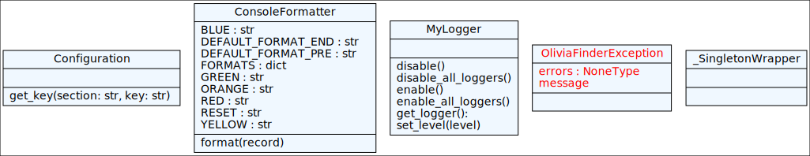
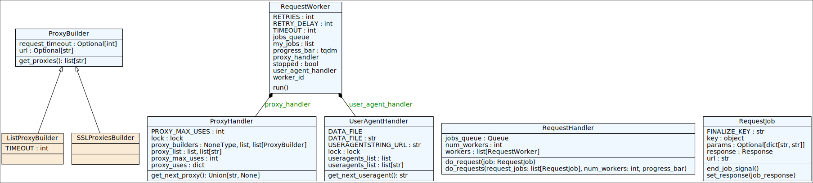
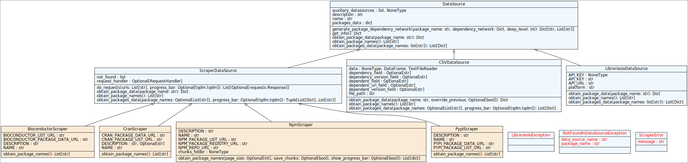
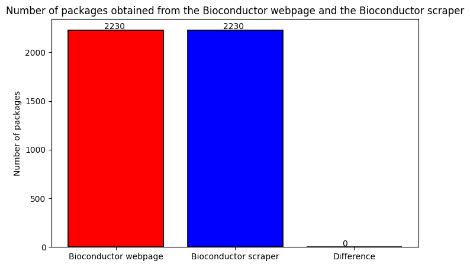
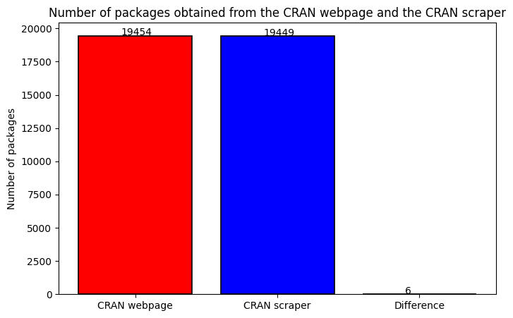
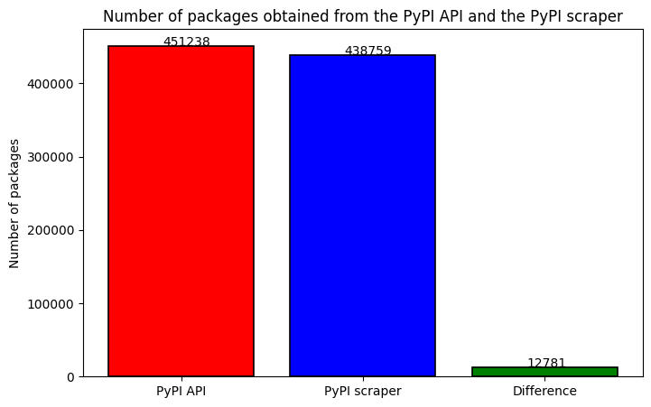
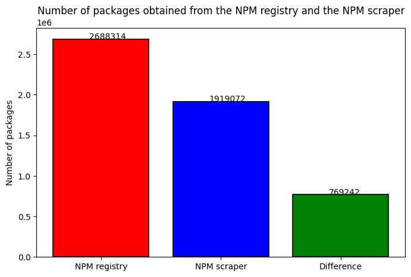
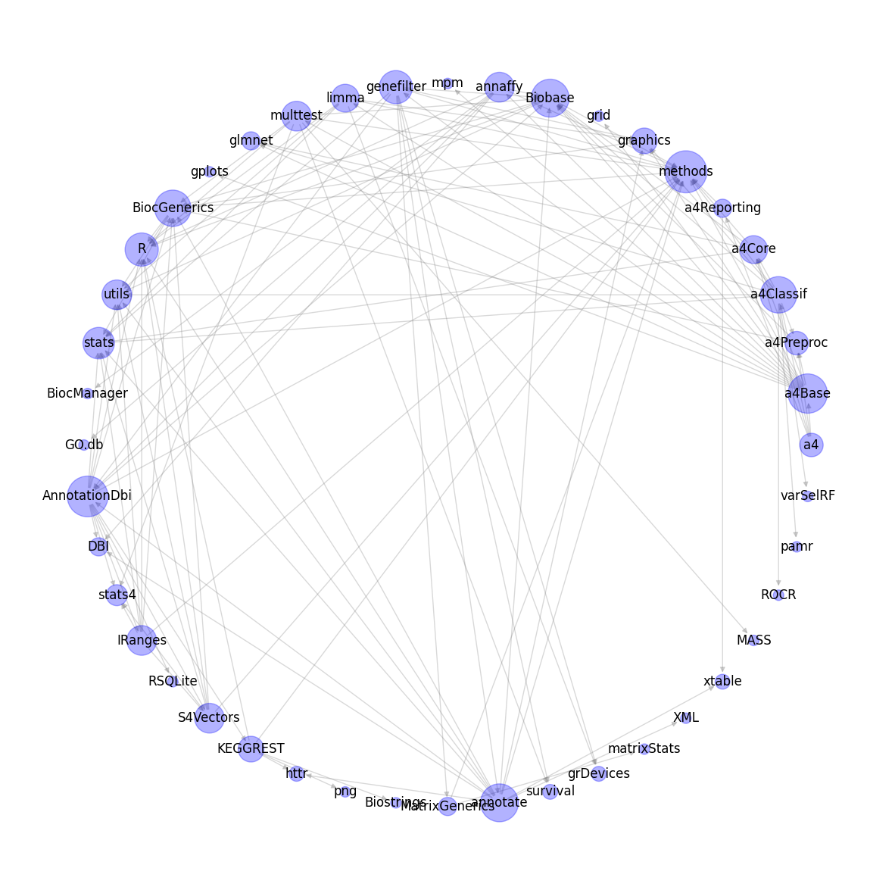

<h1 style="font-size: 80px; color: blue"> 
Olivia-finder
</h1>


Olivia Finder is an open source tool for extracting data from software package dependency networks in package managers, designed to be used in conjunction with Olivia.
Olivia Finder uses the web-scraping technique to get updated data, in addition to CSV files as another data source.


**You can find the documentation in:**

<a href="https://dab0012.github.io/olivia-finder">
<svg xmlns="http://www.w3.org/2000/svg" xmlns:xlink="http://www.w3.org/1999/xlink" width="132" height="20" role="img" aria-label="docs: at Github Pages"><title>docs: at Github Pages</title><linearGradient id="s" x2="0" y2="100%"><stop offset="0" stop-color="#bbb" stop-opacity=".1"/><stop offset="1" stop-opacity=".1"/></linearGradient><clipPath id="r"><rect width="132" height="20" rx="3" fill="#fff"/></clipPath><g clip-path="url(#r)"><rect width="35" height="20" fill="#555"/><rect x="35" width="97" height="20" fill="#4c1"/><rect width="132" height="20" fill="url(#s)"/></g><g fill="#fff" text-anchor="middle" font-family="Verdana,Geneva,DejaVu Sans,sans-serif" text-rendering="geometricPrecision" font-size="110"><text aria-hidden="true" x="185" y="150" fill="#010101" fill-opacity=".3" transform="scale(.1)" textLength="250">docs</text><text x="185" y="140" transform="scale(.1)" fill="#fff" textLength="250">docs</text><text aria-hidden="true" x="825" y="150" fill="#010101" fill-opacity=".3" transform="scale(.1)" textLength="870">at Github Pages</text><text x="825" y="140" transform="scale(.1)" fill="#fff" textLength="870">at Github Pages</text></g></svg>
</a>

**Author:**

Daniel Alonso Báscones

In this notebook the functionalities implemented in the library are shown


<p style="color:red"> Warning ⬇ </p>

# **Previous requirements**


<span style="color: red">Setup venv and install requirements</span>

##

You can install the requirements **locally** or create a **virtual environment** (recommended).

An script <span style="color: lime">activate_venv.sh</span> script is provided in the project root to satisfy this situation


```python
# !pip install -r ../lib/requirements.txt
```

If you use a virtual environment, it is necessary to configure it as selected in the Jupyter kernel


<span style="color: red">Setup library path:</span>

- Make sure to run this cell to have the **olivia-finder** library at PATH

##


```python
import sys
sys.path.append('../lib')
```


<span style="color: red">Load the olivia-finder modules to avoid future import errors:</span>

##


```python
# Utilities submodules
from olivia_finder.utilities.config import Configuration
from olivia_finder.utilities.logger import MyLogger

# MyRequests submodules
from olivia_finder.myrequests.job import RequestJob
from olivia_finder.myrequests.proxy_builder import ProxyBuilder
from olivia_finder.myrequests.proxy_builders.list_builder import ListProxyBuilder
from olivia_finder.myrequests.proxy_builders.ssl_proxies import SSLProxiesBuilder
from olivia_finder.myrequests.proxy_handler import ProxyHandler
from olivia_finder.myrequests.useragent_handler import UserAgentHandler
from olivia_finder.myrequests.request_handler import RequestHandler

# Data Source submodules
from olivia_finder.data_source.csv_ds import CSVDataSource
from olivia_finder.data_source.librariesio_ds import LibrariesioDataSource
from olivia_finder.data_source.repository_scrapers.bioconductor import BioconductorScraper
from olivia_finder.data_source.repository_scrapers.cran import CranScraper
from olivia_finder.data_source.repository_scrapers.npm import NpmScraper
from olivia_finder.data_source.repository_scrapers.pypi import PypiScraper

# Olivia Finder submodules
from olivia_finder.package_manager import PackageManager
from olivia_finder.package import Package

# Utilities
from matplotlib import pyplot as plt
```

<span style="color: red">Setup results</span>

Due to the high weight of some files and the maximum file size specified by github we are forced to use compression with the results folder to be able to store the data in the repository

##

***PACKING RESULTS FOLDER***


```python
!tar -cvjf results.tar.bz2 results
!split -b 50M -d --suffix-length=2 results.tar.bz2 results.tar.bz2_part_
!rm -r results
!rm results.tar.bz2
```

    results/
    results/package_managers/
    results/package_managers/npm_pm_scraper.olvpm
    results/package_managers/package_managers.tar.bz2_part_00
    results/package_managers/bioconductor_scraper.olvpm
    results/package_managers/cran_scraper.olvpm
    results/package_managers/pypi_scraper.olvpm
    results/working/
    results/working/extract_names.py
    results/working/download_package_names.py
    results/package_lists/
    results/package_lists/cran_scraped.txt
    results/package_lists/cran_webpage.txt
    results/package_lists/pypi_scraped.txt
    results/package_lists/npm_registry.txt
    results/package_lists/npm_scraped.txt
    results/package_lists/bioconductor_webpage.txt
    results/package_lists/bioconductor_scraped.txt
    results/package_lists/pypi_api_simple.txt
    results/csv_datasets/
    results/csv_datasets/cran/
    results/csv_datasets/cran/cran_adjlist_librariesio.csv
    results/csv_datasets/cran/cran_adjlist_scraping.csv
    results/csv_datasets/pypi/
    results/csv_datasets/pypi/pypi_adjlist_scraping.csv
    results/csv_datasets/npm/
    results/csv_datasets/npm/npm_adjlist_scraping.csv
    results/csv_datasets/bioconductor/
    results/csv_datasets/bioconductor/bioconductor_adjlist_scraping.csv


***UNPACKING RESULTS FOLDER***


```python
!cat results.tar.bz2_part_* > results.tar.bz2
!mkdir results
!tar -xvjf results.tar.bz2
!rm results.tar.bz2_part_*
!rm results.tar.bz2
```

    results/
    results/csv_datasets/
    results/csv_datasets/npm/
    results/csv_datasets/npm/npm_adjlist_scraping.csv
    results/csv_datasets/cran/
    results/csv_datasets/cran/cran_adjlist_scraping.csv
    results/csv_datasets/cran/cran_adjlist_librariesio.csv
    results/csv_datasets/pypi/
    results/csv_datasets/pypi/pypi_adjlist_scraping.csv
    results/csv_datasets/bioconductor/
    results/csv_datasets/bioconductor/bioconductor_adjlist_scraping.csv
    results/package_lists/
    results/package_lists/pypi_api_simple.txt
    results/package_lists/bioconductor_scraped.txt
    results/package_lists/bioconductor_webpage.txt
    results/package_lists/npm_registry.txt
    results/package_lists/npm_scraped.txt
    results/package_lists/pypi_scraped.txt
    results/package_lists/cran_scraped.txt
    results/package_lists/cran_webpage.txt
    results/working/
    results/working/download_package_names.py
    results/working/extract_names.py
    results/package_managers/
    results/package_managers/cran_scraper.olvpm
    results/package_managers/bioconductor_scraper.olvpm
    results/package_managers/npm_pm_scraper.olvpm
    results/package_managers/package_managers.tar.bz2_part_00
    results/package_managers/pypi_scraper.olvpm


# **Subpackage olivia_finder.utilities**


## Description


**Package structure**

```bash
.
├── config.py
├── exception.py
├── __init__.py
├── logger.py
└── utilities.py
```


```python
!pyreverse -o svg -d . -p utilities ../olivia_finder/utilities --colorized --max-color-depth=6
!sed -i "s/font-family=\"[^\"]*\"/font-family=\"$font\"/g" classes_utilities.svg
!sed -i 's/stroke="[^"]*"/stroke="black"/g' classes_utilities.svg
!mv classes_utilities.svg img/classes_utilities.svg
!rm -r packages_utilities.svg
```

    parsing ../olivia_finder/utilities/__init__.py...
    parsing /home/dnllns/Documentos/repositorios/olivia-finder/olivia_finder/olivia_finder/utilities/exception.py...
    parsing /home/dnllns/Documentos/repositorios/olivia-finder/olivia_finder/olivia_finder/utilities/config.py...
    parsing /home/dnllns/Documentos/repositorios/olivia-finder/olivia_finder/olivia_finder/utilities/logger.py...
    parsing /home/dnllns/Documentos/repositorios/olivia-finder/olivia_finder/olivia_finder/utilities/__init__.py...
    parsing /home/dnllns/Documentos/repositorios/olivia-finder/olivia_finder/olivia_finder/utilities/utilities.py...
    




## Module config


Provides the configuration class, which is used to obtain the configuration variables defined in the .ini configuration file

It is a Singleton instance so only one instance is accessible from any part of the code through the constructor


```python
Configuration().get_key('logger', 'status')
```


    'ENABLED'


## Module logger


The class MyLogger implements a customized logger to register the actions of execution

It is a Singleton instance so only one instance is accessible from any part of the code through the constructor


```python
MyLogger().set_level("DEBUG")

# Log messages
MyLogger().get_logger().debug("Hello World 1")
MyLogger().get_logger().info("Hello World 2")

# disable logger
MyLogger().disable()
MyLogger().get_logger().error("Hello World 3")

# re-enable logger
MyLogger().enable()

MyLogger().get_logger().warning("Hello World 4")
MyLogger().get_logger().error("Hello World 5")
MyLogger().get_logger().critical("Hello World 6")

# reset logger level
MyLogger().set_level(Configuration().get_key('logger', 'level'))
```

    2023-05-15 20:31:29,729 [DEBUG] in 1504849287.<module> (1504849287.py:4)
    Hello World 1
    2023-05-15 20:31:29,729 [INFO] in 1504849287.<module> (1504849287.py:5)
    Hello World 2
    2023-05-15 20:31:29,730 [WARNING] in 1504849287.<module> (1504849287.py:14)
    Hello World 4
    2023-05-15 20:31:29,730 [ERROR] in 1504849287.<module> (1504849287.py:15)
    Hello World 5
    2023-05-15 20:31:29,731 [CRITICAL] in 1504849287.<module> (1504849287.py:16)
    Hello World 6


The console handle shows the different levels using indicative colors

The file handle has the default format


```python
!cat logs/example_log.log
```

    2023-04-25 18:58:06 [DEBUG] Hello World 1 (1008465612.py:7)
    2023-04-25 18:58:06 [INFO] Hello World 2 (1008465612.py:8)
    2023-04-25 18:58:06 [WARNING] Hello World 4 (1008465612.py:17)
    2023-04-25 18:58:06 [ERROR] Hello World 5 (1008465612.py:18)
    2023-04-25 18:58:06 [CRITICAL] Hello World 6 (1008465612.py:19)
    2023-04-25 19:00:07 [INFO] RequestHandler: Creating RequestHandler object
    Number of jobs: 1
    Number of workers: 1
    Creating jobs queue (request_handler.py:20)
    2023-04-25 19:00:07 [INFO] Jobs queue created (request_handler.py:25)
    2023-04-25 19:00:07 [INFO] Jobs queue size: 1 (request_handler.py:26)
    2023-04-25 19:00:07 [INFO] Creating workers (request_handler.py:35)
    2023-04-25 19:00:07 [DEBUG] Starting new HTTPS connection (1): www.sslproxies.org:443 (connectionpool.py:973)
    2023-04-25 19:00:07 [DEBUG] https://www.sslproxies.org:443 "GET / HTTP/1.1" 200 None (connectionpool.py:452)
    2023-04-25 19:00:08 [DEBUG] Found 100 proxies from SSLProxiesBuilder (proxy_builder.py:75)
    2023-04-25 19:00:08 [DEBUG] Starting new HTTPS connection (1): raw.githubusercontent.com:443 (connectionpool.py:973)
    2023-04-25 19:00:08 [DEBUG] https://raw.githubusercontent.com:443 "GET /mertguvencli/http-proxy-list/main/proxy-list/data.txt HTTP/1.1" 200 2034 (connectionpool.py:452)
    2023-04-25 19:00:08 [DEBUG] Found 307 proxies from ListProxyBuilder (proxy_builder.py:75)
    2023-04-25 19:00:08 [DEBUG] Starting new HTTPS connection (1): raw.githubusercontent.com:443 (connectionpool.py:973)
    2023-04-25 19:00:08 [DEBUG] https://raw.githubusercontent.com:443 "GET /TheSpeedX/SOCKS-List/master/http.txt HTTP/1.1" 200 18270 (connectionpool.py:452)
    2023-04-25 19:00:08 [DEBUG] Found 2580 proxies from ListProxyBuilder (proxy_builder.py:75)
    2023-04-25 19:00:08 [DEBUG] Proxies len: 2661 (proxy_handler.py:160)
    2023-04-25 19:00:08 [DEBUG] Proxy Handler initialized with 2661 proxies (proxy_handler.py:82)
    2023-04-25 19:00:08 [DEBUG] Useragents loaded from file: /home/dnllns/Documentos/repositorios/olivia-finder/olivia_finder/olivia_finder/myrequests/data/useragents.txt (useragent_handler.py:35)
    2023-04-25 19:00:08 [INFO] Workers created (request_handler.py:40)
    2023-04-25 19:00:08 [INFO] Number of workers: 1 (request_handler.py:41)
    2023-04-25 19:00:08 [DEBUG] Worker 0: Got job from queue
    Job key: networkx
    url: https://www.pypi.org/project/networkx/ (request_worker.py:67)
    2023-04-25 19:00:08 [DEBUG] Worker 0: Obtaining proxy and user agent (request_worker.py:75)
    2023-04-25 19:00:08 [DEBUG] Getting next proxy (proxy_handler.py:100)
    2023-04-25 19:00:08 [DEBUG] Getting next useragent (useragent_handler.py:134)
    2023-04-25 19:00:08 [DEBUG] Worker 0: Obtained proxy: http://190.121.143.236:999 and user agent: Mozilla/5.0 (X11; Ubuntu; Linux i686; rv:38.0) Gecko/20100101 Firefox/38.0 (request_worker.py:77)
    2023-04-25 19:00:08 [DEBUG] Worker 0: Doing request (request_worker.py:82)
    2023-04-25 19:00:08 [DEBUG] Starting new HTTPS connection (1): www.pypi.org:443 (connectionpool.py:973)
    2023-04-25 19:00:08 [DEBUG] https://www.pypi.org:443 "GET /project/networkx/ HTTP/1.1" 301 122 (connectionpool.py:452)
    2023-04-25 19:00:08 [DEBUG] Starting new HTTPS connection (1): pypi.org:443 (connectionpool.py:973)
    2023-04-25 19:00:08 [DEBUG] https://pypi.org:443 "GET /project/networkx/ HTTP/1.1" 200 14033 (connectionpool.py:452)
    2023-04-25 19:00:08 [DEBUG] Worker 0: https://www.pypi.org/project/networkx/, Response: <Response [200]> (request_worker.py:204)
    2023-04-25 19:00:08 [DEBUG] Worker 0: Done for https://www.pypi.org/project/networkx/ (request_worker.py:99)
    2023-04-25 19:00:08 [DEBUG] Worker 0: Got job from queue
    Job key: FINALIZE
    url: None (request_worker.py:67)
    2023-04-25 19:00:12 [INFO] RequestHandler: Creating RequestHandler object
    Number of jobs: 8
    Number of workers: 4
    Creating jobs queue (request_handler.py:20)
    2023-04-25 19:00:12 [INFO] Jobs queue created (request_handler.py:25)
    2023-04-25 19:00:12 [INFO] Jobs queue size: 8 (request_handler.py:26)
    2023-04-25 19:00:12 [INFO] Creating workers (request_handler.py:35)
    2023-04-25 19:00:12 [INFO] Workers created (request_handler.py:40)
    2023-04-25 19:00:12 [INFO] Number of workers: 4 (request_handler.py:41)
    2023-04-25 19:00:12 [INFO] Starting worker 0 (request_handler.py:62)
    2023-04-25 19:00:12 [DEBUG] Worker 0: Got job from queue
    Job key: networkx
    url: https://www.pypi.org/project/networkx/ (request_worker.py:67)
    2023-04-25 19:00:12 [INFO] Starting worker 1 (request_handler.py:62)
    2023-04-25 19:00:12 [DEBUG] Worker 0: Obtaining proxy and user agent (request_worker.py:75)
    2023-04-25 19:00:12 [DEBUG] Worker 1: Got job from queue
    Job key: pandas
    url: https://www.pypi.org/project/pandas/ (request_worker.py:67)
    2023-04-25 19:00:12 [INFO] Starting worker 2 (request_handler.py:62)
    2023-04-25 19:00:12 [DEBUG] Getting next proxy (proxy_handler.py:100)
    2023-04-25 19:00:12 [DEBUG] Worker 1: Obtaining proxy and user agent (request_worker.py:75)
    2023-04-25 19:00:12 [DEBUG] Worker 2: Got job from queue
    Job key: numpy
    url: https://www.pypi.org/project/numpy/ (request_worker.py:67)
    2023-04-25 19:00:12 [INFO] Starting worker 3 (request_handler.py:62)
    2023-04-25 19:00:12 [DEBUG] Getting next useragent (useragent_handler.py:134)
    2023-04-25 19:00:12 [DEBUG] Getting next proxy (proxy_handler.py:100)
    2023-04-25 19:00:12 [DEBUG] Worker 2: Obtaining proxy and user agent (request_worker.py:75)
    2023-04-25 19:00:12 [DEBUG] Worker 3: Got job from queue
    Job key: matplotlib
    url: https://www.pypi.org/project/matplotlib/ (request_worker.py:67)
    2023-04-25 19:00:12 [DEBUG] Worker 0: Obtained proxy: http://153.101.67.170:9002 and user agent: Mozilla/5.0 (Windows NT 6.1; Win64; x64) AppleWebKit/537.36 (KHTML, like Gecko) Chrome/44.0.2403.157 Safari/537.36 (request_worker.py:77)
    2023-04-25 19:00:12 [INFO] Joining worker 0 (request_handler.py:67)
    2023-04-25 19:00:12 [DEBUG] Getting next useragent (useragent_handler.py:134)
    2023-04-25 19:00:12 [DEBUG] Getting next proxy (proxy_handler.py:100)
    2023-04-25 19:00:12 [DEBUG] Worker 3: Obtaining proxy and user agent (request_worker.py:75)
    2023-04-25 19:00:12 [DEBUG] Worker 0: Doing request (request_worker.py:82)
    2023-04-25 19:00:12 [DEBUG] Worker 1: Obtained proxy: http://117.160.250.132:80 and user agent: Mozilla/5.0 (Windows NT 6.1) AppleWebKit/537.36 (KHTML, like Gecko) Chrome/43.0.2357.132 Safari/537.36 (request_worker.py:77)
    2023-04-25 19:00:12 [DEBUG] Getting next useragent (useragent_handler.py:134)
    2023-04-25 19:00:12 [DEBUG] Getting next proxy (proxy_handler.py:100)
    2023-04-25 19:00:12 [DEBUG] Starting new HTTPS connection (1): www.pypi.org:443 (connectionpool.py:973)
    2023-04-25 19:00:12 [DEBUG] Worker 1: Doing request (request_worker.py:82)
    2023-04-25 19:00:12 [DEBUG] Worker 2: Obtained proxy: http://185.44.232.30:53281 and user agent: Mozilla/5.0 (Macintosh; Intel Mac OS X 10_10_4) AppleWebKit/537.36 (KHTML, like Gecko) Chrome/45.0.2454.85 Safari/537.36 (request_worker.py:77)
    2023-04-25 19:00:12 [DEBUG] Getting next useragent (useragent_handler.py:134)
    2023-04-25 19:00:12 [DEBUG] Starting new HTTPS connection (1): www.pypi.org:443 (connectionpool.py:973)
    2023-04-25 19:00:12 [DEBUG] Worker 2: Doing request (request_worker.py:82)
    2023-04-25 19:00:12 [DEBUG] Worker 3: Obtained proxy: http://188.34.164.99:8080 and user agent: Mozilla/5.0 (Windows NT 6.1; rv:36.0) Gecko/20100101 Firefox/36.0 (request_worker.py:77)
    2023-04-25 19:00:12 [DEBUG] Starting new HTTPS connection (1): www.pypi.org:443 (connectionpool.py:973)
    2023-04-25 19:00:12 [DEBUG] Worker 3: Doing request (request_worker.py:82)
    2023-04-25 19:00:12 [DEBUG] Starting new HTTPS connection (1): www.pypi.org:443 (connectionpool.py:973)
    2023-04-25 19:00:12 [DEBUG] https://www.pypi.org:443 "GET /project/matplotlib/ HTTP/1.1" 301 122 (connectionpool.py:452)
    2023-04-25 19:00:12 [DEBUG] Starting new HTTPS connection (1): pypi.org:443 (connectionpool.py:973)
    2023-04-25 19:00:12 [DEBUG] https://www.pypi.org:443 "GET /project/pandas/ HTTP/1.1" 301 122 (connectionpool.py:452)
    2023-04-25 19:00:12 [DEBUG] Starting new HTTPS connection (1): pypi.org:443 (connectionpool.py:973)
    2023-04-25 19:00:12 [DEBUG] https://www.pypi.org:443 "GET /project/networkx/ HTTP/1.1" 301 122 (connectionpool.py:452)
    2023-04-25 19:00:12 [DEBUG] https://www.pypi.org:443 "GET /project/numpy/ HTTP/1.1" 301 122 (connectionpool.py:452)
    2023-04-25 19:00:12 [DEBUG] Starting new HTTPS connection (1): pypi.org:443 (connectionpool.py:973)
    2023-04-25 19:00:12 [DEBUG] Starting new HTTPS connection (1): pypi.org:443 (connectionpool.py:973)
    2023-04-25 19:00:12 [DEBUG] https://pypi.org:443 "GET /project/matplotlib/ HTTP/1.1" 200 25440 (connectionpool.py:452)
    2023-04-25 19:00:12 [DEBUG] Worker 3: https://www.pypi.org/project/matplotlib/, Response: <Response [200]> (request_worker.py:204)
    2023-04-25 19:00:12 [DEBUG] Worker 3: Done for https://www.pypi.org/project/matplotlib/ (request_worker.py:99)
    2023-04-25 19:00:12 [DEBUG] Worker 3: Got job from queue
    Job key: scipy
    url: https://www.pypi.org/project/scipy/ (request_worker.py:67)
    2023-04-25 19:00:12 [DEBUG] Worker 3: Obtaining proxy and user agent (request_worker.py:75)
    2023-04-25 19:00:12 [DEBUG] Getting next proxy (proxy_handler.py:100)
    2023-04-25 19:00:12 [DEBUG] Getting next useragent (useragent_handler.py:134)
    2023-04-25 19:00:12 [DEBUG] Worker 3: Obtained proxy: http://202.8.73.206:5678 and user agent: Mozilla/5.0 (Macintosh; Intel Mac OS X 10_10_3) AppleWebKit/600.6.3 (KHTML, like Gecko) Version/8.0.6 Safari/600.6.3 (request_worker.py:77)
    2023-04-25 19:00:12 [DEBUG] Worker 3: Doing request (request_worker.py:82)
    2023-04-25 19:00:12 [DEBUG] Starting new HTTPS connection (1): www.pypi.org:443 (connectionpool.py:973)
    2023-04-25 19:00:12 [DEBUG] https://pypi.org:443 "GET /project/pandas/ HTTP/1.1" 200 23715 (connectionpool.py:452)
    2023-04-25 19:00:12 [DEBUG] Worker 1: https://www.pypi.org/project/pandas/, Response: <Response [200]> (request_worker.py:204)
    2023-04-25 19:00:12 [DEBUG] Worker 1: Done for https://www.pypi.org/project/pandas/ (request_worker.py:99)
    2023-04-25 19:00:12 [DEBUG] Worker 1: Got job from queue
    Job key: scikit-learn
    url: https://www.pypi.org/project/scikit-learn/ (request_worker.py:67)
    2023-04-25 19:00:12 [DEBUG] Worker 1: Obtaining proxy and user agent (request_worker.py:75)
    2023-04-25 19:00:12 [DEBUG] Getting next proxy (proxy_handler.py:100)
    2023-04-25 19:00:12 [DEBUG] Getting next useragent (useragent_handler.py:134)
    2023-04-25 19:00:12 [DEBUG] Worker 1: Obtained proxy: http://194.34.232.107:80 and user agent: Mozilla/5.0 (compatible; Windows NT 6.1; Catchpoint) AppleWebKit/537.36 (KHTML, like Gecko) Chrome/43.0.2357.81 Safari/537.36 (request_worker.py:77)
    2023-04-25 19:00:12 [DEBUG] Worker 1: Doing request (request_worker.py:82)
    2023-04-25 19:00:12 [DEBUG] Starting new HTTPS connection (1): www.pypi.org:443 (connectionpool.py:973)
    2023-04-25 19:00:13 [DEBUG] https://pypi.org:443 "GET /project/networkx/ HTTP/1.1" 200 14033 (connectionpool.py:452)
    2023-04-25 19:00:13 [DEBUG] Worker 0: https://www.pypi.org/project/networkx/, Response: <Response [200]> (request_worker.py:204)
    2023-04-25 19:00:13 [DEBUG] https://pypi.org:443 "GET /project/numpy/ HTTP/1.1" 200 22275 (connectionpool.py:452)
    2023-04-25 19:00:13 [DEBUG] Worker 0: Done for https://www.pypi.org/project/networkx/ (request_worker.py:99)
    2023-04-25 19:00:13 [DEBUG] Worker 0: Got job from queue
    Job key: tensorflow
    url: https://www.pypi.org/project/tensorflow/ (request_worker.py:67)
    2023-04-25 19:00:13 [DEBUG] Worker 0: Obtaining proxy and user agent (request_worker.py:75)
    2023-04-25 19:00:13 [DEBUG] Getting next proxy (proxy_handler.py:100)
    2023-04-25 19:00:13 [DEBUG] Getting next useragent (useragent_handler.py:134)
    2023-04-25 19:00:13 [DEBUG] Worker 0: Obtained proxy: http://195.8.52.158:6666 and user agent: Mozilla/5.0 (Windows NT 6.1) AppleWebKit/537.36 (KHTML, like Gecko) Chrome/37.0.2062.124 Safari/537.36 (request_worker.py:77)
    2023-04-25 19:00:13 [DEBUG] Worker 0: Doing request (request_worker.py:82)
    2023-04-25 19:00:13 [DEBUG] Starting new HTTPS connection (1): www.pypi.org:443 (connectionpool.py:973)
    2023-04-25 19:00:13 [DEBUG] Worker 2: https://www.pypi.org/project/numpy/, Response: <Response [200]> (request_worker.py:204)
    2023-04-25 19:00:13 [DEBUG] Worker 2: Done for https://www.pypi.org/project/numpy/ (request_worker.py:99)
    2023-04-25 19:00:13 [DEBUG] Worker 2: Got job from queue
    Job key: keras
    url: https://www.pypi.org/project/keras/ (request_worker.py:67)
    2023-04-25 19:00:13 [DEBUG] Worker 2: Obtaining proxy and user agent (request_worker.py:75)
    2023-04-25 19:00:13 [DEBUG] Getting next proxy (proxy_handler.py:100)
    2023-04-25 19:00:13 [DEBUG] Getting next useragent (useragent_handler.py:134)
    2023-04-25 19:00:13 [DEBUG] Worker 2: Obtained proxy: http://24.51.32.59:8080 and user agent: Mozilla/5.0 (Windows NT 6.2; Win64; x64) AppleWebKit/537.36 (KHTML, like Gecko) Chrome/45.0.2454.85 Safari/537.36 (request_worker.py:77)
    2023-04-25 19:00:13 [DEBUG] Worker 2: Doing request (request_worker.py:82)
    2023-04-25 19:00:13 [DEBUG] Starting new HTTPS connection (1): www.pypi.org:443 (connectionpool.py:973)
    2023-04-25 19:00:13 [DEBUG] https://www.pypi.org:443 "GET /project/scikit-learn/ HTTP/1.1" 301 122 (connectionpool.py:452)
    2023-04-25 19:00:13 [DEBUG] Starting new HTTPS connection (1): pypi.org:443 (connectionpool.py:973)
    2023-04-25 19:00:13 [DEBUG] https://www.pypi.org:443 "GET /project/scipy/ HTTP/1.1" 301 122 (connectionpool.py:452)
    2023-04-25 19:00:13 [DEBUG] Starting new HTTPS connection (1): pypi.org:443 (connectionpool.py:973)
    2023-04-25 19:00:13 [DEBUG] https://www.pypi.org:443 "GET /project/keras/ HTTP/1.1" 301 122 (connectionpool.py:452)
    2023-04-25 19:00:13 [DEBUG] Starting new HTTPS connection (1): pypi.org:443 (connectionpool.py:973)
    2023-04-25 19:00:13 [DEBUG] https://pypi.org:443 "GET /project/scikit-learn/ HTTP/1.1" 200 19915 (connectionpool.py:452)
    2023-04-25 19:00:13 [DEBUG] https://www.pypi.org:443 "GET /project/tensorflow/ HTTP/1.1" 301 122 (connectionpool.py:452)
    2023-04-25 19:00:13 [DEBUG] Starting new HTTPS connection (1): pypi.org:443 (connectionpool.py:973)
    2023-04-25 19:00:13 [DEBUG] https://pypi.org:443 "GET /project/scipy/ HTTP/1.1" 200 19194 (connectionpool.py:452)
    2023-04-25 19:00:13 [DEBUG] Worker 3: https://www.pypi.org/project/scipy/, Response: <Response [200]> (request_worker.py:204)
    2023-04-25 19:00:13 [DEBUG] Worker 3: Done for https://www.pypi.org/project/scipy/ (request_worker.py:99)
    2023-04-25 19:00:13 [DEBUG] Worker 3: Got job from queue
    Job key: FINALIZE
    url: None (request_worker.py:67)
    2023-04-25 19:00:13 [DEBUG] Worker 1: https://www.pypi.org/project/scikit-learn/, Response: <Response [200]> (request_worker.py:204)
    2023-04-25 19:00:13 [DEBUG] Worker 1: Done for https://www.pypi.org/project/scikit-learn/ (request_worker.py:99)
    2023-04-25 19:00:13 [DEBUG] Worker 1: Got job from queue
    Job key: FINALIZE
    url: None (request_worker.py:67)
    2023-04-25 19:00:13 [DEBUG] https://pypi.org:443 "GET /project/keras/ HTTP/1.1" 200 11541 (connectionpool.py:452)
    2023-04-25 19:00:13 [DEBUG] Worker 2: https://www.pypi.org/project/keras/, Response: <Response [200]> (request_worker.py:204)
    2023-04-25 19:00:13 [DEBUG] Worker 2: Done for https://www.pypi.org/project/keras/ (request_worker.py:99)
    2023-04-25 19:00:13 [DEBUG] Worker 2: Got job from queue
    Job key: FINALIZE
    url: None (request_worker.py:67)
    2023-04-25 19:00:13 [DEBUG] https://pypi.org:443 "GET /project/tensorflow/ HTTP/1.1" 200 16595 (connectionpool.py:452)
    2023-04-25 19:00:13 [DEBUG] Worker 0: https://www.pypi.org/project/tensorflow/, Response: <Response [200]> (request_worker.py:204)
    2023-04-25 19:00:13 [DEBUG] Worker 0: Done for https://www.pypi.org/project/tensorflow/ (request_worker.py:99)
    2023-04-25 19:00:13 [DEBUG] Worker 0: Got job from queue
    Job key: FINALIZE
    url: None (request_worker.py:67)
    2023-04-25 19:00:13 [INFO] Joining worker 1 (request_handler.py:67)
    2023-04-25 19:00:13 [INFO] Joining worker 2 (request_handler.py:67)
    2023-04-25 19:00:13 [INFO] Joining worker 3 (request_handler.py:67)
    2023-04-25 19:00:13 [INFO] Worker 0 finished (request_handler.py:73)
    2023-04-25 19:00:13 [INFO] Worker 1 finished (request_handler.py:73)
    2023-04-25 19:00:13 [INFO] Worker 2 finished (request_handler.py:73)
    2023-04-25 19:00:13 [INFO] Worker 3 finished (request_handler.py:73)


# **Subpackage olivia_finder.myrequests**


### Description


The MyRequest subpackage is designed to obtain data repetitively from a web server

It is able to perform requests with thread parallelism

##### Package structure:

```
├── data
│   └── useragents.txt
├── __init__.py
├── job.py
├── proxy_builder.py
├── proxy_builders
│   ├── __init__.py
│   ├── list_builder.py
│   ├── proxy_builder.py
│   └── ssl_proxies.py
├── proxy_handler.py
├── request_handler.py
├── request_worker.py
└── useragent_handler.py
```

##### Package modules:

- **job**

  It represents a web request work, implements Thread

- **proxy_builder**

  It contains the ProxyBuilder class, used to request proxies from web services

- **proxy_handler**

  It contains the ProxyHandler class, used by the RequestHandler object to obtain a fresh proxy (Singleton)

- **useragent_handler**

  It contains the UserAgentHandler class, used by the RequestHandler object to obtain a fresh user agent (Singleton)

- **request_handler**

  It contains the RequestHandler class, from which we can perform the corresponding works

##### Doc pages

For more information see [MyRequest package doc](https://dab0012.github.io/olivia-finder/olivia_finder/myrequests/myrequests_module.html)


```python
!pyreverse -o svg -d . -p myrequests ../olivia_finder/myrequests --colorized --max-color-depth=6
!sed -i "s/font-family=\"[^\"]*\"/font-family=\"$font\"/g" classes_myrequests.svg
!sed -i 's/stroke="[^"]*"/stroke="black"/g' classes_myrequests.svg
!mv classes_myrequests.svg img/classes_myrequests.svg
!rm -r packages_myrequests.svg
```




### Class ProxyBuilder and subclasses


You have the functionality of obtaining a list of internet proxys from some more or less stable data source

ProxyBuilder It is an abstract class and should not be used directly, Its use is made through its subclasses


```python
MyLogger().set_level("DEBUG")
```


```python
try:
    pb = ProxyBuilder()
except Exception as e:
    print(e)
```

    Can't instantiate abstract class ProxyBuilder with abstract method _parse_request


We can focus on two different ways:

- Obtain the data through Web Scraping from some website that provides updated proxys

- Obtain the data from a proxies list in format `<IP>:<PORT>` from a web server

This is shown below


**_Web scraping implementation (from sslproxies.org)_**


```python
pb_SSLProxies = SSLProxiesBuilder()
pb_SSLProxies.get_proxies()
```

    2023-05-01 17:32:25,773 [DEBUG] in connectionpool._new_conn (connectionpool.py:973)
    Starting new HTTPS connection (1): www.sslproxies.org:443
    2023-05-01 17:32:33,787 [DEBUG] in connectionpool._make_request (connectionpool.py:452)
    https://www.sslproxies.org:443 "GET / HTTP/1.1" 200 None
    2023-05-01 17:32:33,856 [DEBUG] in proxy_builder.get_proxies (proxy_builder.py:75)
    Found 100 proxies from SSLProxiesBuilder


    ['35.247.245.218:3129',
     '164.90.253.93:3128',
     '190.61.88.147:8080',
     '152.67.10.190:8100',
     '113.53.231.133:3129',
     '115.144.101.201:10001',
     '207.38.87.110:30114',
     '43.156.100.152:80',
     '198.27.74.6:9300',
     '34.162.144.68:8585',
     '213.83.46.204:3128',
     '20.241.236.196:3128',
     '64.225.8.82:9995',
     '103.118.175.200:3127',
     '194.213.18.81:50098',
     '35.247.198.109:3129',
     '35.247.242.101:3129',
     '35.247.218.71:3129',
     '35.247.223.51:3129',
     '51.159.0.236:3128',
     '35.247.209.139:3129',
     '186.121.235.66:8080',
     '139.99.95.108:8080',
     '35.247.236.135:3129',
     '8.219.97.248:80',
     '87.237.239.95:3128',
     '35.247.247.141:3129',
     '34.94.92.1:8585',
     '158.69.73.79:9300',
     '35.247.237.131:3129',
     '178.151.205.154:45099',
     '35.247.197.18:3129',
     '103.5.109.41:8085',
     '34.118.118.94:8585',
     '34.94.3.209:8585',
     '156.234.201.37:7890',
     '94.130.79.225:24000',
     '200.105.215.22:33630',
     '35.247.239.123:3129',
     '158.160.56.149:8080',
     '61.28.233.217:3128',
     '95.216.196.32:30008',
     '115.144.102.39:10080',
     '35.247.197.36:3129',
     '179.96.28.58:80',
     '178.33.3.163:8080',
     '181.129.1.229:999',
     '34.162.201.107:8585',
     '34.125.80.226:8585',
     '35.247.208.170:3129',
     '5.189.184.6:80',
     '190.202.3.22:32650',
     '66.188.181.143:8080',
     '35.247.227.219:3129',
     '160.251.23.81:8029',
     '188.132.221.24:8080',
     '34.83.139.129:8585',
     '35.247.247.183:3129',
     '51.79.50.31:9300',
     '185.16.61.36:45212',
     '34.116.251.48:8585',
     '103.69.108.78:8191',
     '129.153.107.221:80',
     '186.0.144.131:92',
     '34.125.100.27:8585',
     '103.212.94.253:48434',
     '35.247.253.239:3129',
     '34.162.216.44:8585',
     '195.8.52.158:6666',
     '37.97.132.31:443',
     '34.94.232.140:8585',
     '34.174.48.66:8585',
     '35.247.251.168:3129',
     '103.129.92.95:9995',
     '35.247.214.238:3129',
     '45.61.187.67:4007',
     '34.162.99.58:8585',
     '35.247.203.199:3129',
     '35.247.246.228:3129',
     '35.247.193.135:3129',
     '35.247.240.117:3129',
     '35.247.234.213:3129',
     '35.247.248.104:3129',
     '35.247.248.46:3129',
     '20.69.79.158:8443',
     '95.137.240.30:60030',
     '83.151.4.172:57812',
     '200.25.254.193:54240',
     '35.247.254.207:3129',
     '20.99.187.69:8443',
     '82.148.6.193:80',
     '64.225.4.12:9991',
     '144.217.7.157:9300',
     '198.44.188.147:45787',
     '64.225.4.29:9499',
     '35.247.219.188:3129',
     '205.213.80.8:8009',
     '103.116.203.245:43520',
     '93.91.112.247:41258',
     '103.180.59.220:8080']


**_Web list implementation (from lists)_**


```python
pb_ListBuilder = ListProxyBuilder(url="https://raw.githubusercontent.com/mertguvencli/http-proxy-list/main/proxy-list/data.txt")
pb_ListBuilder.get_proxies()
```

    2023-05-01 17:32:33,929 [DEBUG] in connectionpool._new_conn (connectionpool.py:973)
    Starting new HTTPS connection (1): raw.githubusercontent.com:443
    2023-05-01 17:32:34,011 [DEBUG] in connectionpool._make_request (connectionpool.py:452)
    https://raw.githubusercontent.com:443 "GET /mertguvencli/http-proxy-list/main/proxy-list/data.txt HTTP/1.1" 200 2398
    2023-05-01 17:32:34,014 [DEBUG] in proxy_builder.get_proxies (proxy_builder.py:75)
    Found 350 proxies from ListProxyBuilder


    ['20.241.236.196:3128',
     '3.8.144.154:3128',
     '34.94.3.209:8585',
     '20.99.187.69:8443',
     '35.181.54.72:3128',
     '35.178.115.75:3128',
     '34.174.145.27:8585',
     '116.203.120.106:8080',
     '49.12.219.253:8080',
     '128.140.9.127:8080',
     '167.235.229.11:8080',
     '20.241.236.196:3128',
     '65.109.138.100:8080',
     '35.247.236.135:3129',
     '49.13.1.238:8080',
     '65.21.146.223:8080',
     '35.247.192.123:3129',
     '207.38.87.110:30114',
     '34.174.145.27:8585',
     '49.13.2.254:8080',
     '65.21.244.31:8080',
     '43.156.100.152:80',
     '135.181.198.30:8080',
     '35.247.243.35:3129',
     '135.181.31.43:8080',
     '186.121.235.66:8080',
     '195.201.35.152:8080',
     '35.247.193.135:3129',
     '205.213.80.8:8009',
     '95.216.199.152:8080',
     '35.247.208.170:3129',
     '20.69.79.158:8443',
     '35.247.192.233:3129',
     '77.233.5.68:55443',
     '91.107.216.77:8080',
     '35.247.249.71:3129',
     '113.53.231.133:3129',
     '162.55.218.221:8080',
     '95.216.196.32:30008',
     '8.219.97.248:80',
     '49.12.103.88:8080',
     '35.247.241.32:3129',
     '128.140.3.26:8080',
     '128.140.80.27:8080',
     '159.69.113.91:8080',
     '113.53.94.12:65535',
     '35.247.246.228:3129',
     '82.208.111.19:80',
     '152.67.10.190:8100',
     '95.217.234.46:8080',
     '49.12.211.76:8080',
     '135.181.33.197:8080',
     '207.38.87.110:30114',
     '35.247.205.198:3129',
     '76.181.157.122:32650',
     '34.94.3.209:8585',
     '115.144.101.201:10001',
     '94.130.79.225:24000',
     '45.61.187.67:4007',
     '185.16.61.36:45212',
     '158.160.56.149:8080',
     '51.159.0.236:3128',
     '34.162.229.108:8585',
     '76.181.157.122:32650',
     '20.69.79.158:8443',
     '181.129.1.229:999',
     '110.34.3.229:3128',
     '221.225.81.91:3128',
     '34.162.229.108:8585',
     '171.6.77.117:8080',
     '103.69.108.78:8191',
     '200.105.215.22:33630',
     '157.245.156.176:3128',
     '185.15.172.212:3128',
     '122.155.165.191:3128',
     '213.74.163.181:8080',
     '193.138.178.6:8282',
     '185.44.232.30:53281',
     '34.148.61.164:8585',
     '195.201.35.152:8080',
     '34.106.69.86:8585',
     '65.108.230.239:43243',
     '135.181.104.145:8080',
     '135.181.33.197:8080',
     '65.109.173.52:8080',
     '34.102.104.21:8585',
     '212.156.123.218:8080',
     '5.78.76.77:8080',
     '8.219.97.248:80',
     '167.235.229.11:8080',
     '114.255.132.60:3128',
     '35.198.33.35:3129',
     '24.51.32.59:8080',
     '103.163.227.247:3125',
     '65.109.138.139:8080',
     '183.89.8.75:8080',
     '34.125.224.180:8585',
     '179.63.149.5:999',
     '45.224.148.117:999',
     '186.121.200.4:80',
     '201.182.251.142:999',
     '103.80.54.132:32650',
     '190.187.201.26:8080',
     '27.70.161.33:10048',
     '200.106.184.97:999',
     '165.225.196.155:10101',
     '1.2.252.65:8080',
     '45.61.187.67:4007',
     '165.225.196.155:11544',
     '103.51.21.250:83',
     '103.78.170.13:83',
     '45.61.187.67:4009',
     '158.69.27.94:9300',
     '45.70.236.194:999',
     '165.225.196.154:11240',
     '165.225.196.155:10801',
     '49.12.106.252:8080',
     '65.109.160.122:8080',
     '103.157.13.75:84',
     '62.210.209.223:3128',
     '165.225.196.151:10000',
     '95.56.254.139:3128',
     '95.56.254.139:3128',
     '165.225.196.151:10470',
     '5.78.97.159:8080',
     '165.225.196.155:11294',
     '165.225.196.154:9443',
     '165.225.196.154:10014',
     '165.225.196.150:9443',
     '186.97.102.68:999',
     '205.213.80.8:8009',
     '201.182.251.142:999',
     '103.165.61.139:3128',
     '45.7.66.248:999',
     '142.132.233.188:8080',
     '165.225.196.153:10001',
     '43.156.100.152:80',
     '95.216.188.138:8080',
     '202.131.159.218:1111',
     '14.207.20.219:8080',
     '165.225.196.154:11395',
     '110.78.149.205:8999',
     '103.111.118.68:1080',
     '181.205.61.118:999',
     '185.16.61.36:45212',
     '145.40.68.200:10019',
     '186.121.214.210:32650',
     '103.165.155.75:1111',
     '103.4.167.69:8080',
     '38.44.237.54:999',
     '165.225.196.153:10900',
     '165.225.196.150:10900',
     '165.225.196.152:10000',
     '217.13.211.253:80',
     '222.127.49.35:8080',
     '65.109.235.123:8080',
     '165.225.196.155:13434',
     '165.225.196.154:11238',
     '165.225.196.155:11703',
     '165.225.196.152:10001',
     '35.247.226.255:3129',
     '147.139.181.92:3128',
     '5.78.45.97:8080',
     '200.123.29.37:3128',
     '67.22.28.62:8080',
     '178.216.24.80:55443',
     '20.69.79.158:8443',
     '200.105.215.22:33630',
     '185.108.141.114:8080',
     '142.132.233.188:8080',
     '43.134.211.34:3128',
     '197.232.152.244:41890',
     '8.219.97.248:80',
     '94.228.204.225:41890',
     '14.207.146.53:8080',
     '103.141.247.6:8080',
     '103.160.15.38:3125',
     '103.155.54.237:83',
     '41.65.236.53:1976',
     '5.28.35.226:9812',
     '186.3.85.136:999',
     '88.255.185.249:8080',
     '134.35.13.16:8080',
     '158.160.56.149:8080',
     '36.93.2.50:8080',
     '35.247.228.213:3129',
     '202.43.147.167:6666',
     '177.69.180.171:8080',
     '223.25.100.234:8080',
     '47.242.3.214:8081',
     '43.138.174.22:8888',
     '14.140.131.82:3128',
     '185.108.141.74:8080',
     '94.74.131.234:80',
     '102.165.51.172:3128',
     '183.4.47.38:7890',
     '190.97.228.18:999',
     '102.216.69.176:8080',
     '35.247.205.199:3129',
     '186.121.200.4:80',
     '190.254.0.110:999',
     '107.173.156.182:3000',
     '35.247.242.101:3129',
     '143.202.77.106:999',
     '5.104.174.199:23500',
     '109.86.182.203:3128',
     '163.177.106.4:8001',
     '178.218.88.12:8123',
     '113.53.231.133:3129',
     '103.157.13.75:84',
     '180.191.22.197:8080',
     '103.137.91.250:8080',
     '5.202.53.65:8080',
     '107.173.144.80:8080',
     '38.52.221.254:999',
     '203.188.32.107:9812',
     '88.99.186.50:8080',
     '5.161.221.0:8080',
     '35.247.220.179:3129',
     '179.63.149.5:999',
     '58.69.117.212:8082',
     '196.202.210.35:32650',
     '103.176.96.86:8080',
     '105.112.191.250:3128',
     '51.159.0.236:3128',
     '103.79.74.129:53879',
     '35.247.234.213:3129',
     '38.56.70.97:999',
     '177.207.208.35:8080',
     '63.239.220.5:8080',
     '159.192.138.170:8080',
     '103.178.42.10:8181',
     '62.210.209.223:3128',
     '189.90.255.208:3128',
     '80.82.55.71:80',
     '154.223.182.139:3128',
     '35.247.248.46:3129',
     '183.165.248.179:8089',
     '45.160.74.1:999',
     '65.109.235.123:8080',
     '103.111.118.68:1080',
     '190.103.87.3:8080',
     '201.182.251.142:999',
     '35.247.240.47:3129',
     '154.72.73.58:8080',
     '64.225.4.12:9978',
     '113.53.94.12:65535',
     '102.23.231.31:8080',
     '61.7.146.7:80',
     '20.99.187.69:8443',
     '186.97.102.68:999',
     '50.246.120.125:8080',
     '181.191.94.126:8999',
     '201.71.2.93:999',
     '138.0.123.249:999',
     '20.241.236.196:3128',
     '45.61.187.67:4009',
     '87.250.63.90:80',
     '43.156.100.152:80',
     '183.221.242.102:9443',
     '103.70.79.3:8080',
     '61.139.26.94:3128',
     '103.155.54.38:83',
     '178.93.151.99:8080',
     '47.89.35.147:5000',
     '41.60.236.54:8080',
     '123.182.58.120:8089',
     '188.132.222.35:8080',
     '43.153.62.57:3128',
     '35.247.219.133:3129',
     '102.130.192.231:8080',
     '196.44.224.46:8080',
     '165.16.60.205:8080',
     '133.186.229.93:3128',
     '156.234.201.37:7890',
     '65.108.230.239:46201',
     '115.171.217.15:7890',
     '35.247.253.239:3129',
     '45.70.236.194:999',
     '123.182.58.192:8089',
     '103.168.44.41:9191',
     '204.157.240.52:999',
     '95.56.254.139:3128',
     '181.129.87.170:999',
     '35.247.239.123:3129',
     '103.1.50.43:3125',
     '179.1.192.17:999',
     '180.180.218.250:8080',
     '154.117.159.230:8080',
     '49.12.106.252:8080',
     '103.146.185.110:3127',
     '103.169.187.76:8080',
     '35.247.240.165:3129',
     '124.70.202.161:8090',
     '164.90.253.93:3128',
     '183.221.242.107:8443',
     '179.1.129.93:999',
     '91.194.239.122:8080',
     '89.179.244.233:20000',
     '45.189.234.43:999',
     '35.247.241.193:3129',
     '8.219.234.30:7777',
     '35.247.247.183:3129',
     '5.78.97.159:8080',
     '65.108.157.140:8080',
     '14.161.26.100:8080',
     '202.162.195.54:8089',
     '93.177.73.122:8888',
     '35.247.227.219:3129',
     '35.247.247.141:3129',
     '41.242.116.150:50001',
     '176.235.139.32:10001',
     '152.32.69.227:8095',
     '178.128.124.134:3128',
     '185.86.82.232:8080',
     '40.119.236.22:80',
     '190.61.97.229:999',
     '78.186.85.127:10001',
     '91.107.211.49:8080',
     '5.78.90.28:8080',
     '45.174.87.18:999',
     '154.70.107.81:3128',
     '186.101.84.214:999',
     '206.161.97.16:31337',
     '58.147.171.106:8085',
     '115.127.79.234:8080',
     '45.61.187.67:4006',
     '110.78.28.94:8080',
     '187.141.184.235:8080',
     '201.220.112.98:999',
     '95.216.188.138:8080',
     '41.84.135.102:8080',
     '45.61.187.67:4007',
     '216.169.73.65:34679',
     '35.190.216.116:3128',
     '178.170.221.17:8080',
     '103.75.117.21:4443',
     '193.138.178.6:8282',
     '84.255.35.210:9898',
     '160.242.19.126:8080',
     '167.114.19.195:8050',
     '213.233.177.180:3000',
     '188.166.247.215:5000',
     '103.146.222.2:83',
     '188.132.222.198:8080',
     '217.21.214.139:8080',
     '85.173.165.36:46330',
     '179.63.149.2:999',
     '182.253.79.20:8080',
     '200.106.184.97:999']


### Class ProxyHandler


```python
ph = ProxyHandler()
```

    2023-05-01 17:32:34,068 [DEBUG] in connectionpool._new_conn (connectionpool.py:973)
    Starting new HTTPS connection (1): www.sslproxies.org:443
    2023-05-01 17:32:34,312 [DEBUG] in connectionpool._make_request (connectionpool.py:452)
    https://www.sslproxies.org:443 "GET / HTTP/1.1" 200 None
    2023-05-01 17:32:34,352 [DEBUG] in proxy_builder.get_proxies (proxy_builder.py:75)
    Found 100 proxies from SSLProxiesBuilder
    2023-05-01 17:32:34,354 [DEBUG] in connectionpool._new_conn (connectionpool.py:973)
    Starting new HTTPS connection (1): raw.githubusercontent.com:443
    2023-05-01 17:32:34,427 [DEBUG] in connectionpool._make_request (connectionpool.py:452)
    https://raw.githubusercontent.com:443 "GET /mertguvencli/http-proxy-list/main/proxy-list/data.txt HTTP/1.1" 200 2398
    2023-05-01 17:32:34,429 [DEBUG] in proxy_builder.get_proxies (proxy_builder.py:75)
    Found 350 proxies from ListProxyBuilder
    2023-05-01 17:32:34,430 [DEBUG] in connectionpool._new_conn (connectionpool.py:973)
    Starting new HTTPS connection (1): raw.githubusercontent.com:443
    2023-05-01 17:32:34,501 [DEBUG] in connectionpool._make_request (connectionpool.py:452)
    https://raw.githubusercontent.com:443 "GET /TheSpeedX/SOCKS-List/master/http.txt HTTP/1.1" 200 20946
    2023-05-01 17:32:34,507 [DEBUG] in proxy_builder.get_proxies (proxy_builder.py:75)
    Found 2959 proxies from ListProxyBuilder
    2023-05-01 17:32:34,508 [DEBUG] in proxy_handler._request_proxies (proxy_handler.py:160)
    Proxies len: 3072
    2023-05-01 17:32:34,509 [INFO] in proxy_handler.__init__ (proxy_handler.py:82)
    Proxy Handler initialized with 3072 proxies


### Class UserAgentHandler


The purpose of this class is to provide a set of useragents to be used by the RequestHandler object with the aim of hiding the original identity of the web request

The class is prepared to load the useragents from a text file contained in the package, and in turn can obtain them from a website dedicated to provide them.

If both options are not available, there will be used the default ones hardcoded in the class


Useragents dataset included on the package MyRequests


```python
!tail ../olivia_finder/myrequests/data/useragents.txt
```

    Mozilla/5.0 (Windows NT 6.1) AppleWebKit/537.36 (KHTML, like Gecko) Chrome/40.0.2214.91 Safari/537.36
    Mozilla/5.0 (iPad; U; CPU OS 5_0 like Mac OS X) AppleWebKit/534.46 (KHTML, like Gecko) Version/5.1 Mobile/9A334 Safari/7534.48.3
    Mozilla/5.0 (Windows NT 5.1) AppleWebKit/537.36 (KHTML, like Gecko) Chrome/42.0.2311.135 Safari/537.36
    Mozilla/5.0 (Macintosh; Intel Mac OS X 10_10_2) AppleWebKit/537.36 (KHTML, like Gecko) Chrome/43.0.2357.130 Safari/537.36
    Mozilla/5.0 (Windows NT 6.1) AppleWebKit/537.36 (KHTML, like Gecko) coc_coc_browser/50.0.125 Chrome/44.0.2403.125 Safari/537.36
    Mozilla/5.0 (compatible; MSIE 10.0; Windows NT 6.1; WOW64; Trident/6.0; SLCC2; .NET CLR 2.0.50727; .NET4.0C; .NET4.0E)
    Mozilla/5.0 (Macintosh; Intel Mac OS X 10_10_5) AppleWebKit/537.36 (KHTML, like Gecko) Chrome/43.0.2357.124 Safari/537.36
    Mozilla/5.0 (Windows NT 6.3; Win64; x64; Trident/7.0; MAARJS; rv:11.0) like Gecko
    Mozilla/5.0 (Linux; Android 5.0; SAMSUNG SM-N900T Build/LRX21V) AppleWebKit/537.36 (KHTML, like Gecko) SamsungBrowser/2.1 Chrome/34.0.1847.76 Mobile Safari/537.36
    Mozilla/5.0 (iPhone; CPU iPhone OS 8_4 like Mac OS X) AppleWebKit/600.1.4 (KHTML, like Gecko) GSA/7.0.55539 Mobile/12H143 Safari/600.1.4

The default constructor loads the usragents from the file


```python
ua_handler = UserAgentHandler()
ua_handler.useragents_list[:5]
```

    2023-05-01 17:32:34,729 [INFO] in useragent_handler.__init__ (useragent_handler.py:34)
    Useragents loaded from file: /home/dnllns/Documentos/repositorios/olivia-finder/olivia_finder/olivia_finder/myrequests/data/useragents.txt


    ['Mozilla/5.0 (X11; Linux x86_64) AppleWebKit/537.36 (KHTML, like Gecko) Ubuntu Chromium/37.0.2062.94 Chrome/37.0.2062.94 Safari/537.36',
     'Mozilla/5.0 (Windows NT 6.1; WOW64) AppleWebKit/537.36 (KHTML, like Gecko) Chrome/45.0.2454.85 Safari/537.36',
     'Mozilla/5.0 (Windows NT 6.1; WOW64; Trident/7.0; rv:11.0) like Gecko',
     'Mozilla/5.0 (Windows NT 6.1; WOW64; rv:40.0) Gecko/20100101 Firefox/40.0',
     'Mozilla/5.0 (Macintosh; Intel Mac OS X 10_10_5) AppleWebKit/600.8.9 (KHTML, like Gecko) Version/8.0.8 Safari/600.8.9']


We can force obtaining the useragents from the Internet with the flag:

```python
use_file=False
```

We can force get useragents from internet <span style="color:red">(As the class is a Singleton instance I can't show it in the notebook)</span>

```python
ua_handler = UserAgentHandler(use_file=False)
ua_handler.useragents_list[:5]

```


Once the class is initialized, it can provide a random useragent to the object RequestHandler to perform the request


```python
useragents = [ua_handler.get_next_useragent() for _ in range(10)]
useragents
```

    2023-05-01 17:32:34,807 [DEBUG] in useragent_handler.get_next_useragent (useragent_handler.py:137)
    Next useragent: Mozilla/5.0 (Linux; Android 4.4.2; RCT6773W22 Build/KOT49H) AppleWebKit/537.36 (KHTML, like Gecko) Version/4.0 Chrome/30.0.0.0 Safari/537.36
    2023-05-01 17:32:34,808 [DEBUG] in useragent_handler.get_next_useragent (useragent_handler.py:137)
    Next useragent: Mozilla/5.0 (Windows NT 10.0; WOW64; Trident/7.0; MDDCJS; rv:11.0) like Gecko
    2023-05-01 17:32:34,809 [DEBUG] in useragent_handler.get_next_useragent (useragent_handler.py:137)
    Next useragent: Mozilla/5.0 (X11; Linux x86_64) AppleWebKit/537.36 (KHTML, like Gecko) Ubuntu Chromium/34.0.1847.116 Chrome/34.0.1847.116 Safari/537.36
    2023-05-01 17:32:34,809 [DEBUG] in useragent_handler.get_next_useragent (useragent_handler.py:137)
    Next useragent: Mozilla/5.0 (Windows NT 6.1; WOW64) AppleWebKit/537.36 (KHTML, like Gecko) Chrome/37.0.2062.124 Safari/537.36
    2023-05-01 17:32:34,810 [DEBUG] in useragent_handler.get_next_useragent (useragent_handler.py:137)
    Next useragent: Mozilla/5.0 (Windows NT 10.0; WOW64; Trident/7.0; MDDCJS; rv:11.0) like Gecko
    2023-05-01 17:32:34,810 [DEBUG] in useragent_handler.get_next_useragent (useragent_handler.py:137)
    Next useragent: Mozilla/5.0 (Windows NT 10.0; Win64; x64; rv:40.0) Gecko/20100101 Firefox/40.0.2 Waterfox/40.0.2
    2023-05-01 17:32:34,810 [DEBUG] in useragent_handler.get_next_useragent (useragent_handler.py:137)
    Next useragent: Mozilla/4.0 (compatible; MSIE 8.0; Windows NT 5.1; WOW64; Trident/4.0; SLCC2; .NET CLR 2.0.50727; .NET CLR 3.5.30729; .NET CLR 3.0.30729; .NET4.0C; .NET4.0E)
    2023-05-01 17:32:34,811 [DEBUG] in useragent_handler.get_next_useragent (useragent_handler.py:137)
    Next useragent: Mozilla/5.0 (Windows NT 6.2; WOW64) AppleWebKit/537.36 (KHTML, like Gecko) Chrome/44.0.2403.157 Safari/537.36
    2023-05-01 17:32:34,811 [DEBUG] in useragent_handler.get_next_useragent (useragent_handler.py:137)
    Next useragent: Mozilla/5.0 (Windows NT 6.3; WOW64) AppleWebKit/537.36 (KHTML, like Gecko) Chrome/36.0.1985.125 Safari/537.36
    2023-05-01 17:32:34,812 [DEBUG] in useragent_handler.get_next_useragent (useragent_handler.py:137)
    Next useragent: Mozilla/5.0 (Windows NT 6.1; WOW64; rv:34.0) Gecko/20100101 Firefox/34.0


    ['Mozilla/5.0 (Linux; Android 4.4.2; RCT6773W22 Build/KOT49H) AppleWebKit/537.36 (KHTML, like Gecko) Version/4.0 Chrome/30.0.0.0 Safari/537.36',
     'Mozilla/5.0 (Windows NT 10.0; WOW64; Trident/7.0; MDDCJS; rv:11.0) like Gecko',
     'Mozilla/5.0 (X11; Linux x86_64) AppleWebKit/537.36 (KHTML, like Gecko) Ubuntu Chromium/34.0.1847.116 Chrome/34.0.1847.116 Safari/537.36',
     'Mozilla/5.0 (Windows NT 6.1; WOW64) AppleWebKit/537.36 (KHTML, like Gecko) Chrome/37.0.2062.124 Safari/537.36',
     'Mozilla/5.0 (Windows NT 10.0; WOW64; Trident/7.0; MDDCJS; rv:11.0) like Gecko',
     'Mozilla/5.0 (Windows NT 10.0; Win64; x64; rv:40.0) Gecko/20100101 Firefox/40.0.2 Waterfox/40.0.2',
     'Mozilla/4.0 (compatible; MSIE 8.0; Windows NT 5.1; WOW64; Trident/4.0; SLCC2; .NET CLR 2.0.50727; .NET CLR 3.5.30729; .NET CLR 3.0.30729; .NET4.0C; .NET4.0E)',
     'Mozilla/5.0 (Windows NT 6.2; WOW64) AppleWebKit/537.36 (KHTML, like Gecko) Chrome/44.0.2403.157 Safari/537.36',
     'Mozilla/5.0 (Windows NT 6.3; WOW64) AppleWebKit/537.36 (KHTML, like Gecko) Chrome/36.0.1985.125 Safari/537.36',
     'Mozilla/5.0 (Windows NT 6.1; WOW64; rv:34.0) Gecko/20100101 Firefox/34.0']


### Class RequestHandler


It is the main class of the MyRequest package and makes use of the ProxyHandler and UserAgentHandler classes to obtain the proxies and user agents that will be used in the web requests that is responsible for performing.


The default constructor does not receive parameters, the class will manage to instantize their units and use the default configuration


**Make a request**


```python
job = RequestJob(
    key="networkx",
    url="https://www.pypi.org/project/networkx/"
)
```


```python
rh = RequestHandler()
finalized_job = rh.do_request(job)
```

    2023-05-01 17:32:35,055 [INFO] in request_handler.__init__ (request_handler.py:18)
    Creating RequestHandler object
    2023-05-01 17:32:35,057 [DEBUG] in request_handler._setup_job (request_handler.py:84)
    Job created
    2023-05-01 17:32:35,058 [DEBUG] in request_handler.do_request (request_handler.py:161)
    Starting worker 0
    2023-05-01 17:32:35,058 [INFO] in request_handler.do_request (request_handler.py:163)
    Starting request for networkx: https://www.pypi.org/project/networkx/
    2023-05-01 17:32:35,059 [DEBUG] in request_worker.run (request_worker.py:75)
    Worker 0: Got job from queue
    Job key: networkx
    url: https://www.pypi.org/project/networkx/
    2023-05-01 17:32:35,059 [DEBUG] in request_worker.run (request_worker.py:83)
    Worker 0: Obtaining proxy and user agent
    2023-05-01 17:32:35,060 [DEBUG] in proxy_handler.get_next_proxy (proxy_handler.py:100)
    Getting next proxy
    2023-05-01 17:32:35,060 [DEBUG] in useragent_handler.get_next_useragent (useragent_handler.py:137)
    Next useragent: Mozilla/5.0 (Windows NT 6.1; WOW64; rv:35.0) Gecko/20100101 Firefox/35.0
    2023-05-01 17:32:35,060 [DEBUG] in request_worker.run (request_worker.py:85)
    Worker 0: Obtained proxy: http://93.180.222.134:8080 and user agent: Mozilla/5.0 (Windows NT 6.1; WOW64; rv:35.0) Gecko/20100101 Firefox/35.0
    2023-05-01 17:32:35,061 [DEBUG] in request_worker.run (request_worker.py:90)
    Worker 0: Doing request
    2023-05-01 17:32:35,062 [DEBUG] in connectionpool._new_conn (connectionpool.py:973)
    Starting new HTTPS connection (1): www.pypi.org:443
    2023-05-01 17:32:35,282 [DEBUG] in connectionpool._make_request (connectionpool.py:452)
    https://www.pypi.org:443 "GET /project/networkx/ HTTP/1.1" 301 122
    2023-05-01 17:32:35,284 [DEBUG] in connectionpool._new_conn (connectionpool.py:973)
    Starting new HTTPS connection (1): pypi.org:443
    2023-05-01 17:32:35,352 [DEBUG] in connectionpool._make_request (connectionpool.py:452)
    https://pypi.org:443 "GET /project/networkx/ HTTP/1.1" 200 14033
    2023-05-01 17:32:35,356 [DEBUG] in request_worker._do_request (request_worker.py:230)
    Worker 0: https://www.pypi.org/project/networkx/, Response: <Response [200]>
    2023-05-01 17:32:35,356 [DEBUG] in request_worker.run (request_worker.py:121)
    Worker 0: Done for https://www.pypi.org/project/networkx/
    2023-05-01 17:32:35,357 [DEBUG] in request_worker.run (request_worker.py:75)
    Worker 0: Got job from queue
    Job key: FINALIZE
    url: None
    2023-05-01 17:32:35,357 [DEBUG] in request_handler.do_request (request_handler.py:168)
    Joining worker 0
    2023-05-01 17:32:35,358 [INFO] in request_handler.do_request (request_handler.py:169)
    Request for networkx: https://www.pypi.org/project/networkx/ finished


As a result we obtain the ResponseJob object but with the data of the response


```python
print(
    f'Key: {finalized_job.key}\n'
    f'URL: {finalized_job.url}\n'
    f'Response: {finalized_job.response}\n'
)
```

    Key: networkx
    URL: https://www.pypi.org/project/networkx/
    Response: <Response [200]>
    


**Do parallel requests**


We can make parallel requests through the use of Threads, it is safe to do so since the class is prepared for it


```python
# MyLogger().disable()
```


```python
# Initialize RequestHandler
from tqdm import tqdm
rh = RequestHandler()

# Initialize RequestJobs
request_jobs = [
    RequestJob(key="networkx", url="https://www.pypi.org/project/networkx/"),
    RequestJob(key="pandas", url="https://www.pypi.org/project/pandas/"),
    RequestJob(key="numpy", url="https://www.pypi.org/project/numpy/"),
    RequestJob(key="matplotlib",
               url="https://www.pypi.org/project/matplotlib/"),
    RequestJob(key="scipy", url="https://www.pypi.org/project/scipy/"),
    RequestJob(key="scikit-learn",
               url="https://www.pypi.org/project/scikit-learn/"),
    RequestJob(key="tensorflow",
               url="https://www.pypi.org/project/tensorflow/"),
    RequestJob(key="keras", url="https://www.pypi.org/project/keras/")
]

# Set number of workers
num_workers = 4

# Initialize progress bar
progress_bar = tqdm(total=len(request_jobs))

finalized_jobs = rh.do_requests(
    request_jobs=request_jobs,
    num_workers=num_workers,
    progress_bar=progress_bar
)
```

    2023-05-01 17:33:00,754 [INFO] in request_handler.__init__ (request_handler.py:18)
    Creating RequestHandler object
    2023-05-01 17:33:00,756 [INFO] in request_handler.do_requests (request_handler.py:105)
    Starting requests
    2023-05-01 17:33:00,757 [DEBUG] in request_handler.do_requests (request_handler.py:106)
    Number of jobs: 8
    2023-05-01 17:33:00,758 [DEBUG] in request_handler._setup_jobs (request_handler.py:52)
    Jobs queue size: 8
    2023-05-01 17:33:00,758 [DEBUG] in request_handler._setup_jobs (request_handler.py:61)
    Creating workers
    2023-05-01 17:33:00,759 [DEBUG] in request_handler._setup_jobs (request_handler.py:67)
    Workers created
    2023-05-01 17:33:00,759 [DEBUG] in request_handler._setup_jobs (request_handler.py:68)
    Number of workers: 4
    2023-05-01 17:33:00,759 [DEBUG] in request_handler.do_requests (request_handler.py:112)
    Starting worker 0
    2023-05-01 17:33:00,760 [DEBUG] in request_worker.run (request_worker.py:75)
    Worker 0: Got job from queue
    Job key: networkx
    url: https://www.pypi.org/project/networkx/
    2023-05-01 17:33:00,760 [DEBUG] in request_handler.do_requests (request_handler.py:112)
    Starting worker 1
    2023-05-01 17:33:00,761 [DEBUG] in request_worker.run (request_worker.py:83)
    Worker 0: Obtaining proxy and user agent
    2023-05-01 17:33:00,761 [DEBUG] in request_worker.run (request_worker.py:75)
    Worker 1: Got job from queue
    Job key: pandas
    url: https://www.pypi.org/project/pandas/
    2023-05-01 17:33:00,761 [DEBUG] in request_handler.do_requests (request_handler.py:112)
    Starting worker 2
    2023-05-01 17:33:00,762 [DEBUG] in proxy_handler.get_next_proxy (proxy_handler.py:100)
    Getting next proxy
    2023-05-01 17:33:00,762 [DEBUG] in request_worker.run (request_worker.py:83)
    Worker 1: Obtaining proxy and user agent
    2023-05-01 17:33:00,762 [DEBUG] in request_worker.run (request_worker.py:75)
    Worker 2: Got job from queue
    Job key: numpy
    url: https://www.pypi.org/project/numpy/
    2023-05-01 17:33:00,763 [DEBUG] in request_handler.do_requests (request_handler.py:112)
    Starting worker 3
    2023-05-01 17:33:00,763 [DEBUG] in useragent_handler.get_next_useragent (useragent_handler.py:137)
    Next useragent: Mozilla/5.0 (Windows NT 6.1; WOW64; Trident/7.0; EIE10;ENUSMCM; rv:11.0) like Gecko
    2023-05-01 17:33:00,763 [DEBUG] in proxy_handler.get_next_proxy (proxy_handler.py:100)
    Getting next proxy
    2023-05-01 17:33:00,763 [DEBUG] in request_worker.run (request_worker.py:83)
    Worker 2: Obtaining proxy and user agent
    2023-05-01 17:33:00,764 [DEBUG] in request_worker.run (request_worker.py:75)
    Worker 3: Got job from queue
    Job key: matplotlib
    url: https://www.pypi.org/project/matplotlib/
    2023-05-01 17:33:00,764 [DEBUG] in request_worker.run (request_worker.py:85)
    Worker 0: Obtained proxy: http://122.3.93.151:8085 and user agent: Mozilla/5.0 (Windows NT 6.1; WOW64; Trident/7.0; EIE10;ENUSMCM; rv:11.0) like Gecko
    2023-05-01 17:33:00,764 [DEBUG] in useragent_handler.get_next_useragent (useragent_handler.py:137)
    Next useragent: Mozilla/5.0 (Windows NT 6.1; WOW64; rv:42.0) Gecko/20100101 Firefox/42.0
    2023-05-01 17:33:00,765 [DEBUG] in proxy_handler.get_next_proxy (proxy_handler.py:100)
    Getting next proxy
    2023-05-01 17:33:00,765 [DEBUG] in request_worker.run (request_worker.py:83)
    Worker 3: Obtaining proxy and user agent
    2023-05-01 17:33:00,766 [DEBUG] in request_worker.run (request_worker.py:90)
    Worker 0: Doing request
    2023-05-01 17:33:00,766 [DEBUG] in request_worker.run (request_worker.py:85)
    Worker 1: Obtained proxy: http://159.89.128.130:8989 and user agent: Mozilla/5.0 (Windows NT 6.1; WOW64; rv:42.0) Gecko/20100101 Firefox/42.0
    2023-05-01 17:33:00,766 [DEBUG] in useragent_handler.get_next_useragent (useragent_handler.py:137)
    Next useragent: Mozilla/5.0 (Windows; U; Windows NT 6.1; zh-CN; rv:1.9.0.8) Gecko/2009032609 Firefox/3.0.8 (.NET CLR 3.5.30729)
    2023-05-01 17:33:00,767 [DEBUG] in proxy_handler.get_next_proxy (proxy_handler.py:100)
    Getting next proxy
    2023-05-01 17:33:00,768 [DEBUG] in connectionpool._new_conn (connectionpool.py:973)
    Starting new HTTPS connection (1): www.pypi.org:443
    2023-05-01 17:33:00,768 [DEBUG] in request_worker.run (request_worker.py:90)
    Worker 1: Doing request
    2023-05-01 17:33:00,769 [DEBUG] in request_worker.run (request_worker.py:85)
    Worker 2: Obtained proxy: http://107.173.144.80:8080 and user agent: Mozilla/5.0 (Windows; U; Windows NT 6.1; zh-CN; rv:1.9.0.8) Gecko/2009032609 Firefox/3.0.8 (.NET CLR 3.5.30729)
    2023-05-01 17:33:00,769 [DEBUG] in useragent_handler.get_next_useragent (useragent_handler.py:137)
    Next useragent: Mozilla/5.0 (Windows NT 6.1) AppleWebKit/537.36 (KHTML, like Gecko) Chrome/42.0.2311.90 Safari/537.36
    2023-05-01 17:33:00,770 [DEBUG] in connectionpool._new_conn (connectionpool.py:973)
    Starting new HTTPS connection (1): www.pypi.org:443
    2023-05-01 17:33:00,771 [DEBUG] in request_worker.run (request_worker.py:90)
    Worker 2: Doing request
    2023-05-01 17:33:00,771 [DEBUG] in request_worker.run (request_worker.py:85)
    Worker 3: Obtained proxy: http://103.31.250.196:25566 and user agent: Mozilla/5.0 (Windows NT 6.1) AppleWebKit/537.36 (KHTML, like Gecko) Chrome/42.0.2311.90 Safari/537.36
    2023-05-01 17:33:00,772 [DEBUG] in connectionpool._new_conn (connectionpool.py:973)
    Starting new HTTPS connection (1): www.pypi.org:443
    2023-05-01 17:33:00,773 [DEBUG] in request_worker.run (request_worker.py:90)
    Worker 3: Doing request
    2023-05-01 17:33:00,774 [DEBUG] in connectionpool._new_conn (connectionpool.py:973)
    Starting new HTTPS connection (1): www.pypi.org:443
    2023-05-01 17:33:01,025 [DEBUG] in connectionpool._make_request (connectionpool.py:452)
    https://www.pypi.org:443 "GET /project/matplotlib/ HTTP/1.1" 301 122
    2023-05-01 17:33:01,026 [DEBUG] in connectionpool._new_conn (connectionpool.py:973)
    Starting new HTTPS connection (1): pypi.org:443
    2023-05-01 17:33:01,043 [DEBUG] in connectionpool._make_request (connectionpool.py:452)
    https://www.pypi.org:443 "GET /project/networkx/ HTTP/1.1" 301 122
    2023-05-01 17:33:01,045 [DEBUG] in connectionpool._new_conn (connectionpool.py:973)
    Starting new HTTPS connection (1): pypi.org:443
    2023-05-01 17:33:01,046 [DEBUG] in connectionpool._make_request (connectionpool.py:452)
    https://www.pypi.org:443 "GET /project/pandas/ HTTP/1.1" 301 122
    2023-05-01 17:33:01,048 [DEBUG] in connectionpool._make_request (connectionpool.py:452)
    https://www.pypi.org:443 "GET /project/numpy/ HTTP/1.1" 301 122
    2023-05-01 17:33:01,049 [DEBUG] in connectionpool._new_conn (connectionpool.py:973)
    Starting new HTTPS connection (1): pypi.org:443
    2023-05-01 17:33:01,052 [DEBUG] in connectionpool._new_conn (connectionpool.py:973)
    Starting new HTTPS connection (1): pypi.org:443
    2023-05-01 17:33:01,217 [DEBUG] in connectionpool._make_request (connectionpool.py:452)
    https://pypi.org:443 "GET /project/matplotlib/ HTTP/1.1" 200 25440
    2023-05-01 17:33:01,238 [DEBUG] in request_worker._do_request (request_worker.py:230)
    Worker 3: https://www.pypi.org/project/matplotlib/, Response: <Response [200]>
    2023-05-01 17:33:01,240 [DEBUG] in request_worker.run (request_worker.py:121)
    Worker 3: Done for https://www.pypi.org/project/matplotlib/
    2023-05-01 17:33:01,240 [DEBUG] in request_worker.run (request_worker.py:75)
    Worker 3: Got job from queue
    Job key: scipy
    url: https://www.pypi.org/project/scipy/
    2023-05-01 17:33:01,241 [DEBUG] in request_worker.run (request_worker.py:83)
    Worker 3: Obtaining proxy and user agent
    2023-05-01 17:33:01,241 [DEBUG] in proxy_handler.get_next_proxy (proxy_handler.py:100)
    Getting next proxy
    2023-05-01 17:33:01,242 [DEBUG] in useragent_handler.get_next_useragent (useragent_handler.py:137)
    Next useragent: Mozilla/5.0 (iPad; CPU OS 8_0_2 like Mac OS X) AppleWebKit/600.1.4 (KHTML, like Gecko) Version/8.0 Mobile/12A405 Safari/600.1.4
    2023-05-01 17:33:01,242 [DEBUG] in request_worker.run (request_worker.py:85)
    Worker 3: Obtained proxy: http://154.236.191.45:1976 and user agent: Mozilla/5.0 (iPad; CPU OS 8_0_2 like Mac OS X) AppleWebKit/600.1.4 (KHTML, like Gecko) Version/8.0 Mobile/12A405 Safari/600.1.4
    2023-05-01 17:33:01,242 [DEBUG] in request_worker.run (request_worker.py:90)
    Worker 3: Doing request
    2023-05-01 17:33:01,244 [DEBUG] in connectionpool._new_conn (connectionpool.py:973)
    Starting new HTTPS connection (1): www.pypi.org:443
    2023-05-01 17:33:01,282 [DEBUG] in connectionpool._make_request (connectionpool.py:452)
    https://pypi.org:443 "GET /project/numpy/ HTTP/1.1" 200 22275
    2023-05-01 17:33:01,295 [DEBUG] in connectionpool._make_request (connectionpool.py:452)
    https://pypi.org:443 "GET /project/networkx/ HTTP/1.1" 200 14033
    2023-05-01 17:33:01,305 [DEBUG] in request_worker._do_request (request_worker.py:230)
    Worker 2: https://www.pypi.org/project/numpy/, Response: <Response [200]>
    2023-05-01 17:33:01,306 [DEBUG] in request_worker.run (request_worker.py:121)
    Worker 2: Done for https://www.pypi.org/project/numpy/
    2023-05-01 17:33:01,306 [DEBUG] in request_worker.run (request_worker.py:75)
    Worker 2: Got job from queue
    Job key: scikit-learn
    url: https://www.pypi.org/project/scikit-learn/
    2023-05-01 17:33:01,308 [DEBUG] in request_worker._do_request (request_worker.py:230)
    Worker 0: https://www.pypi.org/project/networkx/, Response: <Response [200]>
    2023-05-01 17:33:01,310 [DEBUG] in request_worker.run (request_worker.py:83)
    Worker 2: Obtaining proxy and user agent
    2023-05-01 17:33:01,310 [DEBUG] in request_worker.run (request_worker.py:121)
    Worker 0: Done for https://www.pypi.org/project/networkx/
    2023-05-01 17:33:01,311 [DEBUG] in proxy_handler.get_next_proxy (proxy_handler.py:100)
    Getting next proxy
    2023-05-01 17:33:01,311 [DEBUG] in request_worker.run (request_worker.py:75)
    Worker 0: Got job from queue
    Job key: tensorflow
    url: https://www.pypi.org/project/tensorflow/
    2023-05-01 17:33:01,311 [DEBUG] in useragent_handler.get_next_useragent (useragent_handler.py:137)
    Next useragent: Mozilla/5.0 (Windows NT 6.3; Win64; x64; Trident/7.0; MATBJS; rv:11.0) like Gecko
    2023-05-01 17:33:01,312 [DEBUG] in request_worker.run (request_worker.py:83)
    Worker 0: Obtaining proxy and user agent
    2023-05-01 17:33:01,313 [DEBUG] in request_worker.run (request_worker.py:85)
    Worker 2: Obtained proxy: http://34.118.119.84:8585 and user agent: Mozilla/5.0 (Windows NT 6.3; Win64; x64; Trident/7.0; MATBJS; rv:11.0) like Gecko
    2023-05-01 17:33:01,313 [DEBUG] in proxy_handler.get_next_proxy (proxy_handler.py:100)
    Getting next proxy
    2023-05-01 17:33:01,315 [DEBUG] in request_worker.run (request_worker.py:90)
    Worker 2: Doing request
    2023-05-01 17:33:01,315 [DEBUG] in useragent_handler.get_next_useragent (useragent_handler.py:137)
    Next useragent: Mozilla/5.0 (Macintosh; Intel Mac OS X 10_10_1) AppleWebKit/537.36 (KHTML, like Gecko) Chrome/45.0.2454.85 Safari/537.36
    2023-05-01 17:33:01,317 [DEBUG] in connectionpool._new_conn (connectionpool.py:973)
    Starting new HTTPS connection (1): www.pypi.org:443
    2023-05-01 17:33:01,317 [DEBUG] in request_worker.run (request_worker.py:85)
    Worker 0: Obtained proxy: http://88.255.185.249:8080 and user agent: Mozilla/5.0 (Macintosh; Intel Mac OS X 10_10_1) AppleWebKit/537.36 (KHTML, like Gecko) Chrome/45.0.2454.85 Safari/537.36
    2023-05-01 17:33:01,318 [DEBUG] in request_worker.run (request_worker.py:90)
    Worker 0: Doing request
    2023-05-01 17:33:01,320 [DEBUG] in connectionpool._new_conn (connectionpool.py:973)
    Starting new HTTPS connection (1): www.pypi.org:443
    2023-05-01 17:33:01,321 [DEBUG] in connectionpool._make_request (connectionpool.py:452)
    https://pypi.org:443 "GET /project/pandas/ HTTP/1.1" 200 23715
    2023-05-01 17:33:01,351 [DEBUG] in request_worker._do_request (request_worker.py:230)
    Worker 1: https://www.pypi.org/project/pandas/, Response: <Response [200]>
    2023-05-01 17:33:01,354 [DEBUG] in request_worker.run (request_worker.py:121)
    Worker 1: Done for https://www.pypi.org/project/pandas/
    2023-05-01 17:33:01,355 [DEBUG] in request_worker.run (request_worker.py:75)
    Worker 1: Got job from queue
    Job key: keras
    url: https://www.pypi.org/project/keras/
    2023-05-01 17:33:01,355 [DEBUG] in request_worker.run (request_worker.py:83)
    Worker 1: Obtaining proxy and user agent
    2023-05-01 17:33:01,356 [DEBUG] in proxy_handler.get_next_proxy (proxy_handler.py:100)
    Getting next proxy
    2023-05-01 17:33:01,356 [DEBUG] in useragent_handler.get_next_useragent (useragent_handler.py:137)
    Next useragent: Mozilla/5.0 (Windows NT 6.1) AppleWebKit/537.36 (KHTML, like Gecko) Chrome/29.0.1547.76 Safari/537.36
    2023-05-01 17:33:01,356 [DEBUG] in request_worker.run (request_worker.py:85)
    Worker 1: Obtained proxy: http://131.221.64.62:8090 and user agent: Mozilla/5.0 (Windows NT 6.1) AppleWebKit/537.36 (KHTML, like Gecko) Chrome/29.0.1547.76 Safari/537.36
    2023-05-01 17:33:01,357 [DEBUG] in request_worker.run (request_worker.py:90)
    Worker 1: Doing request
    2023-05-01 17:33:01,358 [DEBUG] in connectionpool._new_conn (connectionpool.py:973)
    Starting new HTTPS connection (1): www.pypi.org:443
    2023-05-01 17:33:01,359 [DEBUG] in connectionpool._make_request (connectionpool.py:452)
    https://www.pypi.org:443 "GET /project/scipy/ HTTP/1.1" 301 122
    2023-05-01 17:33:01,360 [DEBUG] in connectionpool._new_conn (connectionpool.py:973)
    Starting new HTTPS connection (1): pypi.org:443
    2023-05-01 17:33:01,512 [DEBUG] in connectionpool._make_request (connectionpool.py:452)
    https://www.pypi.org:443 "GET /project/scikit-learn/ HTTP/1.1" 301 122
    2023-05-01 17:33:01,514 [DEBUG] in connectionpool._new_conn (connectionpool.py:973)
    Starting new HTTPS connection (1): pypi.org:443
    2023-05-01 17:33:01,519 [DEBUG] in connectionpool._make_request (connectionpool.py:452)
    https://www.pypi.org:443 "GET /project/tensorflow/ HTTP/1.1" 301 122
    2023-05-01 17:33:01,522 [DEBUG] in connectionpool._new_conn (connectionpool.py:973)
    Starting new HTTPS connection (1): pypi.org:443
    2023-05-01 17:33:01,578 [DEBUG] in connectionpool._make_request (connectionpool.py:452)
    https://pypi.org:443 "GET /project/scipy/ HTTP/1.1" 200 19194
    2023-05-01 17:33:01,583 [DEBUG] in connectionpool._make_request (connectionpool.py:452)
    https://www.pypi.org:443 "GET /project/keras/ HTTP/1.1" 301 122
    2023-05-01 17:33:01,586 [DEBUG] in connectionpool._new_conn (connectionpool.py:973)
    Starting new HTTPS connection (1): pypi.org:443
    2023-05-01 17:33:01,599 [DEBUG] in request_worker._do_request (request_worker.py:230)
    Worker 3: https://www.pypi.org/project/scipy/, Response: <Response [200]>
    2023-05-01 17:33:01,601 [DEBUG] in request_worker.run (request_worker.py:121)
    Worker 3: Done for https://www.pypi.org/project/scipy/
    2023-05-01 17:33:01,601 [DEBUG] in request_worker.run (request_worker.py:75)
    Worker 3: Got job from queue
    Job key: FINALIZE
    url: None
    2023-05-01 17:33:01,686 [DEBUG] in connectionpool._make_request (connectionpool.py:452)
    https://pypi.org:443 "GET /project/scikit-learn/ HTTP/1.1" 200 19915
    2023-05-01 17:33:01,695 [DEBUG] in connectionpool._make_request (connectionpool.py:452)
    https://pypi.org:443 "GET /project/tensorflow/ HTTP/1.1" 200 16595
    2023-05-01 17:33:01,703 [DEBUG] in request_worker._do_request (request_worker.py:230)
    Worker 2: https://www.pypi.org/project/scikit-learn/, Response: <Response [200]>
    2023-05-01 17:33:01,705 [DEBUG] in request_worker.run (request_worker.py:121)
    Worker 2: Done for https://www.pypi.org/project/scikit-learn/
    2023-05-01 17:33:01,705 [DEBUG] in request_worker.run (request_worker.py:75)
    Worker 2: Got job from queue
    Job key: FINALIZE
    url: None
    2023-05-01 17:33:01,709 [DEBUG] in request_worker._do_request (request_worker.py:230)
    Worker 0: https://www.pypi.org/project/tensorflow/, Response: <Response [200]>
    2023-05-01 17:33:01,711 [DEBUG] in request_worker.run (request_worker.py:121)
    Worker 0: Done for https://www.pypi.org/project/tensorflow/
    2023-05-01 17:33:01,711 [DEBUG] in request_worker.run (request_worker.py:75)
    Worker 0: Got job from queue
    Job key: FINALIZE
    url: None
    2023-05-01 17:33:01,712 [DEBUG] in request_handler.do_requests (request_handler.py:119)
    Joining worker 0
    2023-05-01 17:33:01,713 [DEBUG] in connectionpool._make_request (connectionpool.py:452)
    https://pypi.org:443 "GET /project/keras/ HTTP/1.1" 200 11541
    2023-05-01 17:33:01,718 [DEBUG] in request_worker._do_request (request_worker.py:230)
    Worker 1: https://www.pypi.org/project/keras/, Response: <Response [200]>
    2023-05-01 17:33:01,719 [DEBUG] in request_worker.run (request_worker.py:121)
    Worker 1: Done for https://www.pypi.org/project/keras/
    2023-05-01 17:33:01,720 [DEBUG] in request_worker.run (request_worker.py:75)
    Worker 1: Got job from queue
    Job key: FINALIZE
    url: None
    2023-05-01 17:33:01,720 [DEBUG] in request_handler.do_requests (request_handler.py:119)
    Joining worker 1
    2023-05-01 17:33:01,721 [DEBUG] in request_handler.do_requests (request_handler.py:119)
    Joining worker 2
    2023-05-01 17:33:01,721 [DEBUG] in request_handler.do_requests (request_handler.py:119)
    Joining worker 3
    2023-05-01 17:33:01,722 [DEBUG] in request_handler.do_requests (request_handler.py:124)
    Worker 0 finished
    2023-05-01 17:33:01,722 [DEBUG] in request_handler.do_requests (request_handler.py:124)
    Worker 1 finished
    2023-05-01 17:33:01,723 [DEBUG] in request_handler.do_requests (request_handler.py:124)
    Worker 2 finished
    2023-05-01 17:33:01,723 [DEBUG] in request_handler.do_requests (request_handler.py:124)
    Worker 3 finished
    2023-05-01 17:33:01,724 [INFO] in request_handler.do_requests (request_handler.py:128)
    All requests finished
    100%|██████████| 8/8 [00:09<00:00,  1.14s/it]


As a result we get a list of ResponseJob objects


```python
for job in finalized_jobs:
    print(f'Key: {job.key}, URL: {job.url}, Response: {job.response}')
```

    Key: networkx, URL: https://www.pypi.org/project/networkx/, Response: <Response [200]>
    Key: tensorflow, URL: https://www.pypi.org/project/tensorflow/, Response: <Response [200]>
    Key: pandas, URL: https://www.pypi.org/project/pandas/, Response: <Response [200]>
    Key: keras, URL: https://www.pypi.org/project/keras/, Response: <Response [200]>
    Key: numpy, URL: https://www.pypi.org/project/numpy/, Response: <Response [200]>
    Key: scikit-learn, URL: https://www.pypi.org/project/scikit-learn/, Response: <Response [200]>
    Key: matplotlib, URL: https://www.pypi.org/project/matplotlib/, Response: <Response [200]>
    Key: scipy, URL: https://www.pypi.org/project/scipy/, Response: <Response [200]>


The Job object contains the response to request


```python
print(finalized_jobs[0].response.text[10000:20000])
```

    ss="split-layout split-layout--middle package-description">
        
          <p class="package-description__summary">Python package for creating and manipulating graphs and networks</p>
        
        <div data-html-include="/_includes/edit-project-button/networkx">
        </div>
        </div>
      </div>
    </div>
    
    <div data-controller="project-tabs">
      <div class="tabs-container">
        <div class="vertical-tabs">
          <div class="vertical-tabs__tabs">
            <div class="sidebar-section">
              <h3 class="sidebar-section__title">Navigation</h3>
              <nav aria-label="Navigation for networkx">
                <ul class="vertical-tabs__list" role="tablist">
                  <li role="tab">
                    <a id="description-tab" href="#description" data-project-tabs-target="tab" data-action="project-tabs#onTabClick" class="vertical-tabs__tab vertical-tabs__tab--with-icon vertical-tabs__tab--is-active" aria-selected="true" aria-label="Project description. Focus will be moved to the description.">
                      <i class="fa fa-align-left" aria-hidden="true"></i>
                      Project description
                    </a>
                  </li>
                  <li role="tab">
                    <a id="history-tab" href="#history" data-project-tabs-target="tab" data-action="project-tabs#onTabClick" class="vertical-tabs__tab vertical-tabs__tab--with-icon" aria-label="Release history. Focus will be moved to the history panel.">
                      <i class="fa fa-history" aria-hidden="true"></i>
                      Release history
                    </a>
                  </li>
                  
                  <li role="tab">
                    <a id="files-tab" href="#files" data-project-tabs-target="tab" data-action="project-tabs#onTabClick" class="vertical-tabs__tab vertical-tabs__tab--with-icon" aria-label="Download files. Focus will be moved to the project files.">
                      <i class="fa fa-download" aria-hidden="true"></i>
                      Download files
                    </a>
                  </li>
                  
                </ul>
              </nav>
            </div>
            
    <div class="sidebar-section">
      <h3 class="sidebar-section__title">Project links</h3>
      <ul class="vertical-tabs__list">
        
        
        <li>
          <a class="vertical-tabs__tab vertical-tabs__tab--with-icon vertical-tabs__tab--condensed" href="https://networkx.org/" rel="nofollow">
            
    
    
      
    
    
    <i class="fas fa-home" aria-hidden="true"></i>Homepage
          </a>
        </li>
        
        
        
        <li>
          <a class="vertical-tabs__tab vertical-tabs__tab--with-icon vertical-tabs__tab--condensed" href="https://github.com/networkx/networkx/issues" rel="nofollow">
            
    
    
      
    
    
    <i class="fas fa-bug" aria-hidden="true"></i>Bug Tracker
          </a>
        </li>
        
        
        
        <li>
          <a class="vertical-tabs__tab vertical-tabs__tab--with-icon vertical-tabs__tab--condensed" href="https://networkx.org/documentation/stable/" rel="nofollow">
            
    
    
      
    
    
    <i class="fas fa-book" aria-hidden="true"></i>Documentation
          </a>
        </li>
        
        
        
        <li>
          <a class="vertical-tabs__tab vertical-tabs__tab--with-icon vertical-tabs__tab--condensed" href="https://github.com/networkx/networkx" rel="nofollow">
            
    
    
      
    
    
    <i class="fab fa-github" aria-hidden="true"></i>Source Code
          </a>
        </li>
        
        
      </ul>
    </div>
    
    
    <div class="sidebar-section">
      <h3 class="sidebar-section__title">Statistics</h3>
      
      <div class="hidden github-repo-info" data-controller="github-repo-info">
        GitHub statistics:
        <ul class="vertical-tabs__list">
          <li>
            <a class="vertical-tabs__tab vertical-tabs__tab--with-icon vertical-tabs__tab--condensed"
               data-github-repo-info-target="stargazersUrl" rel="noopener">
              <i class="fa fa-star" aria-hidden="true"></i>
              <strong>Stars:</strong>
              <span data-github-repo-info-target="stargazersCount"></span>
            </a>
          </li>
          <li>
            <a class="vertical-tabs__tab vertical-tabs__tab--with-icon vertical-tabs__tab--condensed"
               data-github-repo-info-target="forksUrl" rel="noopener">
              <i class="fa fa-code-branch" aria-hidden="true"></i>
              <strong>Forks:</strong>
              <span data-github-repo-info-target="forksCount"></span>
            </a>
          </li>
          <li>
            <a class="vertical-tabs__tab vertical-tabs__tab--with-icon vertical-tabs__tab--condensed"
               data-github-repo-info-target="openIssuesUrl" rel="noopener">
              <i class="fa fa-exclamation-circle" aria-hidden="true"></i>
              <strong>Open issues:</strong>
              <span data-github-repo-info-target="openIssuesCount"></span>
            </a>
          </li>
          <li>
            <a class="vertical-tabs__tab vertical-tabs__tab--with-icon vertical-tabs__tab--condensed"
               data-github-repo-info-target="openPRsUrl" rel="noopener">
              <i class="fa fa-code-pull-request" aria-hidden="true"></i>
              <strong>Open PRs:</strong>
              <span data-github-repo-info-target="openPRsCount"></span>
            </a>
          </li>
        </ul>
      </div>
      
      <p>
        View statistics for this project via <a href="https://libraries.io/pypi/networkx" title="External link" target="_blank" rel="noopener">Libraries.io</a>, or by using <a href="https://packaging.python.org/guides/analyzing-pypi-package-downloads/" target="_blank" rel="noopener">our public dataset on Google BigQuery</a>
      </p>
    </div>
    
    
    <div class="sidebar-section">
      <h3 class="sidebar-section__title">Meta</h3>
      
      <p><strong>License:</strong> BSD License</p>
      
      
        <p><strong>Author:</strong> <a href="mailto:hagberg@lanl.gov">Aric Hagberg</a></p>
      
      
        <p><strong>Maintainer:</strong> <a href="mailto:networkx-discuss@googlegroups.com">NetworkX Developers</a></p>
      
      
      <p class="tags">
        <i class="fa fa-tags" aria-hidden="true"></i>
        <span class="sr-only">Tags</span>
        
        <span class="package-keyword">
          Networks,
        </span>
        
        <span class="package-keyword">
          Graph Theory,
        </span>
        
        <span class="package-keyword">
          Mathematics,
        </span>
        
        <span class="package-keyword">
          network,
        </span>
        
        <span class="package-keyword">
          graph,
        </span>
        
        <span class="package-keyword">
          discrete mathematics,
        </span>
        
        <span class="package-keyword">
          math
        </span>
        
      </p>
      
      
      <p>
        <strong>Requires:</strong> Python &gt;=3.8
      </p>
      
    </div>
    
    
    <div class="sidebar-section">
      
      
        <h3 class="sidebar-section__title">Maintainers</h3>
        
          
          <span class="sidebar-section__maintainer">
            <a href="/user/dschult/" aria-label="dschult">
              <span class="sidebar-section__user-gravatar">
                
              </span>
              <span class="sidebar-section__user-gravatar-text">
                dschult
              </span>
            </a>
          </span>
        
          
          <span class="sidebar-section__maintainer">
            <a href="/user/hagberg/" aria-label="hagberg">
              <span class="sidebar-section__user-gravatar">
                
              </span>
              <span class="sidebar-section__user-gravatar-text">
                hagberg
              </span>
            </a>
          </span>
        
          
          <span class="sidebar-section__maintainer">
            <a href="/user/jarrodmillman/" aria-label="jarrodmillman">
              <span class="sidebar-section__user-gravatar">
                
              </span>
              <span class="sidebar-section__user-gravatar-text">
                jarrodmillman
              </span>
            </a>
          </span>
        
          
          <span class="sidebar-section__maintainer">
            <a href="/user/MridulS/" aria-label="MridulS">
              <span class="sidebar-section__user-gravatar">
                
              </span>
              <span class="sidebar-section__user-gravatar-text">
                MridulS
              </span>
            </a>
          </span>
        
          
          <span class="sidebar-section__maintainer">
            <a href="/user/rossbar/" aria-label="rossbar">
              <span class="sidebar-section__user-gravatar">
                
              </span>
              <span class="sidebar-section__user-gravatar-text">
                rossbar
              </span>
            </a>
          <


# **Subpackage olivia_finder.DataSource**


## Description


This package is responsible for providing a base data structure for all the derivated classes whose purpose is the obtaining data from a specific source.

It is composed of several modules:

##### Package structure:

```data_source
├── csv_ds.py
├── data_source.py
├── librariesio_ds.py
├── repository_scrapers
│   ├── bioconductor.py
│   ├── cran.py
│   ├── npm.py
│   ├── pypi.py
│   └── r.py
└── scraper_ds.py
```

##### Package modules:

- **data_source.py**

  Implements the abstract class Datasource, which is the base class of the rest of the implementations

- **csv_ds.py**

  Implement datasource for \*.csv files

- **librariesio_ds.py**

  Implements datasource for the API of Libraries.io

- **scraper_ds.py**

  Implements the abstract class ScraperDataSource, which is the base class of customized implementations for each repository

- **repository_scraper/**

  Inside there are several implementations based on Datasource web Scraping for Cran, Bioconductor, NPM and PyPI

##### Doc pages

For more info see [data_source package docs](https://dab0012.github.io/olivia-finder/olivia_finder/data_source/data_source_module.html)


```python
!pyreverse -o svg -d . -p data_source ../olivia_finder/data_source --colorized --max-color-depth=6
!sed -i "s/font-family=\"[^\"]*\"/font-family=\"$font\"/g" classes_data_source.svg
!sed -i 's/stroke="[^"]*"/stroke="black"/g' classes_data_source.svg
!mv classes_data_source.svg img/classes_data_source.svg
!rm -r packages_data_source.svg
```

    parsing ../olivia_finder/data_source/__init__.py...
    parsing /home/dnllns/Documentos/repositorios/olivia-finder/olivia_finder/olivia_finder/data_source/data_source.py...
    parsing /home/dnllns/Documentos/repositorios/olivia-finder/olivia_finder/olivia_finder/data_source/csv_ds.py...
    parsing /home/dnllns/Documentos/repositorios/olivia-finder/olivia_finder/olivia_finder/data_source/scraper_ds.py...
    parsing /home/dnllns/Documentos/repositorios/olivia-finder/olivia_finder/olivia_finder/data_source/__init__.py...
    parsing /home/dnllns/Documentos/repositorios/olivia-finder/olivia_finder/olivia_finder/data_source/librariesio_ds.py...
    parsing /home/dnllns/Documentos/repositorios/olivia-finder/olivia_finder/olivia_finder/data_source/repository_scrapers/pypi.py...
    parsing /home/dnllns/Documentos/repositorios/olivia-finder/olivia_finder/olivia_finder/data_source/repository_scrapers/npm.py...
    parsing /home/dnllns/Documentos/repositorios/olivia-finder/olivia_finder/olivia_finder/data_source/repository_scrapers/__init__.py...
    parsing /home/dnllns/Documentos/repositorios/olivia-finder/olivia_finder/olivia_finder/data_source/repository_scrapers/r.py...
    parsing /home/dnllns/Documentos/repositorios/olivia-finder/olivia_finder/olivia_finder/data_source/repository_scrapers/bioconductor.py...
    parsing /home/dnllns/Documentos/repositorios/olivia-finder/olivia_finder/olivia_finder/data_source/repository_scrapers/cran.py...
    




## Web Scraping-Based implementations


### Constructor


- The default constructor does not receive parameters

- The number of optional parameters depends on the implementation, but as a rule we can define a name and a description (With the purpose of offering information)

- The most relevant parameter is the RequestHandler object, which will use by the webscraping based DataSource to make requests to the website to which it refers


Implementation for CRAN


```python
cran_ds = CranScraper()
```

    2023-05-03 09:21:54,838 [INFO] in request_handler.__init__ (request_handler.py:18)
    Creating RequestHandler object


Implementation for Bioconductor


Note that in this case an auxiliary datasource has been added, this functionality has been added because in packages there are packages with dependencies to packages of other packages managers


```python
bioconductor_scraper = BioconductorScraper()
```

    2023-05-03 09:21:56,582 [INFO] in request_handler.__init__ (request_handler.py:18)
    Creating RequestHandler object


Implementation for PyPi


```python
pypi_scraper = PypiScraper()
```

    2023-05-03 09:22:01,203 [INFO] in request_handler.__init__ (request_handler.py:18)
    Creating RequestHandler object


Implementation for NPM


```python
npm_scraper = NpmScraper()
```

    2023-05-03 09:22:04,335 [INFO] in request_handler.__init__ (request_handler.py:18)
    Creating RequestHandler object


### Obtain package names


```python
MyLogger().disable_all_loggers()
```

CRAN package names


```python
cran_ds.obtain_package_names()[:10]
```

    2023-05-01 13:52:09,150 [INFO] in cran.obtain_package_names (cran.py:145)
    Obtained 19437 packages from https://cran.r-project.org/web/packages/available_packages_by_name.html


    ['A3',
     'AalenJohansen',
     'AATtools',
     'ABACUS',
     'abbreviate',
     'abbyyR',
     'abc',
     'abc.data',
     'ABC.RAP',
     'ABCanalysis']


Bioconductor package names


```python
bioconductor_scraper.obtain_package_names()[:10]
```

    2023-05-01 19:23:35,761 [INFO] in bioconductor.obtain_package_names (bioconductor.py:156)
    Obtained 2230 packages from https://www.bioconductor.org/packages/release/BiocViews.html#___Software


    ['ABSSeq',
     'ABarray',
     'ACE',
     'ACME',
     'ADAM',
     'ADAMgui',
     'ADImpute',
     'ADaCGH2',
     'AGDEX',
     'AHMassBank']


PyPi package names


```python
pypi_scraper.obtain_package_names()[:10]
```

    2023-05-01 13:52:48,182 [INFO] in pypi.obtain_package_names (pypi.py:101)
    Obtained 450686 packages from https://pypi.org/simple/


    ['0',
     '0-._.-._.-._.-._.-._.-._.-0',
     '000',
     '00000a',
     '0.0.1',
     '00101s',
     '00print_lol',
     '00SMALINUX',
     '0101',
     '0121']


NPM package names

<span style="color: red">Note:</span>

- This process is very expensive, the implementation is functional but its use is not recommended unless it is necessary
- It is recommended to import the list of npm packets properctioned as a txt file

Output folder can be configured in `config.ini` file `working_dir`


```python
# npm_scraper.obtain_package_names(
#     page_size=100,                          # Number of packages to obtain per request
#     save_chunks=True,                       # Save packages in a chunk file
#     show_progress_bar=True                  # Show progress bar
# )[:10]
```

The file with the NPM package list is the following


```python
!wc -l results/package_lists/npm_packages.txt
```

    2688314 results/package_lists/npm_packages.txt


```python
!tail -n 20 results/package_lists/npm_packages.txt
```

    zzzzz-first-module
    zzzzz-test
    zzzzz-ui
    zzzzz0803
    zzzzz123321
    zzzzz124554
    zzzzz55555
    zzzzzwszzzz
    zzzzzx-ui
    zzzzzz
    zzzzzz-test
    zzzzzz65432
    zzzzzzxl
    zzzzzzz
    zzzzzzzz-pppppp
    zzzzzzzzztest
    zzzzzzzzzzzz
    zzzzzzzzzzzzzzzzz
    zzzzzzzzzzzzzzzzzzzzzzzzzz-this-is-a-empty-test-pck-dont-use-it
    zzzzzzzzzzzzzzzzzzzzzzzzzzzzzzzzzzzzzzzzzzzzzzzzzz


### Obtain package data


CRAN data of A3 package


```python
cran_ds.obtain_package_data('A3')
```

    2023-05-01 17:44:40,238 [INFO] in proxy_handler.__init__ (proxy_handler.py:82)
    Proxy Handler initialized with 3235 proxies
    2023-05-01 17:44:40,239 [INFO] in useragent_handler.__init__ (useragent_handler.py:34)
    Useragents loaded from file: /home/dnllns/Documentos/repositorios/olivia-finder/olivia_finder/olivia_finder/myrequests/data/useragents.txt
    2023-05-01 17:44:40,240 [INFO] in request_handler.do_request (request_handler.py:163)
    Starting request for A3: https://cran.r-project.org/package=A3
    2023-05-01 17:44:40,511 [INFO] in request_handler.do_request (request_handler.py:169)
    Request for A3: https://cran.r-project.org/package=A3 finished


    {'name': 'A3',
     'version': '1.0.0',
     'dependencies': [{'name': 'R', 'version': '≥ 2.15.0'},
      {'name': 'xtable', 'version': ''},
      {'name': 'pbapply', 'version': ''}],
     'url': 'https://cran.r-project.org/package=A3'}


If the petition fails we will obtain None


```python
non_existent_package = cran_ds.obtain_package_data('NON_EXISTENT_PACKAGE')
print(non_existent_package)
```

    2023-05-01 17:44:47,298 [INFO] in request_handler.do_request (request_handler.py:163)
    Starting request for NON_EXISTENT_PACKAGE: https://cran.r-project.org/package=NON_EXISTENT_PACKAGE
    2023-05-01 17:44:47,574 [ERROR] in request_worker.run (request_worker.py:108)
    Worker 0: Error doing request job: <Response [404]>
    2023-05-01 17:44:47,575 [INFO] in request_handler.do_request (request_handler.py:169)
    Request for NON_EXISTENT_PACKAGE: https://cran.r-project.org/package=NON_EXISTENT_PACKAGE finished
    2023-05-01 17:44:47,575 [ERROR] in request_handler.do_request (request_handler.py:172)
    Request for NON_EXISTENT_PACKAGE: https://cran.r-project.org/package=NON_EXISTENT_PACKAGE failed: response is None


    None


Bioconductor data of a4 package


```python
bioconductor_scraper.obtain_package_data('a4')
```

    2023-05-01 17:45:10,504 [INFO] in request_handler.do_request (request_handler.py:163)
    Starting request for a4: https://www.bioconductor.org/packages/release/bioc/html/a4.html
    2023-05-01 17:45:10,643 [INFO] in request_handler.do_request (request_handler.py:169)
    Request for a4: https://www.bioconductor.org/packages/release/bioc/html/a4.html finished


    {'name': 'a4',
     'version': '1.48.0',
     'dependencies': [{'name': 'a4Base', 'version': ''},
      {'name': 'a4Preproc', 'version': ''},
      {'name': 'a4Classif', 'version': ''},
      {'name': 'a4Core', 'version': ''},
      {'name': 'a4Reporting', 'version': ''}],
     'url': 'https://www.bioconductor.org/packages/release/bioc/html/a4.html'}


PyPi data od networkx package


```python
pypi_scraper.obtain_package_data('networkx')
```

    2023-05-01 17:45:15,817 [INFO] in request_handler.do_request (request_handler.py:163)
    Starting request for networkx: https://pypi.org/pypi/networkx/json
    2023-05-01 17:45:15,994 [INFO] in request_handler.do_request (request_handler.py:169)
    Request for networkx: https://pypi.org/pypi/networkx/json finished


    {'name': 'networkx',
     'version': '3.1',
     'url': 'https://pypi.org/project/networkx/',
     'dependencies': [{'name': 'numpy', 'version': None},
      {'name': 'scipy', 'version': None},
      {'name': 'matplotlib', 'version': None},
      {'name': 'pandas', 'version': None},
      {'name': 'pre', 'version': None},
      {'name': 'mypy', 'version': None},
      {'name': 'sphinx', 'version': None},
      {'name': 'pydata', 'version': None},
      {'name': 'numpydoc', 'version': None},
      {'name': 'pillow', 'version': None},
      {'name': 'nb2plots', 'version': None},
      {'name': 'texext', 'version': None},
      {'name': 'lxml', 'version': None},
      {'name': 'pygraphviz', 'version': None},
      {'name': 'pydot', 'version': None},
      {'name': 'sympy', 'version': None},
      {'name': 'pytest', 'version': None},
      {'name': 'codecov', 'version': None}]}


NPM data of aws-sdk package


```python
npm_scraper.obtain_package_data('aws-sdk')
```

    2023-05-01 17:45:19,420 [INFO] in request_handler.do_request (request_handler.py:163)
    Starting request for aws-sdk: https://skimdb.npmjs.com/registry/aws-sdk
    2023-05-01 17:45:26,775 [INFO] in request_handler.do_request (request_handler.py:169)
    Request for aws-sdk: https://skimdb.npmjs.com/registry/aws-sdk finished


    {'name': 'aws-sdk',
     'version': '2.1368.0',
     'dependencies': [{'name': 'buffer', 'version': '4.9.2'},
      {'name': 'events', 'version': '1.1.1'},
      {'name': 'ieee754', 'version': '1.1.13'},
      {'name': 'jmespath', 'version': '0.16.0'},
      {'name': 'querystring', 'version': '0.2.0'},
      {'name': 'sax', 'version': '1.2.1'},
      {'name': 'url', 'version': '0.10.3'},
      {'name': 'util', 'version': '0.12.4'},
      {'name': 'uuid', 'version': '8.0.0'},
      {'name': 'xml2js', 'version': '0.5.0'}],
     'url': 'https://www.npmjs.com/package/aws-sdk'}


### Obtain a list of packages data


CRAN data for the packages A3, AER y a non existent package


```python
cran_ds.obtain_packages_data(['A3', 'AER', "NON_EXISTING_PACKAGE"])
```

    2023-05-01 17:45:31,373 [INFO] in request_handler.do_requests (request_handler.py:105)
    Starting requests
    2023-05-01 17:45:31,827 [ERROR] in request_worker.run (request_worker.py:108)
    Worker 2: Error doing request job: <Response [404]>
    2023-05-01 17:45:31,829 [INFO] in request_handler.do_requests (request_handler.py:128)
    All requests finished


    ([{'name': 'A3',
       'version': '1.0.0',
       'dependencies': [{'name': 'R', 'version': '≥ 2.15.0'},
        {'name': 'xtable', 'version': ''},
        {'name': 'pbapply', 'version': ''}],
       'url': 'https://cran.r-project.org/package=A3'},
      {'name': 'AER',
       'version': '1.2-10',
       'dependencies': [{'name': 'R', 'version': '≥ 3.0.0'},
        {'name': 'car', 'version': '≥ 2.0-19'},
        {'name': 'lmtest', 'version': ''},
        {'name': 'sandwich', 'version': '≥ 2.4-0'},
        {'name': 'survival', 'version': '≥ 2.37-5'},
        {'name': 'zoo', 'version': ''},
        {'name': 'stats', 'version': ''},
        {'name': 'Formula', 'version': '≥ 0.2-0'}],
       'url': 'https://cran.r-project.org/package=AER'}],
     ['NON_EXISTING_PACKAGE'])


Bioconductor data for the packages TDARACNE, ASICS and a non existent package


```python
from tqdm import tqdm

bioconductor_scraper.obtain_packages_data(
    package_names=['a4', 'a4Preproc', 'a4Classif', 'a4Core', 'a4Base'],
    progress_bar=tqdm(total=5)
)
```

    100%|██████████| 5/5 [00:01<00:00,  2.76it/s]
    2023-05-01 17:47:36,369 [INFO] in request_handler.do_requests (request_handler.py:105)
    Starting requests
    2023-05-01 17:47:36,717 [INFO] in request_handler.do_requests (request_handler.py:128)
    All requests finished


    ([{'name': 'a4',
       'version': '1.48.0',
       'dependencies': [{'name': 'a4Base', 'version': ''},
        {'name': 'a4Preproc', 'version': ''},
        {'name': 'a4Classif', 'version': ''},
        {'name': 'a4Core', 'version': ''},
        {'name': 'a4Reporting', 'version': ''}],
       'url': 'https://www.bioconductor.org/packages/release/bioc/html/a4.html'},
      {'name': 'a4Preproc',
       'version': '1.48.0',
       'dependencies': [{'name': 'BiocGenerics', 'version': ''},
        {'name': 'Biobase', 'version': ''}],
       'url': 'https://www.bioconductor.org/packages/release/bioc/html/a4Preproc.html'},
      {'name': 'a4Classif',
       'version': '1.48.0',
       'dependencies': [{'name': 'a4Core', 'version': ''},
        {'name': 'a4Preproc', 'version': ''},
        {'name': 'methods', 'version': ''},
        {'name': 'Biobase', 'version': ''},
        {'name': 'ROCR', 'version': ''},
        {'name': 'pamr', 'version': ''},
        {'name': 'glmnet', 'version': ''},
        {'name': 'varSelRF', 'version': ''},
        {'name': 'utils', 'version': ''},
        {'name': 'graphics', 'version': ''},
        {'name': 'stats', 'version': ''}],
       'url': 'https://www.bioconductor.org/packages/release/bioc/html/a4Classif.html'},
      {'name': 'a4Core',
       'version': '1.48.0',
       'dependencies': [{'name': 'Biobase', 'version': ''},
        {'name': 'glmnet', 'version': ''},
        {'name': 'methods', 'version': ''},
        {'name': 'stats', 'version': ''}],
       'url': 'https://www.bioconductor.org/packages/release/bioc/html/a4Core.html'},
      {'name': 'a4Base',
       'version': '1.48.0',
       'dependencies': [{'name': 'a4Preproc', 'version': ''},
        {'name': 'a4Core', 'version': ''},
        {'name': 'methods', 'version': ''},
        {'name': 'graphics', 'version': ''},
        {'name': 'grid', 'version': ''},
        {'name': 'Biobase', 'version': ''},
        {'name': 'annaffy', 'version': ''},
        {'name': 'mpm', 'version': ''},
        {'name': 'genefilter', 'version': ''},
        {'name': 'limma', 'version': ''},
        {'name': 'multtest', 'version': ''},
        {'name': 'glmnet', 'version': ''},
        {'name': 'gplots', 'version': ''}],
       'url': 'https://www.bioconductor.org/packages/release/bioc/html/a4Base.html'}],
     [])


```python
pypi_scraper.obtain_packages_data(['networkx', 'requests', "tqdm", "NON_EXISTING_PACKAGE"])
```

    2023-05-01 17:47:54,913 [INFO] in request_handler.do_requests (request_handler.py:105)
    Starting requests
    2023-05-01 17:47:55,290 [ERROR] in request_worker.run (request_worker.py:108)
    Worker 3: Error doing request job: <Response [404]>
    2023-05-01 17:47:55,291 [INFO] in request_handler.do_requests (request_handler.py:128)
    All requests finished


    ([{'name': 'networkx',
       'version': '3.1',
       'url': 'https://pypi.org/project/networkx/',
       'dependencies': [{'name': 'numpy', 'version': None},
        {'name': 'scipy', 'version': None},
        {'name': 'matplotlib', 'version': None},
        {'name': 'pandas', 'version': None},
        {'name': 'pre', 'version': None},
        {'name': 'mypy', 'version': None},
        {'name': 'sphinx', 'version': None},
        {'name': 'pydata', 'version': None},
        {'name': 'numpydoc', 'version': None},
        {'name': 'pillow', 'version': None},
        {'name': 'nb2plots', 'version': None},
        {'name': 'texext', 'version': None},
        {'name': 'lxml', 'version': None},
        {'name': 'pygraphviz', 'version': None},
        {'name': 'pydot', 'version': None},
        {'name': 'sympy', 'version': None},
        {'name': 'pytest', 'version': None},
        {'name': 'codecov', 'version': None}]},
      {'name': 'requests',
       'version': '2.29.0',
       'url': 'https://pypi.org/project/requests/',
       'dependencies': [{'name': 'charset', 'version': None},
        {'name': 'idna', 'version': None},
        {'name': 'urllib3', 'version': None},
        {'name': 'certifi', 'version': None},
        {'name': 'PySocks', 'version': None},
        {'name': 'chardet', 'version': None}]},
      {'name': 'tqdm',
       'version': '4.65.0',
       'url': 'https://pypi.org/project/tqdm/',
       'dependencies': [{'name': 'colorama', 'version': None},
        {'name': 'py', 'version': None},
        {'name': 'twine', 'version': None},
        {'name': 'wheel', 'version': None},
        {'name': 'ipywidgets', 'version': None},
        {'name': 'slack', 'version': None},
        {'name': 'requests', 'version': None}]}],
     ['NON_EXISTING_PACKAGE'])


```python
npm_scraper.obtain_packages_data(['aws-sdk', 'request', "NON_EXISTING_PACKAGE"])
```

    2023-05-01 17:48:16,494 [INFO] in request_handler.do_requests (request_handler.py:105)
    Starting requests
    2023-05-01 17:48:40,498 [ERROR] in request_worker.run (request_worker.py:108)
    Worker 2: Error doing request job: <Response [404]>
    2023-05-01 17:48:42,253 [INFO] in request_handler.do_requests (request_handler.py:128)
    All requests finished


    ([{'name': 'aws-sdk',
       'version': '2.1368.0',
       'dependencies': [{'name': 'buffer', 'version': '4.9.2'},
        {'name': 'events', 'version': '1.1.1'},
        {'name': 'ieee754', 'version': '1.1.13'},
        {'name': 'jmespath', 'version': '0.16.0'},
        {'name': 'querystring', 'version': '0.2.0'},
        {'name': 'sax', 'version': '1.2.1'},
        {'name': 'url', 'version': '0.10.3'},
        {'name': 'util', 'version': '0.12.4'},
        {'name': 'uuid', 'version': '8.0.0'},
        {'name': 'xml2js', 'version': '0.5.0'}],
       'url': 'https://www.npmjs.com/package/aws-sdk'},
      {'name': 'request',
       'version': '2.88.2',
       'dependencies': [{'name': 'aws-sign2', 'version': '~0.7.0'},
        {'name': 'aws4', 'version': '1.8.0'},
        {'name': 'caseless', 'version': '~0.12.0'},
        {'name': 'combined-stream', 'version': '~1.0.6'},
        {'name': 'extend', 'version': '~3.0.2'},
        {'name': 'forever-agent', 'version': '~0.6.1'},
        {'name': 'form-data', 'version': '~2.3.2'},
        {'name': 'har-validator', 'version': '~5.1.3'},
        {'name': 'http-signature', 'version': '~1.2.0'},
        {'name': 'is-typedarray', 'version': '~1.0.0'},
        {'name': 'isstream', 'version': '~0.1.2'},
        {'name': 'json-stringify-safe', 'version': '~5.0.1'},
        {'name': 'mime-types', 'version': '~2.1.19'},
        {'name': 'oauth-sign', 'version': '~0.9.0'},
        {'name': 'performance-now', 'version': '2.1.0'},
        {'name': 'qs', 'version': '~6.5.2'},
        {'name': 'safe-buffer', 'version': '5.1.2'},
        {'name': 'tough-cookie', 'version': '~2.5.0'},
        {'name': 'tunnel-agent', 'version': '0.6.0'},
        {'name': 'uuid', 'version': '3.3.2'}],
       'url': 'https://www.npmjs.com/package/request'}],
     ['NON_EXISTING_PACKAGE'])


## CSV-Based implementation


### Constructor


```python
cran_csv = CSVDataSource(
    "results/csv_datasets/cran_adjlist_scraping.csv",   # Path to the CSV file
    "CRAN",                                             # Name of the data source
    # Description of the data source
    "CRAN as a CSV file",
    # Name of the field that contains the dependencies
    dependent_field="name",
    # Name of the field that contains the name of the package
    dependency_field="dependency",
    # Name of the field that contains the version of the package
    dependent_version_field="version",
    # Name of the field that contains the version of the dependency
    dependency_version_field="dependency_version",
    # Name of the field that contains the URL of the package
    dependent_url_field="url",
)
```


```python
bioconductor_csv = CSVDataSource(
    "results/csv_datasets/bioconductor_adjlist_scraping.csv",   # Path to the CSV file
    # Name of the data source
    "Bioconductor",
    # Description of the data source
    "Bioconductor as a CSV file",
    # Name of the field that contains the dependencies
    dependent_field="name",
    # Name of the field that contains the name of the package
    dependency_field="dependency",
    # Name of the field that contains the version of the package
    dependent_version_field="version",
    # Name of the field that contains the version of the dependency
    dependency_version_field="dependency_version",
    # Name of the field that contains the URL of the package
    dependent_url_field="url",
)
```

### Obtain package data


```python
cran_csv.obtain_package_data('A3')
```


    {'name': 'A3',
     'version': '1.0.0',
     'url': 'https://cran.r-project.org/package=A3',
     'dependencies': [{'name': 'R', 'version': '≥ 2.15.0'},
      {'name': 'xtable', 'version': nan},
      {'name': 'pbapply', 'version': nan}]}


```python
bioconductor_csv.obtain_package_data('TDARACNE')
```


    {'name': 'TDARACNE',
     'version': '1.47.0',
     'url': 'https://www.bioconductor.org/packages/release/bioc/html/TDARACNE.html',
     'dependencies': [{'name': 'GenKern', 'version': nan},
      {'name': 'Rgraphviz', 'version': nan},
      {'name': 'Biobase', 'version': nan}]}


```python
cran_csv.generate_package_dependency_network("AER")
```


    {'AER': [{'name': 'R', 'version': '≥ 3.0.0'},
      {'name': 'car', 'version': '≥ 2.0-19'},
      {'name': 'lmtest', 'version': nan},
      {'name': 'sandwich', 'version': '≥ 2.4-0'},
      {'name': 'survival', 'version': '≥ 2.37-5'},
      {'name': 'zoo', 'version': nan},
      {'name': 'stats', 'version': nan},
      {'name': 'Formula', 'version': '≥ 0.2-0'}],
     'car': [{'name': 'R', 'version': '≥ 3.5.0'},
      {'name': 'carData', 'version': '≥ 3.0-0'},
      {'name': 'abind', 'version': nan},
      {'name': 'MASS', 'version': nan},
      {'name': 'mgcv', 'version': nan},
      {'name': 'nnet', 'version': nan},
      {'name': 'pbkrtest', 'version': '≥ 0.4-4'},
      {'name': 'quantreg', 'version': nan},
      {'name': 'grDevices', 'version': nan},
      {'name': 'utils', 'version': nan},
      {'name': 'stats', 'version': nan},
      {'name': 'graphics', 'version': nan},
      {'name': 'lme4', 'version': '≥ 1.1-27.1'},
      {'name': 'nlme', 'version': nan},
      {'name': 'scales', 'version': nan}],
     'carData': [{'name': 'R', 'version': '≥ 3.5.0'}],
     'abind': [{'name': 'R', 'version': '≥ 1.5.0'},
      {'name': 'methods', 'version': nan},
      {'name': 'utils', 'version': nan}],
     'MASS': [{'name': 'R', 'version': '≥ 3.3.0'},
      {'name': 'grDevices', 'version': nan},
      {'name': 'graphics', 'version': nan},
      {'name': 'stats', 'version': nan},
      {'name': 'utils', 'version': nan},
      {'name': 'methods', 'version': nan}],
     'mgcv': [{'name': 'R', 'version': '≥ 3.6.0'},
      {'name': 'nlme', 'version': '≥ 3.1-64'},
      {'name': 'methods', 'version': nan},
      {'name': 'stats', 'version': nan},
      {'name': 'graphics', 'version': nan},
      {'name': 'Matrix', 'version': nan},
      {'name': 'splines', 'version': nan},
      {'name': 'utils', 'version': nan}],
     'nlme': [{'name': 'R', 'version': '≥ 3.5.0'},
      {'name': 'graphics', 'version': nan},
      {'name': 'stats', 'version': nan},
      {'name': 'utils', 'version': nan},
      {'name': 'lattice', 'version': nan}],
     'lattice': [{'name': 'R', 'version': '≥ 3.0.0'},
      {'name': 'grid', 'version': nan},
      {'name': 'grDevices', 'version': nan},
      {'name': 'graphics', 'version': nan},
      {'name': 'stats', 'version': nan},
      {'name': 'utils', 'version': nan}],
     'Matrix': [{'name': 'R', 'version': '≥ 3.5.0'},
      {'name': 'methods', 'version': nan},
      {'name': 'graphics', 'version': nan},
      {'name': 'grid', 'version': nan},
      {'name': 'lattice', 'version': nan},
      {'name': 'stats', 'version': nan},
      {'name': 'utils', 'version': nan}],
     'nnet': [{'name': 'R', 'version': '≥ 3.0.0'},
      {'name': 'stats', 'version': nan},
      {'name': 'utils', 'version': nan}],
     'pbkrtest': [{'name': 'R', 'version': '≥ 4.1.0'},
      {'name': 'lme4', 'version': '≥ 1.1.31'},
      {'name': 'broom', 'version': nan},
      {'name': 'dplyr', 'version': nan},
      {'name': 'MASS', 'version': nan},
      {'name': 'Matrix', 'version': '≥ 1.2.3'},
      {'name': 'methods', 'version': nan},
      {'name': 'numDeriv', 'version': nan},
      {'name': 'parallel', 'version': nan}],
     'lme4': [{'name': 'R', 'version': '≥ 3.5.0'},
      {'name': 'Matrix', 'version': '≥ 1.2-1'},
      {'name': 'methods', 'version': nan},
      {'name': 'stats', 'version': nan},
      {'name': 'graphics', 'version': nan},
      {'name': 'grid', 'version': nan},
      {'name': 'splines', 'version': nan},
      {'name': 'utils', 'version': nan},
      {'name': 'parallel', 'version': nan},
      {'name': 'MASS', 'version': nan},
      {'name': 'lattice', 'version': nan},
      {'name': 'boot', 'version': nan},
      {'name': 'nlme', 'version': '≥ 3.1-123'},
      {'name': 'minqa', 'version': '≥ 1.1.15'},
      {'name': 'nloptr', 'version': '≥ 1.0.4'}],
     'boot': [{'name': 'R', 'version': '≥ 3.0.0'},
      {'name': 'graphics', 'version': nan},
      {'name': 'stats', 'version': nan}],
     'minqa': [{'name': 'Rcpp', 'version': '≥ 0.9.10'}],
     'broom': [{'name': 'R', 'version': '≥ 3.1'},
      {'name': 'backports', 'version': nan},
      {'name': 'dplyr', 'version': '≥ 1.0.0'},
      {'name': 'ellipsis', 'version': nan},
      {'name': 'generics', 'version': '≥ 0.0.2'},
      {'name': 'glue', 'version': nan},
      {'name': 'purrr', 'version': nan},
      {'name': 'rlang', 'version': nan},
      {'name': 'stringr', 'version': nan},
      {'name': 'tibble', 'version': '≥ 3.0.0'},
      {'name': 'tidyr', 'version': '≥1.0.0'}],
     'backports': [{'name': 'R', 'version': '≥ 3.0.0'}],
     'dplyr': [{'name': 'R', 'version': '≥ 3.4.0'},
      {'name': 'cli', 'version': '≥ 3.4.0'},
      {'name': 'generics', 'version': nan},
      {'name': 'glue', 'version': '≥ 1.3.2'},
      {'name': 'lifecycle', 'version': '≥1.0.3'},
      {'name': 'magrittr', 'version': '≥ 1.5'},
      {'name': 'methods', 'version': nan},
      {'name': 'pillar', 'version': '≥ 1.5.1'},
      {'name': 'R6', 'version': nan},
      {'name': 'rlang', 'version': '≥ 1.0.6'},
      {'name': 'tibble', 'version': '≥ 2.1.3'},
      {'name': 'tidyselect', 'version': '≥ 1.2.0'},
      {'name': 'utils', 'version': nan},
      {'name': 'vctrs', 'version': '≥ 0.5.2'}],
     'ellipsis': [{'name': 'R', 'version': '≥ 3.2'},
      {'name': 'rlang', 'version': '≥ 0.3.0'}],
     'generics': [{'name': 'R', 'version': '≥ 3.2'},
      {'name': 'methods', 'version': nan}],
     'glue': [{'name': 'R', 'version': '≥ 3.4'},
      {'name': 'methods', 'version': nan}],
     'purrr': [{'name': 'R', 'version': '≥ 3.4.0'},
      {'name': 'cli', 'version': '≥ 3.4.0'},
      {'name': 'lifecycle', 'version': '≥ 1.0.3'},
      {'name': 'magrittr', 'version': '≥ 1.5.0'},
      {'name': 'rlang', 'version': '≥ 0.4.10'},
      {'name': 'vctrs', 'version': '≥ 0.5.0'}],
     'rlang': [{'name': 'R', 'version': '≥ 3.4.0'},
      {'name': 'utils', 'version': nan}],
     'stringr': [{'name': 'R', 'version': '≥ 3.3'},
      {'name': 'cli', 'version': nan},
      {'name': 'glue', 'version': '≥ 1.6.1'},
      {'name': 'lifecycle', 'version': '≥ 1.0.3'},
      {'name': 'magrittr', 'version': nan},
      {'name': 'rlang', 'version': '≥ 1.0.0'},
      {'name': 'stringi', 'version': '≥ 1.5.3'},
      {'name': 'vctrs', 'version': nan}],
     'tibble': [{'name': 'R', 'version': '≥ 3.1.0'},
      {'name': 'fansi', 'version': '≥ 0.4.0'},
      {'name': 'lifecycle', 'version': '≥ 1.0.0'},
      {'name': 'magrittr', 'version': nan},
      {'name': 'methods', 'version': nan},
      {'name': 'pillar', 'version': '≥ 1.7.0'},
      {'name': 'pkgconfig', 'version': nan},
      {'name': 'rlang', 'version': '≥ 1.0.2'},
      {'name': 'utils', 'version': nan},
      {'name': 'vctrs', 'version': '≥ 0.3.8'}],
     'tidyr': [{'name': 'R', 'version': '≥ 3.4.0'},
      {'name': 'cli', 'version': '≥ 3.4.1'},
      {'name': 'dplyr', 'version': '≥ 1.0.10'},
      {'name': 'glue', 'version': nan},
      {'name': 'lifecycle', 'version': '≥ 1.0.3'},
      {'name': 'magrittr', 'version': nan},
      {'name': 'purrr', 'version': '≥ 1.0.1'},
      {'name': 'rlang', 'version': '≥ 1.0.4'},
      {'name': 'stringr', 'version': '≥1.5.0'},
      {'name': 'tibble', 'version': '≥ 2.1.1'},
      {'name': 'tidyselect', 'version': '≥ 1.2.0'},
      {'name': 'utils', 'version': nan},
      {'name': 'vctrs', 'version': '≥ 0.5.2'}],
     'numDeriv': [{'name': 'R', 'version': '≥ 2.11.1'}],
     'quantreg': [{'name': 'R', 'version': '≥ 3.5'},
      {'name': 'stats', 'version': nan},
      {'name': 'SparseM', 'version': nan},
      {'name': 'methods', 'version': nan},
      {'name': 'graphics', 'version': nan},
      {'name': 'Matrix', 'version': nan},
      {'name': 'MatrixModels', 'version': nan},
      {'name': 'survival', 'version': nan},
      {'name': 'MASS', 'version': nan}],
     'SparseM': [{'name': 'R', 'version': '≥ 2.15'},
      {'name': 'methods', 'version': nan},
      {'name': 'graphics', 'version': nan},
      {'name': 'stats', 'version': nan},
      {'name': 'utils', 'version': nan}],
     'MatrixModels': [{'name': 'R', 'version': '≥ 3.6.0'},
      {'name': 'stats', 'version': nan},
      {'name': 'methods', 'version': nan},
      {'name': 'Matrix', 'version': '≥ 1.4-2'}],
     'survival': [{'name': 'R', 'version': '≥ 3.5.0'},
      {'name': 'graphics', 'version': nan},
      {'name': 'Matrix', 'version': nan},
      {'name': 'methods', 'version': nan},
      {'name': 'splines', 'version': nan},
      {'name': 'stats', 'version': nan},
      {'name': 'utils', 'version': nan}],
     'scales': [{'name': 'R', 'version': '≥ 3.2'},
      {'name': 'farver', 'version': '≥ 2.0.3'},
      {'name': 'labeling', 'version': nan},
      {'name': 'lifecycle', 'version': nan},
      {'name': 'munsell', 'version': '≥ 0.5'},
      {'name': 'R6', 'version': nan},
      {'name': 'RColorBrewer', 'version': nan},
      {'name': 'rlang', 'version': '≥ 1.0.0'},
      {'name': 'viridisLite', 'version': nan}],
     'labeling': [{'name': 'stats', 'version': nan},
      {'name': 'graphics', 'version': nan}],
     'lifecycle': [{'name': 'R', 'version': '≥ 3.4'},
      {'name': 'cli', 'version': '≥ 3.4.0'},
      {'name': 'glue', 'version': nan},
      {'name': 'rlang', 'version': '≥ 1.0.6'}],
     'cli': [{'name': 'R', 'version': '≥ 3.4'}, {'name': 'utils', 'version': nan}],
     'munsell': [{'name': 'colorspace', 'version': nan},
      {'name': 'methods', 'version': nan}],
     'colorspace': [{'name': 'R', 'version': '≥ 3.0.0'},
      {'name': 'methods', 'version': nan},
      {'name': 'graphics', 'version': nan},
      {'name': 'grDevices', 'version': nan},
      {'name': 'stats', 'version': nan}],
     'R6': [{'name': 'R', 'version': '≥ 3.0'}],
     'RColorBrewer': [{'name': 'R', 'version': '≥ 2.0.0'}],
     'viridisLite': [{'name': 'R', 'version': '≥ 2.10'}],
     'lmtest': [{'name': 'R', 'version': '≥ 3.0.0'},
      {'name': 'stats', 'version': nan},
      {'name': 'zoo', 'version': nan},
      {'name': 'graphics', 'version': nan}],
     'zoo': [{'name': 'R', 'version': '≥ 3.1.0'},
      {'name': 'stats', 'version': nan},
      {'name': 'utils', 'version': nan},
      {'name': 'graphics', 'version': nan},
      {'name': 'grDevices', 'version': nan},
      {'name': 'lattice', 'version': '≥ 0.20-27'}],
     'sandwich': [{'name': 'R', 'version': '≥ 3.0.0'},
      {'name': 'stats', 'version': nan},
      {'name': 'utils', 'version': nan},
      {'name': 'zoo', 'version': nan}],
     'Formula': [{'name': 'R', 'version': '≥ 2.0.0'},
      {'name': 'stats', 'version': nan}]}


### Obtain a list of packages data


```python
cran_csv.obtain_packages_data(['A3', 'AER', "NON_EXISTING_PACKAGE"])
```


    ([{'name': 'A3',
       'version': '1.0.0',
       'url': 'https://cran.r-project.org/package=A3',
       'dependencies': [{'name': 'R', 'version': '≥ 2.15.0'},
        {'name': 'xtable', 'version': nan},
        {'name': 'pbapply', 'version': nan}]},
      {'name': 'AER',
       'version': '1.2-10',
       'url': 'https://cran.r-project.org/package=AER',
       'dependencies': [{'name': 'R', 'version': '≥ 3.0.0'},
        {'name': 'car', 'version': '≥ 2.0-19'},
        {'name': 'lmtest', 'version': nan},
        {'name': 'sandwich', 'version': '≥ 2.4-0'},
        {'name': 'survival', 'version': '≥ 2.37-5'},
        {'name': 'zoo', 'version': nan},
        {'name': 'stats', 'version': nan},
        {'name': 'Formula', 'version': '≥ 0.2-0'}]}],
     ['NON_EXISTING_PACKAGE'])


```python
bioconductor_csv.obtain_packages_data(
    ['TDARACNE', 'ASICS', "NON_EXISTING_PACKAGE"])
```


    ([{'name': 'TDARACNE',
       'version': '1.47.0',
       'url': 'https://www.bioconductor.org/packages/release/bioc/html/TDARACNE.html',
       'dependencies': [{'name': 'GenKern', 'version': nan},
        {'name': 'Rgraphviz', 'version': nan},
        {'name': 'Biobase', 'version': nan}]},
      {'name': 'ASICS',
       'version': '2.14.0',
       'url': 'https://www.bioconductor.org/packages/release/bioc/html/ASICS.html',
       'dependencies': [{'name': 'R', 'version': '>= 3.5'},
        {'name': 'BiocParallel', 'version': nan},
        {'name': 'ggplot2', 'version': nan},
        {'name': 'glmnet', 'version': nan},
        {'name': 'grDevices', 'version': nan},
        {'name': 'gridExtra', 'version': nan},
        {'name': 'methods', 'version': nan},
        {'name': 'mvtnorm', 'version': nan},
        {'name': 'PepsNMR', 'version': nan},
        {'name': 'plyr', 'version': nan},
        {'name': 'quadprog', 'version': nan},
        {'name': 'ropls', 'version': nan},
        {'name': 'stats', 'version': nan},
        {'name': 'SummarizedExperiment', 'version': nan},
        {'name': 'utils', 'version': nan},
        {'name': 'Matrix', 'version': nan},
        {'name': 'zoo', 'version': nan}]}],
     ['NON_EXISTING_PACKAGE'])


## Web API-Based implementation (Libraries.io API)


Based on the Web API of Libraries.io we can obtain data from this source.

It is important to note that the data is not updated as a mandatory point to care about


### Constructor


In this case, it is necessary to define the API Key of Libraries.io in the _config.ini_ file


```python
pypi_libio = LibrariesioDataSource(
    # Name of the data source
    name="Libraries.io",
    # Description of the data source
    description="Libraries.io datasource form Libraries.io api",
    # Name of the platform
    platform="pypi",
)

nuget_libio = LibrariesioDataSource(
    # Name of the data source
    name="Libraries.io",
    # Description of the data source
    description="Libraries.io datasource form Libraries.io api",
    # Name of the platform
    platform="nuget",
)

cran_libio = LibrariesioDataSource(
    # Name of the data source
    name="Libraries.io",
    # Description of the data source
    description="Libraries.io datasource form Libraries.io api",
    # Name of the platform
    platform="cran"
)
```

### Obtain package names


<p style="color:red">
This functionality has not been implemented because there is no way to get this data through the API
</p>


The library used to access API from Python has a search functionality but unfortunately it cannot be used efficiently for this task


```python
# Set the apikey as an environment variable
import os
os.environ['LIBRARIES_API_KEY'] = Configuration().get_key("librariesio", "api_key")

from pybraries.search import Search

search = Search()
info = search.project_search(platform='pypi')

for project in info:
    print(project['name'])
```

    A string of keywords must be passed as a keyword argument
    typescript
    @types/node
    eslint
    webpack
    prettier
    @types/jest
    @types/react
    @babel/runtime
    @babel/preset-typescript
    jest
    rxjs
    postcss
    vue-template-compiler
    vue
    axios
    requests
    moment
    @types/react-dom
    @types/mocha
    babel-preset-react
    @babel/core
    babel-runtime
    babel-core
    @babel/preset-env
    @babel/plugin-proposal-class-properties
    @babel/plugin-transform-runtime
    @babel/preset-react
    babel-jest
    gulp
    commander


### Obtain package data


```python
MyLogger().disable_all_loggers()
```


```python
pypi_libio.obtain_package_data('networkx')
```


    {'name': 'networkx',
     'version': '3.1rc0',
     'dependencies': [{'name': 'codecov', 'version': '2.1.13'},
      {'name': 'pytest-cov', 'version': '4.0.0'},
      {'name': 'pytest', 'version': '7.3.1'},
      {'name': 'sympy', 'version': '1.11.1'},
      {'name': 'pydot', 'version': '0.9.10'},
      {'name': 'pygraphviz', 'version': '1.3.1'},
      {'name': 'lxml', 'version': '4.9.2'},
      {'name': 'texext', 'version': '0.6.7'},
      {'name': 'nb2plots', 'version': '0.6.1'},
      {'name': 'pillow', 'version': '9.5.0'},
      {'name': 'numpydoc', 'version': '1.5.0'},
      {'name': 'sphinx-gallery', 'version': '0.13.0'},
      {'name': 'pydata-sphinx-theme', 'version': '0.13.3'},
      {'name': 'sphinx', 'version': '7.0.0'},
      {'name': 'mypy', 'version': '1.2.0'},
      {'name': 'pre-commit', 'version': '3.2.2'},
      {'name': 'pandas', 'version': '2.0.1'},
      {'name': 'matplotlib', 'version': '3.7.1'},
      {'name': 'scipy', 'version': '1.10.1'},
      {'name': 'numpy', 'version': '1.24.2'}],
     'url': 'https://pypi.org/project/networkx/'}


```python
nuget_libio.obtain_package_data('Microsoft.Extensions.DependencyInjection')
```


    {'name': 'Microsoft.Extensions.DependencyInjection',
     'version': '8.0.0-preview.3.23174.8',
     'dependencies': [{'name': 'System.Threading.Tasks.Extensions',
       'version': '4.5.4'},
      {'name': 'Microsoft.Extensions.DependencyInjection.Abstractions',
       'version': '3.1.32'},
      {'name': 'Microsoft.Bcl.AsyncInterfaces', 'version': '7.0.0'}],
     'url': 'https://www.nuget.org/packages/Microsoft.Extensions.DependencyInjection/'}


### Obtain a list of packages data


```python
cran_libio.obtain_packages_data(['A3', 'AER', "NON_EXISTING_PACKAGE"])
```


    [{'name': 'A3',
      'version': '1.0.0',
      'dependencies': [{'name': 'R', 'version': None},
       {'name': 'randomForest', 'version': None}],
      'url': 'https://cran.r-project.org/package=A3'},
     {'name': 'AER',
      'version': '1.2-9',
      'dependencies': [{'name': 'vars', 'version': '0.5.3'},
       {'name': 'urca', 'version': None},
       {'name': 'tseries', 'version': None},
       {'name': 'truncreg', 'version': None},
       {'name': 'systemfit', 'version': None},
       {'name': 'strucchange', 'version': None},
       {'name': 'scatterplot3d', 'version': '0.3.4'},
       {'name': 'sampleSelection', 'version': None},
       {'name': 'rugarch', 'version': None},
       {'name': 'ROCR', 'version': None},
       {'name': 'rgl', 'version': '0.109.2'},
       {'name': 'quantreg', 'version': '5.42.1'},
       {'name': 'pscl', 'version': '1.5.5'},
       {'name': 'plm', 'version': None},
       {'name': 'np', 'version': None},
       {'name': 'nnet', 'version': None},
       {'name': 'nlme', 'version': None},
       {'name': 'mlogit', 'version': None},
       {'name': 'MASS', 'version': None},
       {'name': 'longmemo', 'version': None},
       {'name': 'lattice', 'version': None},
       {'name': 'KernSmooth', 'version': None},
       {'name': 'ineq', 'version': None},
       {'name': 'foreign', 'version': None},
       {'name': 'forecast', 'version': '8.17.0'},
       {'name': 'fGarch', 'version': '3042.83.2'},
       {'name': 'effects', 'version': None},
       {'name': 'dynlm', 'version': None},
       {'name': 'boot', 'version': None},
       {'name': 'Formula', 'version': None},
       {'name': 'stats', 'version': None},
       {'name': 'zoo', 'version': None},
       {'name': 'survival', 'version': None},
       {'name': 'sandwich', 'version': None},
       {'name': 'lmtest', 'version': None},
       {'name': 'car', 'version': None},
       {'name': 'R', 'version': None}],
      'url': 'https://cran.r-project.org/package=AER'}]


# **Module olivia_finder.package**


Define the data structure of a package


```python
package = Package("AER", "3.1.1", "https://cran.r-project.org/web/packages/AER/index.html", [
    Package("car", "3.0-10",
            "https://cran.r-project.org/web/packages/car/index.html", []),
    Package("effects", "4.2-0",
            "https://cran.r-project.org/web/packages/effects/index.html", []),
    Package("foreign", "0.8-80",
            "https://cran.r-project.org/web/packages/foreign/index.html", []),
]
)

package.print()
```

    Package:
      name: AER
      version: 3.1.1
      url: https://cran.r-project.org/web/packages/AER/index.html
      dependencies:
        car:3.0-10
        effects:4.2-0
        foreign:0.8-80


```python
package.to_dict()
```


    {'name': 'AER',
     'version': '3.1.1',
     'url': 'https://cran.r-project.org/web/packages/AER/index.html',
     'dependencies': [{'name': 'car',
       'version': '3.0-10',
       'url': 'https://cran.r-project.org/web/packages/car/index.html',
       'dependencies': []},
      {'name': 'effects',
       'version': '4.2-0',
       'url': 'https://cran.r-project.org/web/packages/effects/index.html',
       'dependencies': []},
      {'name': 'foreign',
       'version': '0.8-80',
       'url': 'https://cran.r-project.org/web/packages/foreign/index.html',
       'dependencies': []}]}


```python
package.load(
    {
        "name": "AER",
        "version": "3.1.1",
        "url": "https://cran.r-project.org/web/packages/AER/index.html",
        "dependencies": [
            {
                "name": "car",
                "version": "3.0-10",
                "url": "https://cran.r-project.org/web/packages/car/index.html",
                "dependencies": []
            },
            {
                "name": "effects",
                "version": "4.2-0",
                "url": "https://cran.r-project.org/web/packages/effects/index.html",
                "dependencies": []
            },
            {
                "name": "foreign",
                "version": "0.8-80",
                "url": "https://cran.r-project.org/web/packages/foreign/index.html",
                "dependencies": []
            }
        ]
    }

)
```


    <olivia_finder.package.Package at 0x7fcbb6a93820>


# **Module olivia_finder.package_manager**


## Initialize a package manager


**Note:**

Initialization based on a scraper-type datasource involves initializing the data prior to its use.

Initialization based on a CSV-type datasource already contains all the data and can be retrieved directly.

Loading from a persistence file implies that the file contains an object that has already been initialized or already contains data.

A bioconductor scraping based package manager


```python
bioconductor_pm_scraper = PackageManager(
    "Bioconductor scraper",         # Name of the package manager
    data_sources=[                  # List of data sources
        BioconductorScraper(),
    ]
)
```

A cran package manager loaded from a csv file


```python
cran_pm_csv = PackageManager(
    "CRAN CSV",             # Name of the package manager
    data_sources=[                  # List of data sources
        CSVDataSource(
             # Path to the CSV file
            "results/csv_datasets/cran/cran_adjlist_librariesio.csv",  
            # Name of the data source
            "CRAN",
            "CRAN as a CSV file",
            dependent_field="Project Name",
            dependency_field="Dependency Name",
            dependent_version_field="Version Number",
        )
    ]
)
```

A pypi package manager loaded from persistence file


```python
pypi_pm_loaded = PackageManager.load_package_manager("results/package_managers/pypi_scraper.olvpm")
```

    2023-05-04 20:01:51,399 [INFO] in request_handler.__init__ (request_handler.py:20)
    Creating RequestHandler object


A Maven package manager loaded from librariesio api


```python
maven_pm_libio = PackageManager(
    "Maven Libraries.io",         # Name of the package manager
    data_sources=[                  # List of data sources
        LibrariesioDataSource(
            name="Maven Libraries.io",
            description="Libraries.io datasource form Libraries.io api",
            platform="maven",
        )
    ]
)
```

**For scraping-based datasources: Initialize the structure with the data of the selected sources**


<span style="color:red">Note:</span>

The automatic obtaining of bioconductor packages as mentioned above depends on Selenium, which requires a pre-installed browser in the system, in our case Firefox.

It is possible that if you are running this notebook from a third-party Jupyter server, do not have a browser available

As a solution to this problem it is proposed to use the package_names parameter, in this way we can add a list of packages and the process can be continued


```python
# bioconductor_pm_scraper.initialize(show_progress=True)
```

    Loading packages: 100%|██████████| 2230/2230 [05:50<00:00,  6.37it/s]


Initialization of the bioconductor package manager using package list


```python
# Initialize the package list
bioconductor_package_list = []
with open('results/package_lists/bioconductor_packages.txt', 'r') as file:
    bioconductor_package_list = file.read().splitlines()

# Initialize the package manager with the package list
bioconductor_pm_scraper.initialize(show_progress=True, package_names=bioconductor_package_list)
```

Initialization of the Pypi package manager


```python
MyLogger().disable_all_loggers()

pypi_pm_scraper = PackageManager(
    "Pypi scraper",                 # Name of the package manager
    data_sources=[                  # List of data sources
        PypiScraper(),
    ]
)

# Initialize the package manager
pypi_pm_scraper.initialize(show_progress=True)

# Save the package manager
pypi_pm_scraper.save_package_manager(path="results/package_managers/pypi_pm_scraper.olvpm")
```

    Loading packages: 100%|█████████▉| 451533/451539 [1:53:58<00:00, 66.03packages/s]


Initialization of the npm package manager


```python
# Initialize the package manager
npm_package_list = []
with open('results/package_lists/npm_packages.txt', 'r') as file:
    npm_package_list = file.read().splitlines()

npm_pm_scraper = PackageManager(
    "Npm scraper",                  # Name of the package manager
    data_sources=[                  # List of data sources
        NpmScraper(),
    ]
)

# Initialize the package manager
npm_pm_scraper.initialize(show_progress=True, package_names=npm_package_list)

# Save the package manager
npm_pm_scraper.save_package_manager(path="results/package_managers/npm_pm_scraper.olvpm")
```

And using a csv based package manager


```python
cran_pm_csv.initialize(show_progress=True)
```

    Loading packages:  64%|██████▍   | 9995/15522 [02:44<01:31, 60.48packages/s]2023-05-04 21:33:29,272 [INFO] in package_manager.obtain_packages (package_manager.py:258)
    Total packages found: 10000
    2023-05-04 21:33:29,273 [INFO] in package_manager.obtain_packages (package_manager.py:264)
    Extending data source with obtained packages
    Loading packages: 100%|██████████| 15522/15522 [04:15<00:00, 56.70packages/s]2023-05-04 21:35:00,473 [INFO] in package_manager.obtain_packages (package_manager.py:258)
    Total packages found: 5522
    2023-05-04 21:35:00,474 [INFO] in package_manager.obtain_packages (package_manager.py:264)
    Extending data source with obtained packages
    Loading packages: 100%|██████████| 15522/15522 [04:15<00:00, 60.71packages/s]


## Persistence


**Save the package manager**


```python
# bioconductor_pm_scraper.save_package_manager("results/package_managers/bioconductor_scraper.olvpm")
```


```python
# cran_pm_scraper.save_package_manager("results/package_managers/cran_scraper.olvpm")
```


```python
# pypi_pm_scraper.save_package_manager("results/package_managers/pypi_scraper.olvpm")
```

**Load package manager from persistence file**


```python
bioconductor_pm_loaded = PackageManager.load_package_manager("results/package_managers/bioconductor_scraper.olvpm")
```

    2023-05-09 22:38:17,159 [INFO] in request_handler.__init__ (request_handler.py:20)
    Creating RequestHandler object


```python
cran_pm_loaded = PackageManager.load_package_manager("results/package_managers/cran_scraper.olvpm")
```

    2023-05-09 19:40:31,961 [INFO] in request_handler.__init__ (request_handler.py:20)
    Creating RequestHandler object


```python
pypi_pm_loaded = PackageManager.load_package_manager("results/package_managers/pypi_scraper.olvpm")
```

    2023-05-09 19:40:40,511 [INFO] in request_handler.__init__ (request_handler.py:20)
    Creating RequestHandler object


```python
npm_pm_loaded = PackageManager.load_package_manager("results/package_managers/npm_scraper.olvpm")
```

    2023-05-09 19:41:17,635 [INFO] in request_handler.__init__ (request_handler.py:20)
    Creating RequestHandler object


## Package manager functionalities


**List package names**


```python
bioconductor_pm_loaded.list_package_names()[300:320]
```


    ['CNVgears',
     'CONSTANd',
     'CTSV',
     'CellNOptR',
     'ChAMP',
     'ChIPseqR',
     'CiteFuse',
     'Clonality',
     'CopyNumberPlots',
     'CytoGLMM',
     'DEFormats',
     'DEScan2',
     'DEsingle',
     'DMRcaller',
     'DOSE',
     'DSS',
     'DelayedMatrixStats',
     'DirichletMultinomial',
     'EBImage',
     'EDASeq']


```python
pypi_pm_loaded.list_package_names()[300:320]
```


    ['adafruit-circuitpython-bh1750',
     'adafruit-circuitpython-ble-beacon',
     'adafruit-circuitpython-ble-eddystone',
     'adafruit-circuitpython-bluefruitspi',
     'adafruit-circuitpython-bno08x',
     'adafruit-circuitpython-circuitplayground',
     'adafruit-circuitpython-debug-i2c',
     'adafruit-circuitpython-displayio-ssd1306',
     'adafruit-circuitpython-ds18x20',
     'adafruit-circuitpython-ens160',
     'adafruit-circuitpython-fingerprint',
     'adafruit-circuitpython-gc-iot-core',
     'adafruit-circuitpython-hcsr04',
     'adafruit-circuitpython-htu31d',
     'adafruit-circuitpython-imageload',
     'adafruit-circuitpython-itertools',
     'adafruit-circuitpython-lis2mdl',
     'adafruit-circuitpython-lps2x',
     'adafruit-circuitpython-lsm9ds0',
     'adafruit-circuitpython-max31855']


<span style="color: red"> Obtaining package names from libraries io api is not suported</span>


```python
maven_pm_libio.list_package_names()
```


    []


```python
with open('results/package_lists/bioconductor_scraped.txt', 'w') as file:
    file.write('\n'.join(bioconductor_pm_loaded.list_package_names()))

with open('results/package_lists/cran_scraped.txt', 'w') as file:
    file.write('\n'.join(cran_pm_loaded.list_package_names()))

with open('results/package_lists/pypi_scraped.txt', 'w') as file:
    file.write('\n'.join(pypi_pm_loaded.list_package_names()))

with open('results/package_lists/npm_scraped.txt', 'w') as file:
    file.write('\n'.join(npm_pm_loaded.list_package_names()))


```

**Get the data as a dict usung datasource**


```python
maven_pm_libio.obtain_package("org.apache.commons:commons-lang3").to_dict()
```


    {'name': 'org.apache.commons:commons-lang3',
     'version': '3.9',
     'url': 'https://repo1.maven.org/maven2/org/apache/commons/commons-lang3',
     'dependencies': [{'name': 'org.openjdk.jmh:jmh-generator-annprocess',
       'version': '1.25.2',
       'url': None,
       'dependencies': []},
      {'name': 'org.openjdk.jmh:jmh-core',
       'version': '1.25.2',
       'url': None,
       'dependencies': []},
      {'name': 'org.easymock:easymock',
       'version': '5.1.0',
       'url': None,
       'dependencies': []},
      {'name': 'org.hamcrest:hamcrest',
       'version': None,
       'url': None,
       'dependencies': []},
      {'name': 'org.junit-pioneer:junit-pioneer',
       'version': '2.0.1',
       'url': None,
       'dependencies': []},
      {'name': 'org.junit.jupiter:junit-jupiter',
       'version': '5.9.3',
       'url': None,
       'dependencies': []}]}


```python
cran_pm_csv.obtain_package('A3').to_dict()
```


    {'name': 'A3',
     'version': '1.0.0',
     'url': None,
     'dependencies': [{'name': 'R',
       'version': None,
       'url': None,
       'dependencies': []},
      {'name': 'randomForest', 'version': None, 'url': None, 'dependencies': []}]}


**Get a package from self data**


```python
cran_pm_loaded.get_package('A3')
```

    2023-05-04 20:11:52,337 [INFO] in request_handler.__init__ (request_handler.py:20)
    Creating RequestHandler object


    <olivia_finder.package.Package at 0x7f58bb44d690>


```python
npm_pm_loaded.get_package("react").to_dict()
```


    {'name': 'react',
     'version': '18.2.0',
     'url': 'https://www.npmjs.com/package/react',
     'dependencies': [{'name': 'loose-envify',
       'version': '^1.1.0',
       'url': None,
       'dependencies': []}]}


**List package objects**


```python
len(npm_pm_loaded.list_package_names())
```


    1919072


```python
pypi_pm_loaded.list_packages()[300:320]

```


    [<olivia_finder.package.Package at 0x7f58efb5e0b0>,
     <olivia_finder.package.Package at 0x7f58efb5e1d0>,
     <olivia_finder.package.Package at 0x7f58efb5e2f0>,
     <olivia_finder.package.Package at 0x7f58efb5e410>,
     <olivia_finder.package.Package at 0x7f58efb5e530>,
     <olivia_finder.package.Package at 0x7f58efb5e650>,
     <olivia_finder.package.Package at 0x7f58efb5e770>,
     <olivia_finder.package.Package at 0x7f58efb5e890>,
     <olivia_finder.package.Package at 0x7f58efb5e950>,
     <olivia_finder.package.Package at 0x7f58efb5ead0>,
     <olivia_finder.package.Package at 0x7f58efb5ec50>,
     <olivia_finder.package.Package at 0x7f58efb5ed70>,
     <olivia_finder.package.Package at 0x7f58efb5ee90>,
     <olivia_finder.package.Package at 0x7f58efb5ef50>,
     <olivia_finder.package.Package at 0x7f58efb5f0d0>,
     <olivia_finder.package.Package at 0x7f58efb5f1f0>,
     <olivia_finder.package.Package at 0x7f58efb5f2b0>,
     <olivia_finder.package.Package at 0x7f58efb5f430>,
     <olivia_finder.package.Package at 0x7f58efb5f550>,
     <olivia_finder.package.Package at 0x7f58efb5f670>]


**Obtain dependency networks**

Using the data previously obtained and that are already loaded in the structure


```python
a4_network = bioconductor_pm_loaded.dependency_network("a4")
a4_network
```

    2023-05-04 20:03:30,419 [INFO] in request_handler.__init__ (request_handler.py:20)
    Creating RequestHandler object


    {'a4': ['a4Base', 'a4Preproc', 'a4Classif', 'a4Core', 'a4Reporting'],
     'a4Base': ['a4Preproc',
      'a4Core',
      'methods',
      'graphics',
      'grid',
      'Biobase',
      'annaffy',
      'mpm',
      'genefilter',
      'limma',
      'multtest',
      'glmnet',
      'gplots'],
     'a4Preproc': ['BiocGenerics', 'Biobase'],
     'BiocGenerics': ['R', 'methods', 'utils', 'graphics', 'stats'],
     'Biobase': ['R', 'BiocGenerics', 'utils', 'methods'],
     'a4Core': ['Biobase', 'glmnet', 'methods', 'stats'],
     'annaffy': ['R',
      'methods',
      'Biobase',
      'BiocManager',
      'GO.db',
      'AnnotationDbi',
      'DBI'],
     'AnnotationDbi': ['R',
      'methods',
      'utils',
      'stats4',
      'BiocGenerics',
      'Biobase',
      'IRanges',
      'DBI',
      'RSQLite',
      'S4Vectors',
      'stats',
      'KEGGREST'],
     'IRanges': ['R',
      'methods',
      'utils',
      'stats',
      'BiocGenerics',
      'S4Vectors',
      'stats4'],
     'S4Vectors': ['R', 'methods', 'utils', 'stats', 'stats4', 'BiocGenerics'],
     'KEGGREST': ['R', 'methods', 'httr', 'png', 'Biostrings'],
     'genefilter': ['MatrixGenerics',
      'AnnotationDbi',
      'annotate',
      'Biobase',
      'graphics',
      'methods',
      'stats',
      'survival',
      'grDevices'],
     'MatrixGenerics': ['matrixStats', 'methods'],
     'annotate': ['R',
      'AnnotationDbi',
      'XML',
      'Biobase',
      'DBI',
      'xtable',
      'graphics',
      'utils',
      'stats',
      'methods',
      'BiocGenerics',
      'httr'],
     'limma': ['R', 'grDevices', 'graphics', 'stats', 'utils', 'methods'],
     'multtest': ['R',
      'methods',
      'BiocGenerics',
      'Biobase',
      'survival',
      'MASS',
      'stats4'],
     'a4Classif': ['a4Core',
      'a4Preproc',
      'methods',
      'Biobase',
      'ROCR',
      'pamr',
      'glmnet',
      'varSelRF',
      'utils',
      'graphics',
      'stats'],
     'a4Reporting': ['methods', 'xtable']}


```python
commons_lang3_network = maven_pm_libio.dependency_network("org.apache.commons:commons-lang3", generate=True)
commons_lang3_network
```


    {'org.apache.commons:commons-lang3': ['org.openjdk.jmh:jmh-generator-annprocess',
      'org.openjdk.jmh:jmh-core',
      'org.easymock:easymock',
      'org.hamcrest:hamcrest',
      'org.junit-pioneer:junit-pioneer',
      'org.junit.jupiter:junit-jupiter'],
     'org.openjdk.jmh:jmh-generator-annprocess': ['org.openjdk.jmh:jmh-core'],
     'org.openjdk.jmh:jmh-core': ['junit:junit',
      'net.sf.jopt-simple:jopt-simple',
      'org.apache.commons:commons-math3'],
     'junit:junit': ['org.hamcrest:hamcrest-core'],
     'org.hamcrest:hamcrest-core': ['org.hamcrest:hamcrest'],
     'net.sf.jopt-simple:jopt-simple': ['org.hamcrest:hamcrest-all',
      'org.apache.ant:ant',
      'org.infinitest:continuous-testing-toolkit',
      'joda-time:joda-time',
      'junit:junit'],
     'org.apache.ant:ant': ['junit:junit', 'org.apache.ant:ant-launcher'],
     'org.infinitest:continuous-testing-toolkit': ['junit:junit',
      'org.hamcrest:hamcrest-all',
      'commons-io:commons-io',
      'commons-lang:commons-lang',
      'com.google.collections:google-collections'],
     'joda-time:joda-time': ['org.joda:joda-convert', 'junit:junit'],
     'org.apache.commons:commons-math3': ['junit:junit'],
     'org.easymock:easymock': ['org.testng:testng',
      'junit:junit',
      'org.junit.vintage:junit-vintage-engine',
      'org.junit.jupiter:junit-jupiter',
      'org.droidparts.dexmaker:dexmaker',
      'org.objenesis:objenesis'],
     'org.testng:testng': ['org.yaml:snakeyaml',
      'junit:junit',
      'com.google.inject:guice',
      'org.apache.ant:ant',
      'org.webjars:jquery',
      'com.beust:jcommander',
      'org.slf4j:slf4j-api'],
     'org.yaml:snakeyaml': ['org.projectlombok:lombok',
      'joda-time:joda-time',
      'org.apache.velocity:velocity-engine-core',
      'junit:junit'],
     'org.apache.velocity:velocity-engine-core': ['org.slf4j:slf4j-simple',
      'org.hsqldb:hsqldb',
      'junit:junit',
      'org.slf4j:slf4j-api',
      'org.apache.commons:commons-lang3'],
     'com.google.inject:guice': ['org.apache.felix:org.apache.felix.framework',
      'biz.aQute:bnd'],
     'org.apache.felix:org.apache.felix.framework': ['org.codehaus.mojo:animal-sniffer-annotations',
      'junit:junit',
      'org.mockito:mockito-all',
      'org.easymock:easymock',
      'org.ow2.asm:asm-all',
      'org.apache.felix:org.apache.felix.resolver',
      'org.osgi:org.osgi.annotation'],
     'org.junit.vintage:junit-vintage-engine': ['org.junit:junit-bom',
      'org.apiguardian:apiguardian-api',
      'junit:junit',
      'org.junit.platform:junit-platform-engine'],
     'org.junit:junit-bom': ['org.junit.vintage:junit-vintage-engine',
      'org.junit.platform:junit-platform-testkit',
      'org.junit.platform:junit-platform-suite-engine',
      'org.junit.platform:junit-platform-suite-commons',
      'org.junit.platform:junit-platform-suite-api',
      'org.junit.platform:junit-platform-suite',
      'org.junit.platform:junit-platform-runner',
      'org.junit.platform:junit-platform-reporting',
      'org.junit.platform:junit-platform-launcher',
      'org.junit.platform:junit-platform-jfr',
      'org.junit.platform:junit-platform-engine',
      'org.junit.platform:junit-platform-console',
      'org.junit.platform:junit-platform-commons',
      'org.junit.jupiter:junit-jupiter-params',
      'org.junit.jupiter:junit-jupiter-migrationsupport',
      'org.junit.jupiter:junit-jupiter-engine',
      'org.junit.jupiter:junit-jupiter-api',
      'org.junit.jupiter:junit-jupiter'],
     'org.junit.platform:junit-platform-testkit': ['org.junit:junit-bom',
      'org.apiguardian:apiguardian-api',
      'org.junit.platform:junit-platform-launcher',
      'org.opentest4j:opentest4j',
      'org.assertj:assertj-core'],
     'org.junit.platform:junit-platform-suite-engine': ['org.junit:junit-bom',
      'org.junit.platform:junit-platform-suite-commons',
      'org.apiguardian:apiguardian-api',
      'org.junit.platform:junit-platform-suite-api',
      'org.junit.platform:junit-platform-engine'],
     'org.junit.platform:junit-platform-suite-commons': ['org.junit:junit-bom',
      'org.junit.platform:junit-platform-suite-api',
      'org.junit.platform:junit-platform-engine',
      'org.apiguardian:apiguardian-api',
      'org.junit.platform:junit-platform-launcher'],
     'org.junit.platform:junit-platform-suite-api': ['org.junit:junit-bom',
      'org.apiguardian:apiguardian-api',
      'org.junit.platform:junit-platform-commons'],
     'org.junit.platform:junit-platform-suite': ['org.junit:junit-bom',
      'org.junit.platform:junit-platform-suite-engine',
      'org.junit.platform:junit-platform-suite-api'],
     'org.junit.platform:junit-platform-runner': ['org.junit:junit-bom',
      'org.junit.platform:junit-platform-suite-commons',
      'org.apiguardian:apiguardian-api',
      'org.junit.platform:junit-platform-suite-api',
      'org.junit.platform:junit-platform-launcher',
      'junit:junit'],
     'org.junit.platform:junit-platform-reporting': ['org.junit:junit-bom',
      'org.apiguardian:apiguardian-api',
      'org.junit.platform:junit-platform-launcher'],
     'org.junit.platform:junit-platform-launcher': ['org.junit:junit-bom',
      'org.apiguardian:apiguardian-api',
      'org.junit.platform:junit-platform-engine'],
     'org.junit.platform:junit-platform-jfr': ['org.junit:junit-bom',
      'org.apiguardian:apiguardian-api',
      'org.junit.platform:junit-platform-launcher'],
     'org.junit.platform:junit-platform-engine': ['org.junit:junit-bom',
      'org.apiguardian:apiguardian-api',
      'org.junit.platform:junit-platform-commons',
      'org.opentest4j:opentest4j'],
     'org.junit.platform:junit-platform-console': ['org.junit:junit-bom',
      'org.apiguardian:apiguardian-api',
      'org.junit.platform:junit-platform-reporting'],
     'org.junit.platform:junit-platform-commons': ['org.junit:junit-bom',
      'org.apiguardian:apiguardian-api'],
     'org.junit.jupiter:junit-jupiter-params': ['org.junit:junit-bom',
      'org.apiguardian:apiguardian-api',
      'org.junit.jupiter:junit-jupiter-api'],
     'org.junit.jupiter:junit-jupiter-migrationsupport': ['org.junit:junit-bom',
      'org.apiguardian:apiguardian-api',
      'org.junit.jupiter:junit-jupiter-api',
      'junit:junit'],
     'org.junit.jupiter:junit-jupiter-engine': ['org.junit:junit-bom',
      'org.apiguardian:apiguardian-api',
      'org.junit.jupiter:junit-jupiter-api',
      'org.junit.platform:junit-platform-engine'],
     'org.junit.jupiter:junit-jupiter-api': ['org.junit:junit-bom',
      'org.apiguardian:apiguardian-api',
      'org.junit.platform:junit-platform-commons',
      'org.opentest4j:opentest4j'],
     'org.junit.jupiter:junit-jupiter': ['org.junit:junit-bom',
      'org.junit.jupiter:junit-jupiter-engine',
      'org.junit.jupiter:junit-jupiter-params',
      'org.junit.jupiter:junit-jupiter-api'],
     'org.objenesis:objenesis': ['org.objenesis:objenesis-test'],
     'org.junit-pioneer:junit-pioneer': ['org.junit:junit-bom',
      'com.fasterxml.jackson.core:jackson-databind'],
     'com.fasterxml.jackson.core:jackson-databind': ['javax.measure:jsr-275',
      'org.powermock:powermock-api-mockito',
      'org.powermock:powermock-module-junit4',
      'com.fasterxml.jackson.core:jackson-core',
      'com.fasterxml.jackson.core:jackson-annotations'],
     'org.powermock:powermock-api-mockito': ['org.mockito:mockito-core',
      'org.powermock:powermock-api-mockito-common'],
     'org.mockito:mockito-core': ['org.objenesis:objenesis',
      'net.bytebuddy:byte-buddy-agent',
      'net.bytebuddy:byte-buddy'],
     'org.powermock:powermock-api-mockito-common': ['org.mockito:mockito-core',
      'org.powermock:powermock-api-support'],
     'org.powermock:powermock-module-junit4': ['org.hamcrest:hamcrest-core',
      'junit:junit',
      'org.powermock:powermock-module-junit4-common'],
     'org.powermock:powermock-module-junit4-common': ['org.hamcrest:hamcrest-core',
      'junit:junit',
      'org.powermock:powermock-core',
      'org.powermock:powermock-reflect']}


**Obtaining updated data**


```python
MyLogger().disable_all_loggers()
```


```python
a4_network2 = bioconductor_pm_loaded.dependency_network("a4", generate=True)
a4_network2
```


    {'a4': ['a4Base', 'a4Preproc', 'a4Classif', 'a4Core', 'a4Reporting'],
     'a4Base': ['a4Preproc',
      'a4Core',
      'methods',
      'graphics',
      'grid',
      'Biobase',
      'annaffy',
      'mpm',
      'genefilter',
      'limma',
      'multtest',
      'glmnet',
      'gplots'],
     'a4Preproc': ['BiocGenerics', 'Biobase'],
     'BiocGenerics': ['R', 'methods', 'utils', 'graphics', 'stats'],
     'Biobase': ['R', 'BiocGenerics', 'utils', 'methods'],
     'a4Core': ['Biobase', 'glmnet', 'methods', 'stats'],
     'annaffy': ['R',
      'methods',
      'Biobase',
      'BiocManager',
      'GO.db',
      'AnnotationDbi',
      'DBI'],
     'AnnotationDbi': ['R',
      'methods',
      'utils',
      'stats4',
      'BiocGenerics',
      'Biobase',
      'IRanges',
      'DBI',
      'RSQLite',
      'S4Vectors',
      'stats',
      'KEGGREST'],
     'IRanges': ['R',
      'methods',
      'utils',
      'stats',
      'BiocGenerics',
      'S4Vectors',
      'stats4'],
     'S4Vectors': ['R', 'methods', 'utils', 'stats', 'stats4', 'BiocGenerics'],
     'KEGGREST': ['R', 'methods', 'httr', 'png', 'Biostrings'],
     'genefilter': ['MatrixGenerics',
      'AnnotationDbi',
      'annotate',
      'Biobase',
      'graphics',
      'methods',
      'stats',
      'survival',
      'grDevices'],
     'MatrixGenerics': ['matrixStats', 'methods'],
     'annotate': ['R',
      'AnnotationDbi',
      'XML',
      'Biobase',
      'DBI',
      'xtable',
      'graphics',
      'utils',
      'stats',
      'methods',
      'BiocGenerics',
      'httr'],
     'limma': ['R', 'grDevices', 'graphics', 'stats', 'utils', 'methods'],
     'multtest': ['R',
      'methods',
      'BiocGenerics',
      'Biobase',
      'survival',
      'MASS',
      'stats4'],
     'a4Classif': ['a4Core',
      'a4Preproc',
      'methods',
      'Biobase',
      'ROCR',
      'pamr',
      'glmnet',
      'varSelRF',
      'utils',
      'graphics',
      'stats'],
     'a4Reporting': ['methods', 'xtable']}


Note that some package managers use dependencies that are not found is their repositories, as is the case of the 'xable' package, which although it is not in bioconductor, is dependence on a bioconductor package


```python
xtable_bioconductor = bioconductor_pm_scraper.get_package("xtable")
xtable_bioconductor
```

In concrete this package is in Cran


```python
cran_pm = PackageManager(
    "CRAN scraper",         # Name of the package manager
    data_sources=[                  # List of data sources
        CranScraper(),
    ]
)

cran_pm.obtain_package("xtable")
```

    2023-05-02 17:15:21,559 [INFO] in request_handler.__init__ (request_handler.py:18)
    Creating RequestHandler object
    2023-05-02 17:15:21,566 [INFO] in request_handler.do_request (request_handler.py:165)
    Starting request for xtable: https://cran.r-project.org/package=xtable
    2023-05-02 17:15:21,990 [INFO] in request_handler.do_request (request_handler.py:171)
    Request for xtable: https://cran.r-project.org/package=xtable finished


    <olivia_finder.package.Package at 0x7f4842566a30>


To solve this incongruity, we can supply the packet manager the Datasource de Cran, such as auxiliary datasource in which to perform searches if data is not found in the main datasource


```python
bioconductor_cran_pm = PackageManager(
    "Bioconductor with auxyliary CRAN datasource",          # Name of the package manager
    data_sources=[                                          # List of data sources
        BioconductorScraper(),
        CranScraper(),
    ]
)

bioconductor_cran_pm.obtain_package("xtable")
```

    2023-05-02 17:15:25,399 [INFO] in request_handler.__init__ (request_handler.py:18)
    Creating RequestHandler object
    2023-05-02 17:15:25,403 [INFO] in request_handler.__init__ (request_handler.py:18)
    Creating RequestHandler object
    2023-05-02 17:15:25,404 [INFO] in request_handler.do_request (request_handler.py:165)
    Starting request for xtable: https://www.bioconductor.org/packages/release/bioc/html/xtable.html
    2023-05-02 17:15:25,886 [ERROR] in request_worker.run (request_worker.py:108)
    Worker 0: Error doing request job: <Response [404]>
    2023-05-02 17:15:25,889 [INFO] in request_handler.do_request (request_handler.py:171)
    Request for xtable: https://www.bioconductor.org/packages/release/bioc/html/xtable.html finished
    2023-05-02 17:15:25,890 [ERROR] in request_handler.do_request (request_handler.py:174)
    Request for xtable: https://www.bioconductor.org/packages/release/bioc/html/xtable.html failed: response is None
    2023-05-02 17:15:25,895 [INFO] in request_handler.do_request (request_handler.py:165)
    Starting request for xtable: https://cran.r-project.org/package=xtable
    2023-05-02 17:15:26,288 [INFO] in request_handler.do_request (request_handler.py:171)
    Request for xtable: https://cran.r-project.org/package=xtable finished


    <olivia_finder.package.Package at 0x7f484238c490>


In this way we can obtain the network of dependencies for a package recursively, now having access to packages and dependencies that are from CRAN repository


```python
a4_network3 = bioconductor_cran_pm.dependency_network("a4", generate=True)
a4_network3
```


    {'a4': ['a4Base', 'a4Preproc', 'a4Classif', 'a4Core', 'a4Reporting'],
     'a4Base': ['a4Preproc',
      'a4Core',
      'methods',
      'graphics',
      'grid',
      'Biobase',
      'annaffy',
      'mpm',
      'genefilter',
      'limma',
      'multtest',
      'glmnet',
      'gplots'],
     'a4Preproc': ['BiocGenerics', 'Biobase'],
     'BiocGenerics': ['R', 'methods', 'utils', 'graphics', 'stats'],
     'Biobase': ['R', 'BiocGenerics', 'utils', 'methods'],
     'a4Core': ['Biobase', 'glmnet', 'methods', 'stats'],
     'glmnet': ['R',
      'Matrix',
      'methods',
      'utils',
      'foreach',
      'shape',
      'survival',
      'Rcpp'],
     'Matrix': ['R', 'methods', 'graphics', 'grid', 'lattice', 'stats', 'utils'],
     'foreach': ['R', 'codetools', 'utils', 'iterators'],
     'shape': ['R', 'stats', 'graphics', 'grDevices'],
     'survival': ['R',
      'graphics',
      'Matrix',
      'methods',
      'splines',
      'stats',
      'utils'],
     'Rcpp': ['methods', 'utils'],
     'annaffy': ['R',
      'methods',
      'Biobase',
      'BiocManager',
      'GO.db',
      'AnnotationDbi',
      'DBI'],
     'BiocManager': ['utils'],
     'AnnotationDbi': ['R',
      'methods',
      'utils',
      'stats4',
      'BiocGenerics',
      'Biobase',
      'IRanges',
      'DBI',
      'RSQLite',
      'S4Vectors',
      'stats',
      'KEGGREST'],
     'IRanges': ['R',
      'methods',
      'utils',
      'stats',
      'BiocGenerics',
      'S4Vectors',
      'stats4'],
     'DBI': ['methods', 'R'],
     'RSQLite': ['R', 'bit64', 'blob', 'DBI', 'memoise', 'methods', 'pkgconfig'],
     'S4Vectors': ['R', 'methods', 'utils', 'stats', 'stats4', 'BiocGenerics'],
     'KEGGREST': ['R', 'methods', 'httr', 'png', 'Biostrings'],
     'mpm': ['R', 'MASS', 'KernSmooth'],
     'MASS': ['R', 'grDevices', 'graphics', 'stats', 'utils', 'methods'],
     'KernSmooth': ['R', 'stats'],
     'genefilter': ['MatrixGenerics',
      'AnnotationDbi',
      'annotate',
      'Biobase',
      'graphics',
      'methods',
      'stats',
      'survival',
      'grDevices'],
     'MatrixGenerics': ['matrixStats', 'methods'],
     'matrixStats': ['R'],
     'annotate': ['R',
      'AnnotationDbi',
      'XML',
      'Biobase',
      'DBI',
      'xtable',
      'graphics',
      'utils',
      'stats',
      'methods',
      'BiocGenerics',
      'httr'],
     'XML': ['R', 'methods', 'utils'],
     'xtable': ['R', 'stats', 'utils'],
     'httr': ['R', 'curl', 'jsonlite', 'mime', 'openssl', 'R6'],
     'limma': ['R', 'grDevices', 'graphics', 'stats', 'utils', 'methods'],
     'multtest': ['R',
      'methods',
      'BiocGenerics',
      'Biobase',
      'survival',
      'MASS',
      'stats4'],
     'gplots': ['R', 'gtools', 'stats', 'caTools', 'KernSmooth', 'methods'],
     'gtools': ['methods', 'stats', 'utils'],
     'caTools': ['R', 'bitops'],
     'a4Classif': ['a4Core',
      'a4Preproc',
      'methods',
      'Biobase',
      'ROCR',
      'pamr',
      'glmnet',
      'varSelRF',
      'utils',
      'graphics',
      'stats'],
     'ROCR': ['R', 'methods', 'graphics', 'grDevices', 'gplots', 'stats'],
     'pamr': ['R', 'cluster', 'survival'],
     'cluster': ['R', 'graphics', 'grDevices', 'stats', 'utils'],
     'varSelRF': ['R', 'randomForest', 'parallel'],
     'randomForest': ['R', 'stats'],
     'a4Reporting': ['methods', 'xtable']}


As you can see, we can get a more complete network when we combine datasources

It is necessary that there be compatibility as in the case of Bioconductor/CRAN


```python
a4_network.keys() == a4_network2.keys()
```


    True


```python
print(len(a4_network.keys()))
print(len(a4_network2.keys()))
print(len(a4_network3.keys()))
```

    18
    18
    42


## Export the data


```python
bioconductor_df = bioconductor_pm_loaded.export_adjlist(full_data=True)
bioconductor_df.to_csv("results/csv_datasets/bioconductor/bioconductor_adjlist_scraping.csv", index=False)
bioconductor_df
```


<div>
<style scoped>
    .dataframe tbody tr th:only-of-type {
        vertical-align: middle;
    }

    .dataframe tbody tr th {
        vertical-align: top;
    }

    .dataframe thead th {
        text-align: right;
    }
</style>
<table border="1" class="dataframe">
  <thead>
    <tr style="text-align: right;">
      <th></th>
      <th>name</th>
      <th>version</th>
      <th>url</th>
      <th>dependency</th>
      <th>dependency_version</th>
      <th>dependency_url</th>
    </tr>
  </thead>
  <tbody>
    <tr>
      <th>0</th>
      <td>ABSSeq</td>
      <td>1.54.0</td>
      <td>https://www.bioconductor.org/packages/release/...</td>
      <td>R</td>
      <td>None</td>
      <td>None</td>
    </tr>
    <tr>
      <th>1</th>
      <td>ABSSeq</td>
      <td>1.54.0</td>
      <td>https://www.bioconductor.org/packages/release/...</td>
      <td>methods</td>
      <td>None</td>
      <td>None</td>
    </tr>
    <tr>
      <th>2</th>
      <td>ABSSeq</td>
      <td>1.54.0</td>
      <td>https://www.bioconductor.org/packages/release/...</td>
      <td>locfit</td>
      <td>None</td>
      <td>None</td>
    </tr>
    <tr>
      <th>3</th>
      <td>ABSSeq</td>
      <td>1.54.0</td>
      <td>https://www.bioconductor.org/packages/release/...</td>
      <td>limma</td>
      <td>3.56.0</td>
      <td>https://www.bioconductor.org/packages/release/...</td>
    </tr>
    <tr>
      <th>4</th>
      <td>AMOUNTAIN</td>
      <td>1.26.0</td>
      <td>https://www.bioconductor.org/packages/release/...</td>
      <td>R</td>
      <td>None</td>
      <td>None</td>
    </tr>
    <tr>
      <th>...</th>
      <td>...</td>
      <td>...</td>
      <td>...</td>
      <td>...</td>
      <td>...</td>
      <td>...</td>
    </tr>
    <tr>
      <th>28322</th>
      <td>zenith</td>
      <td>1.2.0</td>
      <td>https://www.bioconductor.org/packages/release/...</td>
      <td>reshape2</td>
      <td>None</td>
      <td>None</td>
    </tr>
    <tr>
      <th>28323</th>
      <td>zenith</td>
      <td>1.2.0</td>
      <td>https://www.bioconductor.org/packages/release/...</td>
      <td>progress</td>
      <td>None</td>
      <td>None</td>
    </tr>
    <tr>
      <th>28324</th>
      <td>zenith</td>
      <td>1.2.0</td>
      <td>https://www.bioconductor.org/packages/release/...</td>
      <td>utils</td>
      <td>None</td>
      <td>None</td>
    </tr>
    <tr>
      <th>28325</th>
      <td>zenith</td>
      <td>1.2.0</td>
      <td>https://www.bioconductor.org/packages/release/...</td>
      <td>Rdpack</td>
      <td>None</td>
      <td>None</td>
    </tr>
    <tr>
      <th>28326</th>
      <td>zenith</td>
      <td>1.2.0</td>
      <td>https://www.bioconductor.org/packages/release/...</td>
      <td>stats</td>
      <td>None</td>
      <td>None</td>
    </tr>
  </tbody>
</table>
<p>28327 rows × 6 columns</p>
</div>


```python
pypi_df = pypi_pm_loaded.export_adjlist(full_data=True)
pypi_df.to_csv("results/csv_datasets/pypi/pypi_adjlist_scraping.csv", index=False)
pypi_df
```


<div>
<style scoped>
    .dataframe tbody tr th:only-of-type {
        vertical-align: middle;
    }

    .dataframe tbody tr th {
        vertical-align: top;
    }

    .dataframe thead th {
        text-align: right;
    }
</style>
<table border="1" class="dataframe">
  <thead>
    <tr style="text-align: right;">
      <th></th>
      <th>name</th>
      <th>version</th>
      <th>url</th>
      <th>dependency</th>
      <th>dependency_version</th>
      <th>dependency_url</th>
    </tr>
  </thead>
  <tbody>
    <tr>
      <th>0</th>
      <td>0x-sra-client</td>
      <td>4.0.0</td>
      <td>https://pypi.org/project/0x-sra-client/</td>
      <td>urllib3</td>
      <td>2.0.2</td>
      <td>https://pypi.org/project/urllib3/</td>
    </tr>
    <tr>
      <th>1</th>
      <td>0x-sra-client</td>
      <td>4.0.0</td>
      <td>https://pypi.org/project/0x-sra-client/</td>
      <td>six</td>
      <td>1.16.0</td>
      <td>https://pypi.org/project/six/</td>
    </tr>
    <tr>
      <th>2</th>
      <td>0x-sra-client</td>
      <td>4.0.0</td>
      <td>https://pypi.org/project/0x-sra-client/</td>
      <td>certifi</td>
      <td>2022.12.7</td>
      <td>https://pypi.org/project/certifi/</td>
    </tr>
    <tr>
      <th>3</th>
      <td>0x-sra-client</td>
      <td>4.0.0</td>
      <td>https://pypi.org/project/0x-sra-client/</td>
      <td>python</td>
      <td>None</td>
      <td>None</td>
    </tr>
    <tr>
      <th>4</th>
      <td>0x-sra-client</td>
      <td>4.0.0</td>
      <td>https://pypi.org/project/0x-sra-client/</td>
      <td>0x</td>
      <td>0.1</td>
      <td>https://pypi.org/project/0x/</td>
    </tr>
    <tr>
      <th>...</th>
      <td>...</td>
      <td>...</td>
      <td>...</td>
      <td>...</td>
      <td>...</td>
      <td>...</td>
    </tr>
    <tr>
      <th>933950</th>
      <td>zyfra-check</td>
      <td>0.0.9</td>
      <td>https://pypi.org/project/zyfra-check/</td>
      <td>pytest</td>
      <td>7.3.1</td>
      <td>https://pypi.org/project/pytest/</td>
    </tr>
    <tr>
      <th>933951</th>
      <td>zyfra-check</td>
      <td>0.0.9</td>
      <td>https://pypi.org/project/zyfra-check/</td>
      <td>jira</td>
      <td>3.5.0</td>
      <td>https://pypi.org/project/jira/</td>
    </tr>
    <tr>
      <th>933952</th>
      <td>zyfra-check</td>
      <td>0.0.9</td>
      <td>https://pypi.org/project/zyfra-check/</td>
      <td>testit</td>
      <td>None</td>
      <td>None</td>
    </tr>
    <tr>
      <th>933953</th>
      <td>zython</td>
      <td>0.4.1</td>
      <td>https://pypi.org/project/zython/</td>
      <td>wheel</td>
      <td>0.40.0</td>
      <td>https://pypi.org/project/wheel/</td>
    </tr>
    <tr>
      <th>933954</th>
      <td>zython</td>
      <td>0.4.1</td>
      <td>https://pypi.org/project/zython/</td>
      <td>minizinc</td>
      <td>0.9.0</td>
      <td>https://pypi.org/project/minizinc/</td>
    </tr>
  </tbody>
</table>
<p>933955 rows × 6 columns</p>
</div>


```python
npm_df = npm_pm_loaded.export_adjlist(full_data=True)
npm_df.to_csv("results/csv_datasets/npm/npm_adjlist_scraping.csv", index=False)
npm_df
```


<div>
<style scoped>
    .dataframe tbody tr th:only-of-type {
        vertical-align: middle;
    }

    .dataframe tbody tr th {
        vertical-align: top;
    }

    .dataframe thead th {
        text-align: right;
    }
</style>
<table border="1" class="dataframe">
  <thead>
    <tr style="text-align: right;">
      <th></th>
      <th>name</th>
      <th>version</th>
      <th>url</th>
      <th>dependency</th>
      <th>dependency_version</th>
      <th>dependency_url</th>
    </tr>
  </thead>
  <tbody>
    <tr>
      <th>0</th>
      <td>--hoodmane-test-pyodide</td>
      <td>0.21.0</td>
      <td>https://www.npmjs.com/package/--hoodmane-test-...</td>
      <td>base-64</td>
      <td>1.0.0</td>
      <td>https://www.npmjs.com/package/base-64</td>
    </tr>
    <tr>
      <th>1</th>
      <td>--hoodmane-test-pyodide</td>
      <td>0.21.0</td>
      <td>https://www.npmjs.com/package/--hoodmane-test-...</td>
      <td>node-fetch</td>
      <td>3.3.1</td>
      <td>https://www.npmjs.com/package/node-fetch</td>
    </tr>
    <tr>
      <th>2</th>
      <td>--hoodmane-test-pyodide</td>
      <td>0.21.0</td>
      <td>https://www.npmjs.com/package/--hoodmane-test-...</td>
      <td>ws</td>
      <td>8.13.0</td>
      <td>https://www.npmjs.com/package/ws</td>
    </tr>
    <tr>
      <th>3</th>
      <td>-lidonghui</td>
      <td>1.0.0</td>
      <td>https://www.npmjs.com/package/-lidonghui</td>
      <td>axios</td>
      <td>1.4.0</td>
      <td>https://www.npmjs.com/package/axios</td>
    </tr>
    <tr>
      <th>4</th>
      <td>-lidonghui</td>
      <td>1.0.0</td>
      <td>https://www.npmjs.com/package/-lidonghui</td>
      <td>commander</td>
      <td>10.0.1</td>
      <td>https://www.npmjs.com/package/commander</td>
    </tr>
    <tr>
      <th>...</th>
      <td>...</td>
      <td>...</td>
      <td>...</td>
      <td>...</td>
      <td>...</td>
      <td>...</td>
    </tr>
    <tr>
      <th>4855089</th>
      <td>zzzzz-first-module</td>
      <td>1.0.0</td>
      <td>https://www.npmjs.com/package/zzzzz-first-module</td>
      <td>rxjs</td>
      <td>7.8.1</td>
      <td>https://www.npmjs.com/package/rxjs</td>
    </tr>
    <tr>
      <th>4855090</th>
      <td>zzzzz-first-module</td>
      <td>1.0.0</td>
      <td>https://www.npmjs.com/package/zzzzz-first-module</td>
      <td>zone.js</td>
      <td>0.13.0</td>
      <td>https://www.npmjs.com/package/zone.js</td>
    </tr>
    <tr>
      <th>4855091</th>
      <td>zzzzzwszzzz</td>
      <td>1.0.0</td>
      <td>https://www.npmjs.com/package/zzzzzwszzzz</td>
      <td>commander</td>
      <td>10.0.1</td>
      <td>https://www.npmjs.com/package/commander</td>
    </tr>
    <tr>
      <th>4855092</th>
      <td>zzzzzwszzzz</td>
      <td>1.0.0</td>
      <td>https://www.npmjs.com/package/zzzzzwszzzz</td>
      <td>inquirer</td>
      <td>9.2.2</td>
      <td>https://www.npmjs.com/package/inquirer</td>
    </tr>
    <tr>
      <th>4855093</th>
      <td>zzzzzwszzzz</td>
      <td>1.0.0</td>
      <td>https://www.npmjs.com/package/zzzzzwszzzz</td>
      <td>link</td>
      <td>1.5.1</td>
      <td>https://www.npmjs.com/package/link</td>
    </tr>
  </tbody>
</table>
<p>4855094 rows × 6 columns</p>
</div>


## Explore the data


### Stats

**Difference between the data obtained and the expected data**


```python
def compare_package_lists(list1, name1, list2, name2):
    """Compare two package lists and graph the difference"""
    # get the difference between the two lists
    difference = list(set(list1) - set(list2))
    
    # Graph the difference between the two lists using bar plots
    plt.figure(figsize=(8, 5))
    plt.bar(
        x=[name1, name2, "Difference"],
        height=[len(list1), len(list2), len(difference)],
        color=["red", "blue", "green"],
        edgecolor="black",
        linewidth=1.2
    )
    plt.ylabel("Number of packages")
    plt.title(f'Number of packages obtained from the {name1} and the {name2}')
    
    
    # add the numbers on top of the bars
    for i, v in enumerate([len(list1), len(list2), len(difference)]):
        plt.text(i - 0.1, v + 10, str(v))
    
    plt.show()
```


```python
bioconductor_package_list_expected = []
with open('results/package_lists/bioconductor_webpage.txt', 'r') as file:
    bioconductor_package_list_expected = file.read().splitlines()

bioconductor_package_list_obtained = []
with open('results/package_lists/bioconductor_scraped.txt', 'r') as file:
    bioconductor_package_list_obtained = file.read().splitlines()

compare_package_lists(
    bioconductor_package_list_expected,
    "Bioconductor webpage",
    bioconductor_package_list_obtained,
    "Bioconductor scraper"
)

```


    

    


```python
cran_package_list_expected = []
with open('results/package_lists/cran_webpage.txt', 'r') as file:
    cran_package_list_expected = file.read().splitlines()

cran_package_list_obtained = []
with open('results/package_lists/cran_scraped.txt', 'r') as file:
    cran_package_list_obtained = file.read().splitlines()

compare_package_lists(
    cran_package_list_expected,
    "CRAN webpage",
    cran_package_list_obtained,
    "CRAN scraper"
)
```


    

    


```python
pypi_package_list_expected = []
with open('results/package_lists/pypi_api_simple.txt', 'r') as file:
    pypi_package_list_expected = file.read().splitlines()

pypi_package_list_obtained = []
with open('results/package_lists/pypi_scraped.txt', 'r') as file:
    pypi_package_list_obtained = file.read().splitlines()

compare_package_lists(
    pypi_package_list_expected,
    "PyPI API",
    pypi_package_list_obtained,
    "PyPI scraper"
)
```


    

    


```python
npm_package_list_expected = []
with open('results/package_lists/npm_registry.txt', 'r') as file:
    npm_package_list_expected = file.read().splitlines()

npm_package_list_obtained = []
with open('results/package_lists/npm_scraped.txt', 'r') as file:
    npm_package_list_obtained = file.read().splitlines()

compare_package_lists(
    npm_package_list_expected,
    "NPM registry",
    npm_package_list_obtained,
    "NPM scraper"
)

```


    

    


### Draw network


If we wanted to visualize the network we could draw it


```python
import networkx as nx
import matplotlib.pyplot as plt

def draw_network(network, layout=nx.random_layout):
    '''
    Draw a network with networkx

    Parameters
    ----------
    network : dict
        Dictionary with the network
    layout : function
        Function to set the layout of the network
    '''
    
    G = nx.DiGraph()

    for package in network.keys():
        for dependency in network[package]:
            G.add_edge(package, dependency)

    # Set layout without superimposing nodes
    pos = layout(G)

    # Set size of nodes according to their degree
    node_size = [G.degree(node) * 100 for node in G]

    # Set size of figure
    plt.figure(figsize=(15, 15))
    nx.draw_networkx_nodes(G, pos, node_size=node_size, node_color="blue", alpha=0.3)
    nx.draw_networkx_edges(G, pos, edge_color="grey", alpha=0.3)
    nx.draw_networkx_labels(G, pos, font_size=12, font_family="sans-serif")

    # Show plot
    plt.axis("off")
    plt.show()
```

Using the Bioconductor A4 Package dependency network that we are using as an example


```python
draw_network(a4_network, nx.circular_layout)
```


    

    


We can appreciate the difference, as we explained before if we use a combined datasource


```python
bioconductor_cran_pm = PackageManager(
    "Bioconductor scraper with cran scraper as auxyliary",
    data_sources=[BioconductorScraper(), CranScraper()]
)

a4_network_2 = bioconductor_cran_pm.dependency_network("a4", generate=True)
```


```python
draw_network(a4_network_2, nx.circular_layout)
```


    

    

